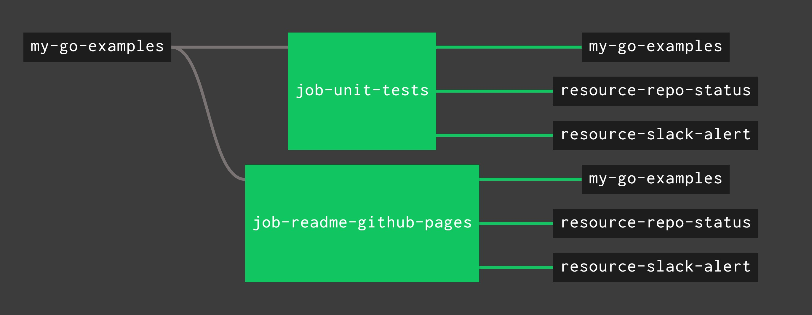

# my-go-examples

_A place to keep my go code snippets and examples._

These go examples also contain a lot of information
I gathered from other sources.

Table of Contents,

* [API](https://github.com/JeffDeCola/my-go-examples#api)
* [BASIC PROGRAMMING](https://github.com/JeffDeCola/my-go-examples#basic-programming)
* [BASIC SYNTAX](https://github.com/JeffDeCola/my-go-examples#basic-syntax)
  * Data Types
  * Functions
  * Interfaces
  * Methods
* [BLOCKCHAIN](https://github.com/JeffDeCola/my-go-examples#blockchain)
* [CGO](https://github.com/JeffDeCola/my-go-examples#cgo)
* [CLOUD SERVICES](https://github.com/JeffDeCola/my-go-examples#cloud-services)
* [CRYPTOGRAPHY](https://github.com/JeffDeCola/my-go-examples#cryptography)
  * ASYMMETRIC CRYPTOGRAPHY
  * HASHING
  * SYMMETRIC CRYPTOGRAPHY
* [DATABASE](https://github.com/JeffDeCola/my-go-examples#database)
* [GOROUTINES](https://github.com/JeffDeCola/my-go-examples#goroutines)
* [JEFFS GO TEMPLATES](https://github.com/JeffDeCola/my-go-examples#jeffs-go-templates)
* [MESSAGING](https://github.com/JeffDeCola/my-go-examples#messaging)
* [PACKAGES](https://github.com/JeffDeCola/my-go-examples#packages)
* [TESTING](https://github.com/JeffDeCola/my-go-examples#testing)
* [WEBSERVER](https://github.com/JeffDeCola/my-go-examples#webserver)

[GitHub Webpage](https://jeffdecola.github.io/my-go-examples/)

## GO EXAMPLES

_All sections in alphabetical order._

### API

* [http-GET-POST](https://github.com/JeffDeCola/my-go-examples/tree/master/api/http-GET-POST)

  _Using the standard `net/http` package to `http.Get` and `http.PostForm`._

* [OAuth-2.0-google-cloud-storage-api](https://github.com/JeffDeCola/my-go-examples/tree/master/api/OAuth-2.0-google-cloud-storage-api)
  _(Under construction - check back soon)_

  _Using OAuth 2.0 to access a users google cloud storage
  (based on scopes) via googles api._

* [OAuth-2.0-google-cloud-storage-api-over-NATS](https://github.com/JeffDeCola/my-go-examples/tree/master/api/OAuth-2.0-google-cloud-storage-api-over-NATS)
  _(Under construction - check back soon)_

  _Using OAuth 2.0 (frontend and backend via protobuf over NATS)
  to access a users google cloud storage (based on scopes) via googles api._

* [simple-tcp-ip-server](https://github.com/JeffDeCola/my-go-examples/tree/master/api/simple-tcp-ip-server)

  _Using the standard `net` package to build a simple tcp server
  to handle requests concurrently over ip (tcp/ip)._

* [simple-webserver-with-REST](https://github.com/JeffDeCola/my-go-examples/tree/master/api/simple-webserver-with-REST)

  _Adding REST (GET, POST, PUT, DELETE) JSON API to my
  [simple-webserver](https://github.com/JeffDeCola/my-go-examples#webserver).
  See example below._

### BASIC PROGRAMMING

_Just cool programs that are very useful and can be used as building blocks for
other cool programs._

* [json](https://github.com/JeffDeCola/my-go-examples/tree/master/basic-programming/json)

  _Encode a struct to json and decode back to a struct._

* [read-file](https://github.com/JeffDeCola/my-go-examples/tree/master/basic-programming/read-file)

  _Reading a file a few different ways._

* [singly-linked-list](https://github.com/JeffDeCola/my-go-examples/tree/master/basic-programming/singly-linked-list)

  _A singly linked list (i.e. using just a head pointer)._

### BASIC SYNTAX

* DATA TYPES

  * [closure](https://github.com/JeffDeCola/my-go-examples/tree/master/basic-syntax/data-types/closure)

    _An example of closure (a function that references variables from outside
    its body)._

  * [pointers1](https://github.com/JeffDeCola/my-go-examples/tree/master/basic-syntax/data-types/pointers1)

    _A struct passed to function by value (copy) and by address (reference)._

  * [pointers2](https://github.com/JeffDeCola/my-go-examples/tree/master/basic-syntax/data-types/pointers2)

    _An int passed to function by address (reference) and by int pointer (reference)._

  * [slices-underlying-array](https://github.com/JeffDeCola/my-go-examples/tree/master/basic-syntax/data-types/slices-underlying-array)

    _A slice being appended to showing the underlying array
    being added to the slice._

* FUNCTIONS

  * [callback](https://github.com/JeffDeCola/my-go-examples/tree/master/basic-syntax/functions/callback)

    _Passing a function (as an argument) to a function. Not really used that often._

  * [recursion](https://github.com/JeffDeCola/my-go-examples/tree/master/basic-syntax/functions/recursion)

    _A function calling itself to make a fibonacci series._

  * [shapes-using-functions](https://github.com/JeffDeCola/my-go-examples/tree/master/basic-syntax/functions/shapes-using-functions)

    _Calculating the area and perimeter of
    circles, rectangles and triangles using functions.
    Also refer to **method** and **interface** implementations below._

* INTERFACES

  * [interface](https://github.com/JeffDeCola/my-go-examples/tree/master/basic-syntax/interfaces/interface)

    _A simple example of an interface as parameter and an interface as a return.
    Also see the next example that uses this in a package._

  * [interface-package](https://github.com/JeffDeCola/my-go-examples/tree/master/basic-syntax/interfaces/interface-package)

    _The same example as above but the interface and methods placed in a package._

  * [interfaces-card-atm-bank](https://github.com/JeffDeCola/my-go-examples/tree/master/basic-syntax/interfaces/interfaces-card-atm-bank)

    _Using interfaces to show how a bank card is
    used to interact with an atm and bank._

  * [shapes-using-interfaces](https://github.com/JeffDeCola/my-go-examples/tree/master/basic-syntax/interfaces/shapes-using-interfaces)

    _Calculating the area and perimeter of
    circles, rectangles and triangles using interfaces.
    Also refer to **function** and **method** implementations._

* METHODS

  * [shapes-using-methods](https://github.com/JeffDeCola/my-go-examples/tree/master/basic-syntax/methods/shapes-using-methods)

    _Calculating the area and perimeter of
    circles, rectangles and triangles using methods.
    Also refer to **function** and **interface** implementations above._

### BLOCKCHAIN

* [bitcoin-ledger](https://github.com/JeffDeCola/my-go-examples/tree/master/blockchain/bitcoin-ledger)
  
  _Demonstrates the bitcoin ledger in a blockchain using the
  **unspent transaction output model**._

* [create-bitcoin-address-from-ecdsa-publickey](https://github.com/JeffDeCola/my-go-examples/tree/master/blockchain/create-bitcoin-address-from-ecdsa-publickey)
  
  _Create a bitcoin address from your ecdsa public key
  using the `crypto/ecdsa` standard package._

* [jeffCoin](https://github.com/JeffDeCola/jeffCoin)
  _(Links to another repo)_

  _I made a working cryptocurrency. This link will take you to that repo._

* [single-node-blockchain-with-REST](https://github.com/JeffDeCola/my-go-examples/tree/master/blockchain/single-node-blockchain-with-REST)

  _A simple single node sha256 blockchain with a REST JSON API
  (to view (GET) the blockchain and add (POST) a block)._

### CGO

_Using c with go._

* [simple-c-code](https://github.com/JeffDeCola/my-go-examples/tree/master/cgo/simple-c-code)

  _A very simple example to show you how to write a c function in go._

* [simple-c-code-using-stdio](https://github.com/JeffDeCola/my-go-examples/tree/master/cgo/simple-c-code-using-stdio)

  _Same code from above, but using stdio.h for printf._

### CLOUD SERVICES

* [amazon-aws](https://github.com/JeffDeCola/my-go-examples/tree/master/cloud-services/amazon-aws)
  _(Under construction - check back soon)_

  _Interacting with amazon's
  [aws](https://github.com/JeffDeCola/my-cheat-sheets/tree/master/software/service-providers/amazon-web-services-cheat-sheet)
  using
  `aws-sdk-go`
  client libraries._

* [google-gcp](https://github.com/JeffDeCola/my-go-examples/tree/master/cloud-services/google-gcp)

  _Interacting with google's
  [gcp](https://github.com/JeffDeCola/my-cheat-sheets/tree/master/software/service-providers/google-cloud-platform-cheat-sheet)
  using
  [google-cloud-go](https://github.com/googleapis/google-api-go-client/tree/master)
  client libraries._

### CRYPTOGRAPHY

* ASYMMETRIC CRYPTOGRAPHY

  _Great for digital signatures (verify sender) and receiving encrypted data._

  * [ecdsa-digital-signature](https://github.com/JeffDeCola/my-go-examples/tree/master/cryptography/asymmetric-cryptography/ecdsa-digital-signature)
  
    _To verify who a message is from,
    create and verify a digital signature using the
    `crypto/ecdsa` standard package._

  * [rsa-asymmetric-cryptography](https://github.com/JeffDeCola/my-go-examples/tree/master/cryptography/asymmetric-cryptography/rsa-asymmetric-cryptography)
  
    _Encrypt a message using a public key.
    Decrypt the message using a private key.
    Key pair generated using the `crypto/rsa` standard package
    (RSA is a cryptosystem for public key encryption)._

  * [rsa-asymmetric-cryptography-with-digital-signature](https://github.com/JeffDeCola/my-go-examples/tree/master/cryptography/asymmetric-cryptography/rsa-asymmetric-cryptography-with-digital-signature)
  
    _Using the above example, lets verify who the message is from.
    Create and verify a digital signature using the
    `crypto/rsa` standard package._

* HASHING

  _Great for getting fingerprints._

  * [bcrypt-password-hashing](https://github.com/JeffDeCola/my-go-examples/tree/master/cryptography/hashing/bcrypt-password-hashing)

    _Store your password hash, not your password.
    Set your password hash and then check your password using bcrypt._

  * [md5-hash-from-file](https://github.com/JeffDeCola/my-go-examples/tree/master/cryptography/hashing/md5-hash-from-file)

    _Get an md5 hash (fingerprint) from an input file using the standard
    `crypto/md5` package.
    I also added a flag to read in your `.ssh/id_rsa.pub` key to get your ssh fingerprint.
    Your github uses this for verification._

  * [sha256-hash-from-file](https://github.com/JeffDeCola/my-go-examples/tree/master/cryptography/hashing/sha256-hash-from-file)

    _Get an sha256 hash (fingerprint) from an input file using the standard
    `crypto/sha256` package_.

* SYMMETRIC CRYPTOGRAPHY

  _Using the same key to encrypt and decrypt._

  * [aes-256](https://github.com/JeffDeCola/my-go-examples/tree/master/cryptography/symmetric-cryptography/aes-256)

    _AES-256 **No Mode**
    can only encrypt/decrypt 16 bytes of data._

  * [aes-256-cbc](https://github.com/JeffDeCola/my-go-examples/tree/master/cryptography/symmetric-cryptography/aes-256-cbc)

    _AES-256 **CBC** (**Cipher Block Chaining**) mode
    where a block of plaintext is XORed with the previous cipherText block before
    being encrypted._

  * [aes-256-cfb](https://github.com/JeffDeCola/my-go-examples/tree/master/cryptography/symmetric-cryptography/aes-256-cfb)

    _AES-256 **CFB** (**Cipher FeedBack**) mode
    is almost identical to CBC mode but performed in reverse._

  * [aes-256-ctr](https://github.com/JeffDeCola/my-go-examples/tree/master/cryptography/symmetric-cryptography/aes-256-ctr)

    _AES-256 **CTR** (**Counter**) mode
    has similar characteristics to OFB, but also
    allows a random access property during decryption._

  * [aes-256-gcm](https://github.com/JeffDeCola/my-go-examples/tree/master/cryptography/symmetric-cryptography/aes-256-gcm)
    **I like this one**

    _AES-256 **GCM** (**Galois/Counter Mode**)
    is a block cipher counter mode with authentication._
  
  * [aes-256-ofb](https://github.com/JeffDeCola/my-go-examples/tree/master/cryptography/symmetric-cryptography/aes-256-ofb)

    _AES-256 **OFB** (**Output FeedBack**) mode
    makes a block cipher into a synchronous stream cipher.
    It generates keystream blocks, which are XORed with the plaintext blocks
    to get the cipherText._

### DATABASE

* [postgreSQL](https://github.com/JeffDeCola/my-go-examples/tree/master/database/postgreSQL)

  _A relational database - Read/Write from/to a table._

* [redis](https://github.com/JeffDeCola/my-go-examples/tree/master/database/redis)

  _A non-relational (NoSQL) database - Set/Get from/to a key/value pair._

### GOROUTINES

_Go is written for concurrency.
The go runtime schedules goroutines on threads.
The OS schedules these threads on cpus/cores._

* [goroutines-async-channel-receive-no-waiting](https://github.com/JeffDeCola/my-go-examples/tree/master/goroutines/goroutines-async-channel-receive-no-waiting)

  _A goroutine asynchronously sending data (via a channel buffer) and a goroutine
  receiving that data, using the latest (if available) and does not wait._

* [goroutines-async-channel-send-receive-waiting](https://github.com/JeffDeCola/my-go-examples/tree/master/goroutines/goroutines-async-channel-send-receive-waiting)

  _Sending data to a goroutine via an async channel.
  Both SEND and RCV will block/wait for data._

* [goroutines-multi-core](https://github.com/JeffDeCola/my-go-examples/tree/master/goroutines/goroutines-multi-core)

  _Concurrency across multiples cores.  You can play around with workers,
  threads, cpus/cores and nice to find the fastest performance.
  It will find the total amount of prime numbers up to a number._

* [goroutines-waitgroup](https://github.com/JeffDeCola/my-go-examples/tree/master/goroutines/goroutines-waitgroup)

  _Concurrency using a waitgroup (waiting for a collection of goroutines to finish)._

* [goroutines-worker-pools](https://github.com/JeffDeCola/my-go-examples/tree/master/goroutines/goroutines-worker-pools)

  _Concurrency using worker pools._

### JEFFS GO TEMPLATES

_My starting point for all my go projects._

* [jeffs-basic-go-template](https://github.com/JeffDeCola/my-go-examples/tree/master/jeffs-go-templates/jeffs-basic-go-template)

  _A simple go template with flags, logging & error handling._

### MESSAGING

* [protobuf](https://github.com/JeffDeCola/my-go-examples/tree/master/messaging/protobuf)

  _Using protobuf to show `data -> marshal -> snd -> rcv -> unmarshal -> data`._
  
* [protobuf-NATS-publish-subscribe](https://github.com/JeffDeCola/my-go-examples/tree/master/messaging/protobuf-NATS-publish-subscribe)

  _Using NATS (publish/subscribe) as a pipe to send protobuf messages.
  This is a model for **one-to-many** communication._

* [protobuf-NATS-queue-groups](https://github.com/JeffDeCola/my-go-examples/tree/master/messaging/protobuf-NATS-queue-groups)

  _Using NATS (queue groups) as a pipe to send protobuf messages.
  This is a model for **one-to-one** communication._

* [protobuf-NATS-queue-groups-request-reply](https://github.com/JeffDeCola/my-go-examples/tree/master/messaging/protobuf-NATS-queue-groups-request-reply)
  **I like this one**

  _Using NATS (queue groups) as a pipe to send protobuf messages with a
  request and getting a reply back from the subscriber.
  This is a model for **one-to-one** communication._

* [protobuf-NATS-request-reply](https://github.com/JeffDeCola/my-go-examples/tree/master/messaging/protobuf-NATS-request-reply)

  _Using NATS (request/reply) as a pipe to send protobuf messages.
  This is a model for a subscriber sending a msg with a request and
  getting a reply back from a subscriber.
  This is also a model for **one-to-many** communication._

* [protobuf-NATS-request-reply-goroutines](https://github.com/JeffDeCola/my-go-examples/tree/master/messaging/protobuf-NATS-request-reply-goroutines)

  _Same as above `protobuf-NATS-request-reply` but using goroutines for subscribers.
  This is also a model for **one-to-one** communication._

### PACKAGES

_Refer to my repo
[my-go-packages](https://github.com/JeffDeCola/my-go-packages)
for packages I created. Refer to
[golang.org/pkg](https://golang.org/pkg/)
for the standard go packages_

* [errors](https://github.com/JeffDeCola/my-go-examples/tree/master/packages/errors)
  _(github.com/pkg/errors)_

  _Error Handling using non-standard `github.com/pkg/errors` package._

* [flag](https://github.com/JeffDeCola/my-go-examples/tree/master/packages/flag)
  _(standard)_

  _The `flag` package makes it easy to implement command-line flag parsing._

* [fmt-scan](https://github.com/JeffDeCola/my-go-examples/tree/master/packages/fmt-scan)
  _(standard)_

  _The `fmt` package makes it easy to scan user input using fmt.Scan() by reading os.Stdin._

* [logrus](https://github.com/JeffDeCola/my-go-examples/tree/master/packages/logrus)
  _(github.com/sirupsen/logrus)_

  _Logging using non-standard `logrus` package._

* `net/http`
  _(standard)_

  _See above
  [http-GET-POST](https://github.com/JeffDeCola/my-go-examples#api)
  and below
  [simple-webserver](https://github.com/JeffDeCola/my-go-examples#webserver)
  examples._

* [test-jeffshapes](https://github.com/JeffDeCola/my-go-examples/tree/master/packages/test-jeffshapes)
  _(github.com/JeffDeCola/my-go-packages/jeffshapes)_
  
  _Testing the jeffshapes package (below)._

### TESTING

* [gomock](https://github.com/JeffDeCola/my-go-examples/tree/master/testing/gomock)

  _Using `gomock` on an interface and using the go tool `gotests` for unit testing._

* [gotests](https://github.com/JeffDeCola/my-go-examples/tree/master/testing/gotests)

  _Using the go tool `gotests` to test a very simple function and method._

* [gotests-complex-function](https://github.com/JeffDeCola/my-go-examples/tree/master/testing/gotests-complex-function)

  _Using the go tool `gotests` to test a function with complex inputs and outputs._

### WEBSERVER

* [simple-webserver](https://github.com/JeffDeCola/my-go-examples/tree/master/webserver/simple-webserver)

  _Using the standard `net/http` package to build a simple webserver.
  I added a REST JSON API to this example in the above example
  [simple-webserver-with-REST](https://github.com/JeffDeCola/my-go-examples#api)._

## UPDATE GITHUB WEBPAGE & UNIT TESTS USING CONCOURSE (OPTIONAL)

For fun, I use concourse to  update
[my-go-examples GitHub Webpage](https://jeffdecola.github.io/my-go-examples/),
run my unit-tests and alert me of the changes via repo status and slack.

A pipeline file [pipeline.yml](https://github.com/JeffDeCola/my-go-examples/tree/master/ci/pipeline.yml)
shows the entire ci flow. Visually, it looks like,

The `jobs` and `tasks` are,

* `job-readme-github-pages` runs task
  [readme-github-pages.sh](https://github.com/JeffDeCola/my-go-examples/tree/master/ci/scripts/readme-github-pages.sh).
* `job-unit-tests` runs task
  [unit-tests.sh](https://github.com/JeffDeCola/my-go-examples/tree/master/ci/scripts/unit-tests.sh).

The concourse `resources types` are,

* `my-go-examples` uses a resource type
  [docker-image](https://hub.docker.com/r/concourse/git-resource/)
  to PULL a repo from github.
* `resource-slack-alert` uses a resource type
  [docker image](https://hub.docker.com/r/cfcommunity/slack-notification-resource)
  that will notify slack on your progress.
* `resource-repo-status` uses a resource type
  [docker image](https://hub.docker.com/r/dpb587/github-status-resource)
  that will update your git status for that particular commit.

For more information on using concourse for continuous integration,
refer to my cheat sheet on [concourse](https://github.com/JeffDeCola/my-cheat-sheets/tree/master/software/operations-tools/continuous-integration-continuous-deployment/concourse-cheat-sheet).
