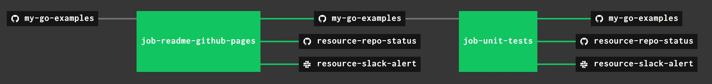

# my-go-examples

`my-go-examples` _is a place to keep my go code snippets and examples._

I organized everything (alphabetically) into these sections,

* [API](https://github.com/JeffDeCola/my-go-examples#api)
* [BASIC PROGRAMMING](https://github.com/JeffDeCola/my-go-examples#basic-programming)
* [CLOUD SERVICES](https://github.com/JeffDeCola/my-go-examples#cloud-services)
* [DATABASE](https://github.com/JeffDeCola/my-go-examples#database)
* [GOROUTINES](https://github.com/JeffDeCola/my-go-examples#goroutines)
* [USEFUL TOOLS I USE](https://github.com/JeffDeCola/my-go-examples#useful-tools-i-use)
* [WEBSERVER](https://github.com/JeffDeCola/my-go-examples#webserver)

These go examples also contain info I gathered from other sources.

[GitHub Webpage](https://jeffdecola.github.io/my-go-examples/)

## GO EXAMPLES

_All sections in alphabetical order._

### API

* [http-GET-POST](https://github.com/JeffDeCola/my-go-examples/tree/master/api/http-GET-POST)

  _Using a http package to GET or POST (update via json)._

* [OAuth-2.0-google-cloud-storage-api](https://github.com/JeffDeCola/my-go-examples/tree/master/api/OAuth-2.0-google-cloud-storage-api)

  _Using OAuth 2.0 to access a users google cloud storage
  (based on scopes) via googles api._

* [OAuth-2.0-google-cloud-storage-api-over-NATS](https://github.com/JeffDeCola/my-go-examples/tree/master/api/OAuth-2.0-google-cloud-storage-api-over-NATS)

  _Using OAuth 2.0 (frontend and backend via protobuf over NATS)
  to access a users google cloud storage (based on scopes) via googles api._

* [simple-webserver-with-REST](https://github.com/JeffDeCola/my-go-examples/tree/master/api/simple-webserver-with-REST)

  _Adding REST to my
  [simple-webserver](https://github.com/JeffDeCola/my-go-examples/tree/master/simple-webserver)._

* [something-postgreSQL](https://github.com/JeffDeCola/my-go-examples/tree/master/api/something-postgreSQL)

  _tbd_

* [something-RESTful](https://github.com/JeffDeCola/my-go-examples/tree/master/api/something-RESTful)

  _tbd_
  
* [something-youtube-content-id-api](https://github.com/JeffDeCola/my-go-examples/tree/master/api/something-youtube-content-id-api)

  _tbd_

* [something-youtube-data-api-v3](https://github.com/JeffDeCola/my-go-examples/tree/master/api/something-youtube-data-api-v3)

  _tbd_

* [track-email-mailgun-api](https://github.com/JeffDeCola/my-go-examples/tree/master/api/track-email-mailgun-api)

  _Send and track an email using mailgun over their go client api._

### BASIC PROGRAMMING

* [callback](https://github.com/JeffDeCola/my-go-examples/tree/master/basic-programming/callback)

  _Passing a function (as an argument) to a function._

* [closure](https://github.com/JeffDeCola/my-go-examples/tree/master/basic-programming/closure)

  _Assigning a variable to a function._

* [gomock](https://github.com/JeffDeCola/my-go-examples/tree/master/basic-programming/gomock)

  _Using gomock on an interface for unit testing._

* [gotests-complex-function](https://github.com/JeffDeCola/my-go-examples/tree/master/basic-programming/gotests-complex-function)

  _Testing a function with complex inputs and outputs._

* [interface](https://github.com/JeffDeCola/my-go-examples/tree/master/basic-programming/interface)

  _Accepting ANYTHING (as long as anything has a method attached
  to an interface)._

* [interfaces-card-atm-bank](https://github.com/JeffDeCola/my-go-examples/tree/master/basic-programming/interfaces-card-atm-bank)

  _Using interfaces to show how an atm card is
  used to interact with an atm and bank._

* [json](https://github.com/JeffDeCola/my-go-examples/tree/master/basic-programming/json)

  _Encode a struct to json and decode back to a struct._

* [linked-list](https://github.com/JeffDeCola/my-go-examples/tree/master/basic-programming/linked-list)

  _A singly linked list (i.e. using just a head pointer)._

* [logging-error-handling](https://github.com/JeffDeCola/my-go-examples/tree/master/basic-programming/logging-error-handling)

  _Logging and error handling._

* [pointers](https://github.com/JeffDeCola/my-go-examples/tree/master/basic-programming/pointers)

  _A pointer to a struct._

* [read-file](https://github.com/JeffDeCola/my-go-examples/tree/master/basic-programming/read-file)

  _Reading a file a few different ways._

* [recursion](https://github.com/JeffDeCola/my-go-examples/tree/master/basic-programming/recursion)

  _A function calling itself to make a fibonacci series._

* [slices-underlying-array](https://github.com/JeffDeCola/my-go-examples/tree/master/basic-programming/slices-underlying-array)

  _A slice being appended to, and shows the underlying array
  being added to the slice._

* [structs-methods-interfaces](https://github.com/JeffDeCola/my-go-examples/tree/master/basic-programming/structs-methods-interfaces)

  _Structs, methods and interfaces._

### CLOUD SERVICES

* [amazon-aws](https://github.com/JeffDeCola/my-go-examples/tree/master/cloud-services/amazon-aws)

  _Interacting with amazon's
  [aws](https://github.com/JeffDeCola/my-cheat-sheets/tree/master/software/service-providers/amazon-web-services-cheat-sheet)
  using
  `aws-sdk-go`
  client libraries._

* [google-gcp](https://github.com/JeffDeCola/my-go-examples/tree/master/cloud-services/google-gcp)

  _Interacting with google's
  [gcp](https://github.com/JeffDeCola/my-cheat-sheets/tree/master/software/service-providers/google-cloud-platform-cheat-sheet)
  using
  [google-cloud-go](https://github.com/googleapis/google-api-go-client/tree/master)
  client libraries._

### DATABASE

* [google-cloud-spanner-table](https://github.com/JeffDeCola/my-go-examples/tree/master/database/google-cloud-spanner-table)

  _tbd._

* [postgreSQL](https://github.com/JeffDeCola/my-go-examples/tree/master/database/postgreSQL)

  _A relational database - Read/Write from/to a table._

* [redis](https://github.com/JeffDeCola/my-go-examples/tree/master/database/redis)

  _A non-relational (NoSQL) database - Set/Get from/to a key/value pair._

### GOROUTINES

* [async-channel-no-waiting](https://github.com/JeffDeCola/my-go-examples/tree/master/goroutines/async-channel-no-waiting)

  _A goroutine asynchronously sending data (via a channel)
  to a function that uses the latest data (if available) and does not wait._

* [goroutines-channels-select](https://github.com/JeffDeCola/my-go-examples/tree/master/goroutines/goroutines-channels-select)

  _Concurrency and message passing via channels in go._

* [goroutines-waitgroup](https://github.com/JeffDeCola/my-go-examples/tree/master/goroutines/goroutines-waitgroup)

  _Concurrency using a waitgroup._

* [goroutines-worker-pools](https://github.com/JeffDeCola/my-go-examples/tree/master/goroutines/goroutines-worker-pools)

  _Concurrency using a worker pool with goroutines and channels._

* MESSAGING

* [protobuf](https://github.com/JeffDeCola/my-go-examples/tree/master/messaging/protobuf)

  _Protocol buffers serialize structured data, useful for messaging._

* [protobuf-NATS-publish-subscribe](https://github.com/JeffDeCola/my-go-examples/tree/master/messaging/protobuf-NATS-publish-subscribe)

  _Sending a protobuf msg over NATS from a client
  to a server using publish and subscribe._

* [protobuf-NATS-request-response](https://github.com/JeffDeCola/my-go-examples/tree/master/messaging/protobuf-NATS-request-response)

  _Sending a protobuf msg over NATS from a
  client to a server using request and response._

### USEFUL TOOLS I USE

* [markdown-create-table-of-contents](https://github.com/JeffDeCola/my-go-examples/tree/master/useful-tools-i-use/markdown-create-table-of-contents)

  _Parse a markdown file to find ##, ### to create a table of contents (TOC)
  for links at github.  I like to use a TOC it at the beginning of my readme files._

* [markdown-delimiter-doer](https://github.com/JeffDeCola/my-go-examples/tree/master/useful-tools-i-use/markdown-delimiter-doer)

  _Take a markdown file and "do whatever you want" between the delimiters
  and output new markdown file._

### WEBSERVER

* [simple-webserver](https://github.com/JeffDeCola/my-go-examples/tree/master/webserver/simple-webserver)

  _Using the http package to build a simple webserver._

## UPDATE GITHUB WEBPAGE & UNIT TESTS USING CONCOURSE (OPTIONAL)

For fun, I use concourse to  update
[my-go-examples GitHub Webpage](https://jeffdecola.github.io/my-go-examples/),
run my unit-tests and alert me of the changes via repo status and slack.

A pipeline file [pipeline.yml](https://github.com/JeffDeCola/my-go-examples/tree/master/ci/pipeline.yml)
shows the entire ci flow. Visually, it looks like,

The `jobs` and `tasks` are,

* `job-readme-github-pages` runs task
  [readme-github-pages.sh](https://github.com/JeffDeCola/my-go-examples/tree/master/ci/scripts/readme-github-pages.sh).
* `job-unit-tests` runs task
  [unit-tests.sh](https://github.com/JeffDeCola/my-go-examples/tree/master/ci/scripts/unit-tests.sh).

The concourse `resources types` are,

* `my-go-examples` uses a resource type
  [docker-image](https://hub.docker.com/r/concourse/git-resource/)
  to PULL a repo from github.
* `resource-slack-alert` uses a resource type
  [docker image](https://hub.docker.com/r/cfcommunity/slack-notification-resource)
  that will notify slack on your progress.
* `resource-repo-status` uses a resource type
  [docker image](https://hub.docker.com/r/dpb587/github-status-resource)
  that will update your git status for that particular commit.

For more information on using concourse for continuous integration,
refer to my cheat sheet on [concourse](https://github.com/JeffDeCola/my-cheat-sheets/tree/master/software/operations-tools/continuous-integration-continuous-deployment/concourse-cheat-sheet).
