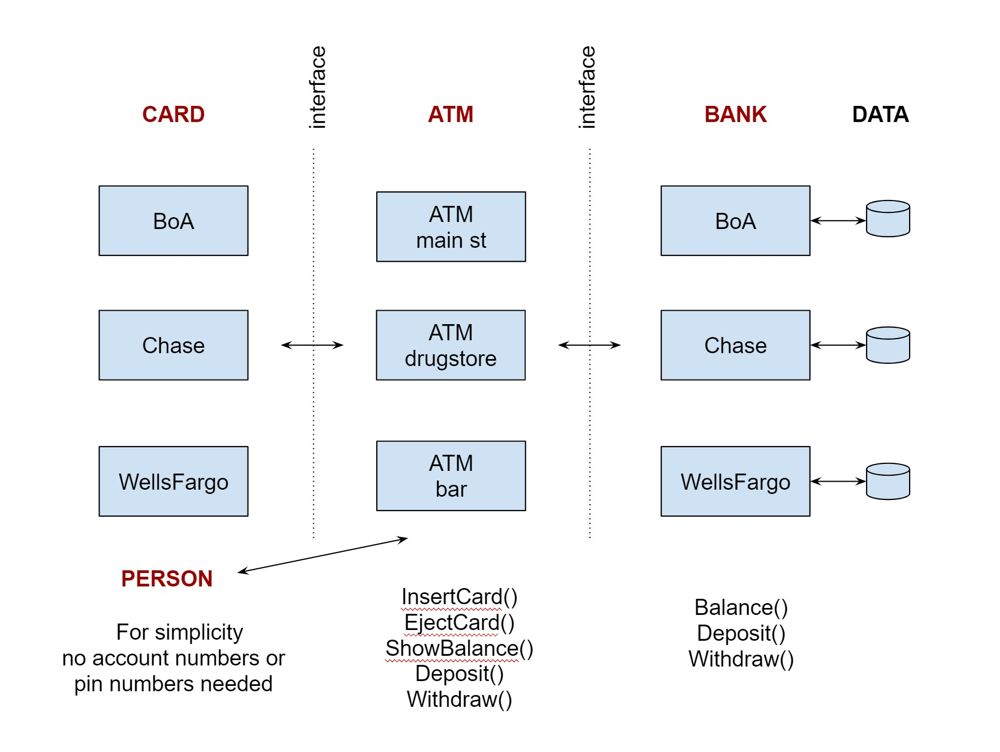

# interfaces-card-atm-bank example

`interfaces-card-atm-bank` _is an example of
using interfaces to show how an atm card is
used to interact with an atm and bank._

[GitHub Webpage](https://jeffdecola.github.io/my-go-examples/)

## OVERVIEW

This is the bare bones minimum to really highlight interfaces.  For example, you could
add pins and account numbers and a database.

