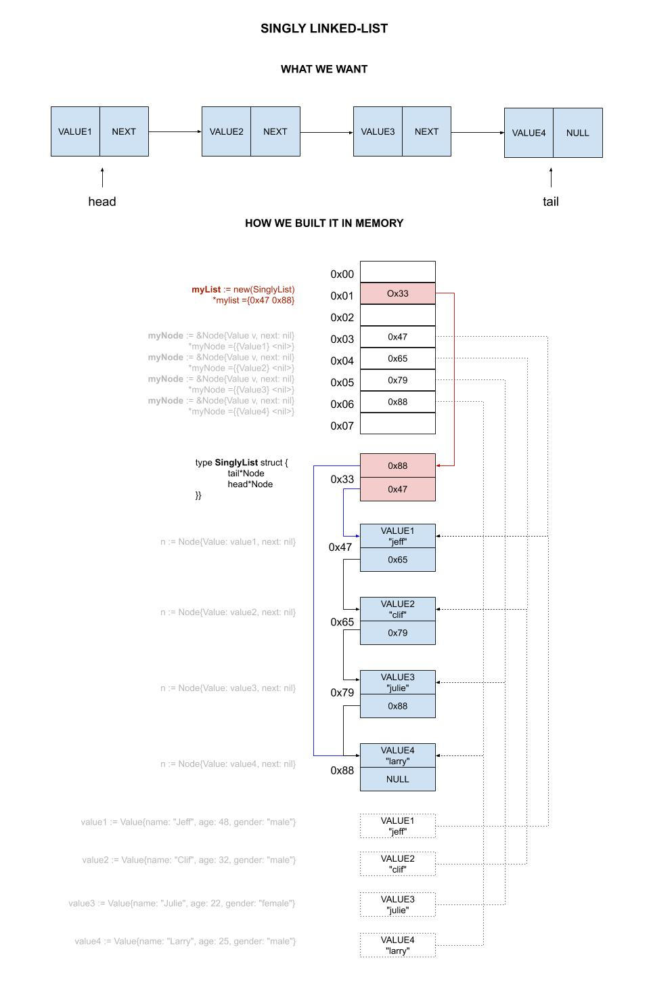

# singly-linked-list example

_A singly linked list (i.e. using just a head pointer)._

[GitHub Webpage](https://jeffdecola.github.io/my-go-examples/)

## SINGLY LINKED LIST

Linked Lists function as an array that can grow and shrink as needed,
from any point in the list.

Each `Node` contains data `Value` and a pointer `NEXT` to the next
Node in the list. If the pointer is null, you are at the end of the list.

`head` -> `VALUE|NEXT` -> `VALUE|NEXT` -> `VALUE|(null)`

A local `head` pointer variable points to the first item of a list.

A example of a Node is created by a struct,

```go
type Node struct {
    Value
    next  *Node
}
```

Where Value can be something like,

```go
type Value struct {
    name   string
    age    int
    gender string
}
```

This illustration may help,



### Advantages over arrays

* Nodes can be added or removed from middle of list
* There is no need to define size

### Disadvantages over arrays

* You must iterate over the list until you get to the node you want
* Dynamic pointers required
* larger overhead

## RUN

```bash
go run linked-list.go
```
