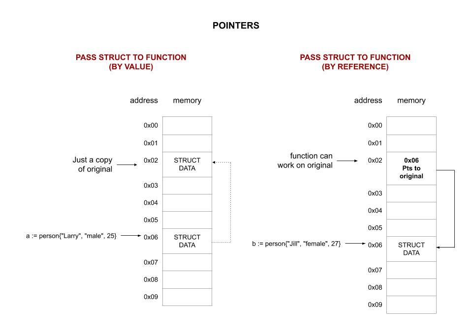

# pointers1 example

_A struct passed to function by value (copy) and by address (reference)._

[GitHub Webpage](https://jeffdecola.github.io/my-go-examples/)

## PASS BY REFERENCE (MAKES POINTER IN FUNCTION)

Passing the address of a struct to a function (by reference),

```go
b := person{"Jill", "female", 27}
changeNamePtr(&b)
```

So the function can now work on that original struct,

```go
func changeNamePtr(p *person) {
    p.name = "Lisa"
}
```

In this case the name is changed from Jill to Lisa.

This diagram may help,



## RUN

Run,

```bash
go run pointers1.go
```
