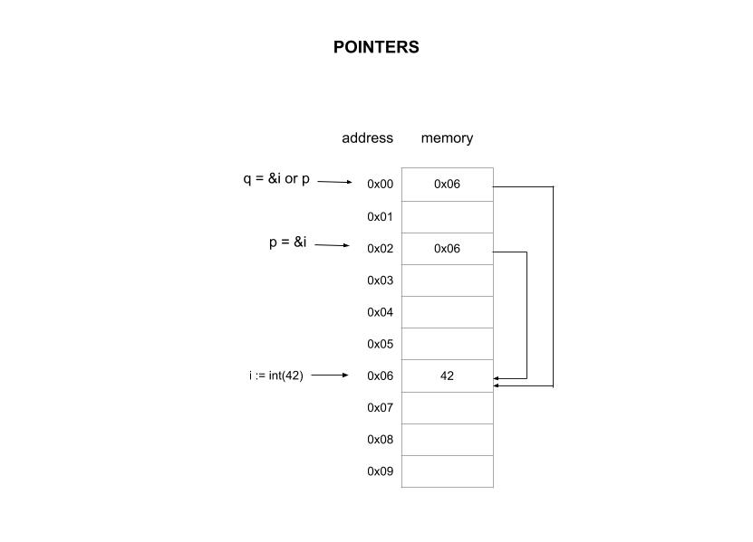

# pointers2 example

`pointers2` _in an example of
an int passed to function by address (reference) and by int pointer (reference).._

[GitHub Webpage](https://jeffdecola.github.io/my-go-examples/)

## OVERVIEW

This diagram may help,



## RUN

Run,

```go
go run pointers2.go
```
