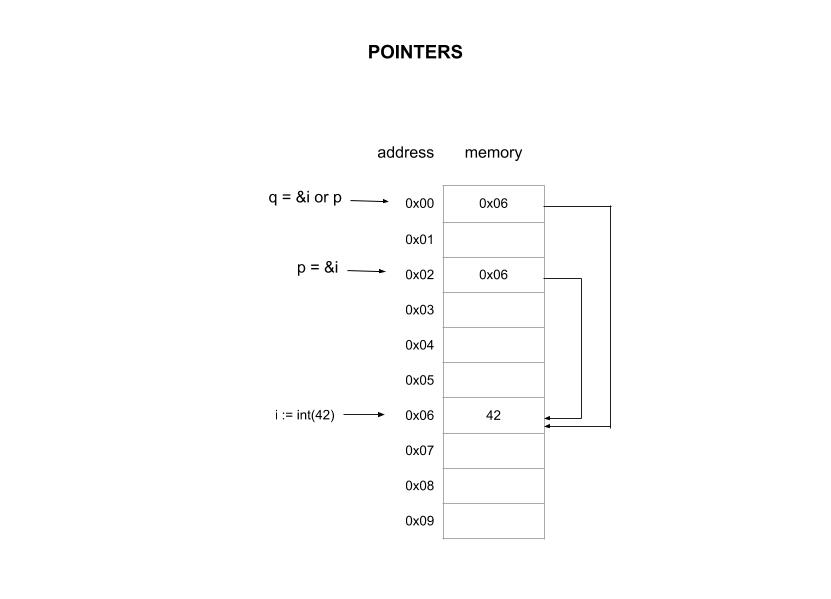

# pointers2 example

_An int passed to function by address (reference) and by int pointer (reference)._

[GitHub Webpage](https://jeffdecola.github.io/my-go-examples/)

## OVERVIEW

This diagram may help,



## RUN

Run,

```bash
go run pointers2.go
```
