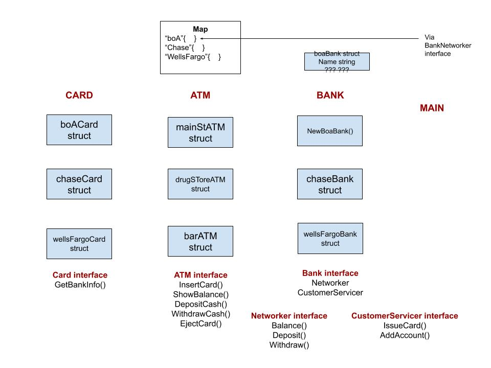

# interfaces-card-atm-bank example

`interfaces-card-atm-bank` _is an example of
using interfaces to show how a bank card is
used to interact with an atm and bank._

[GitHub Webpage](https://jeffdecola.github.io/my-go-examples/)

## OVERVIEW / GOAL

This is the bare bones minimum to really highlight interfaces.
For example, you could add pins, account numbers, a database. etc...

The goal is to create some interfaces for the bank, card and
atm machine respectively,

```go
b1 := bank.NewBoaBank("elmStBranch")
c1 := bank.NewBoaCard(b1, "Jeff")
a1 := atm.NewATM("123Main")
```

Then add some accounts to the bank,

```go
bank.NewBoaAccount(b1, "Jeff", 100)
```

Finally load the bank information in the atm machines,

```go
atm.LoadBank(b1)
atm.LoadBank(b2)
```

Now we can use an atm machine with your card to do things,

```go
atm.ShowBalance(a1, c1)
atm.Deposit(a1, c1, 740)
atm.Withdraw(a1, c1, 50)
```

This image shows the various functions and methods I made in my packages.



## RUN

Run,

```bash
go run insterfaces-card-atm-bank.go
```
