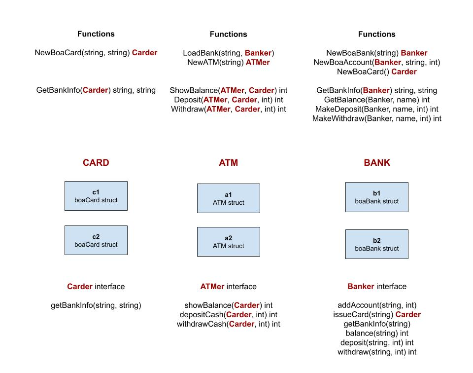

# interfaces-card-atm-bank example

`interfaces-card-atm-bank` _is an example of
using interfaces to show how a bank card is
used to interact with an atm and bank._

[GitHub Webpage](https://jeffdecola.github.io/my-go-examples/)

## OVERVIEW

This is the bare bones minimum to really highlight interfaces.
For example, you could add pins, account numbers, a database. etc...

This image shows the various functions and methods I made in my packages.



## RUN

Run,

```bash
go run insterfaces-card-atm-bank.go
```
