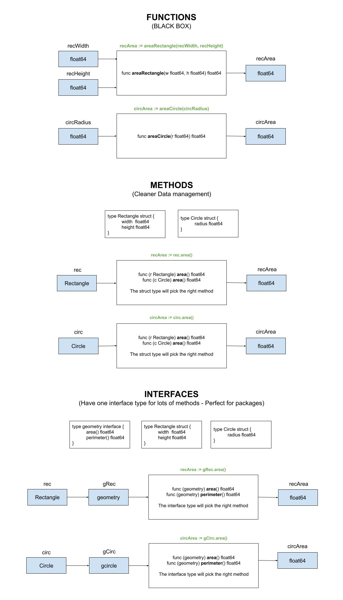

# shapes-package

_Using an interface to calculate the area and perimeter of a rectangle,
circle and triangle via a shapes package._

tl;dr,

```go
// FUNCTION
recArea := areaRectangle(recWidth, recHeight)
// METHOD
rec := Rectangle{2.4, 34.4}
recArea := rec.area()
// INTERFACE
var g geometry
g = rec
recArea := g.area()
```

Table of Contents,

* [OVERVIEW](https://github.com/JeffDeCola/my-go-examples/tree/master/basic-syntax/interfaces/shapes-package#overview)
* [RUN](https://github.com/JeffDeCola/my-go-examples/tree/master/basic-syntax/interfaces/shapes-package#run)
* [TEST](https://github.com/JeffDeCola/my-go-examples/tree/master/basic-syntax/interfaces/shapes-package#test)
* [AN ILLUSTRATION THAT MAY HELP](https://github.com/JeffDeCola/my-go-examples/tree/master/basic-syntax/interfaces/shapes-package#an-illustration-that-may-help)

Documentation and reference,

* This repos [github webpage](https://jeffdecola.github.io/my-go-examples/)

## OVERVIEW

The power of interfaces really shine when you have a package.
Because you can have one interface that does a lot of things.

Defines the shapes using a struct,

```go
rec := shapes.Rectangle{
    Width:  2.4,
    Height: 34.4,
}
circ := shapes.Circle{
    Radius: 2.3,
}
tri := shapes.Triangle{
    A: 2,
    B: 3.3,
    C: 4,
}
```

Calculate area and perimeter using geometry interface

```go
var g shapes.Geometry

g = rec
recArea := g.Area()
recPerimeter := g.Perimeter()
g = circ
circArea := g.Area()
circPerimeter := g.Perimeter()
g = tri
triArea := g.Area()
triPerimeter := g.Perimeter()
```

## RUN

To run,

```bash
go run shapes-package.go
```

## TEST

To create _test files,

```bash
cd shapes
gotests -w -all shapes.go
```

To unit test the code,

```bash
go test -cover ./... 
```

## AN ILLUSTRATION THAT MAY HELP


