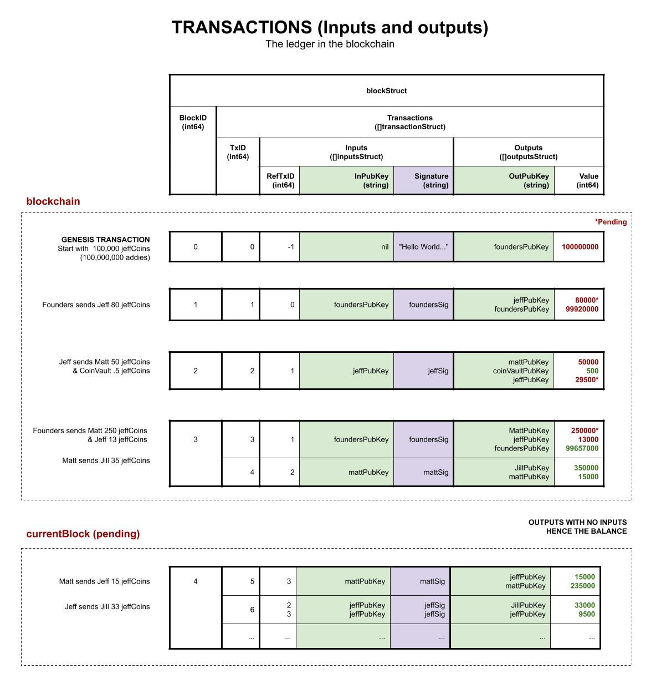
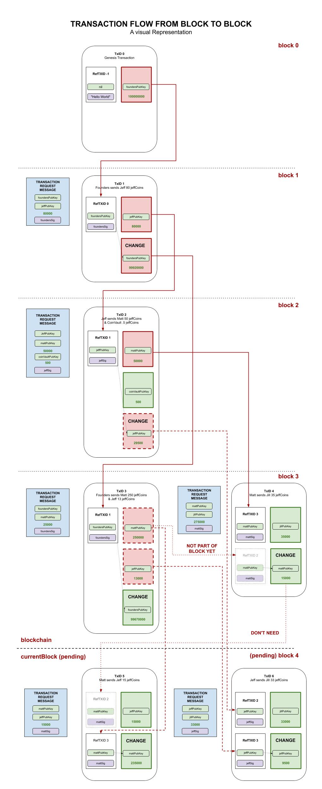

# bitcoin-ledger example

_Demonstrates the bitcoin ledger in a blockchain using the
**unspent transaction output model**._

Table of Contents,

* [PREREQUISITES](https://github.com/JeffDeCola/my-go-examples/tree/master/blockchain/bitcoin-ledger#prerequisites)
* [OVERVIEW](https://github.com/JeffDeCola/my-go-examples/tree/master/blockchain/bitcoin-ledger#overview)
* [THIS EXAMPLE](https://github.com/JeffDeCola/my-go-examples/tree/master/blockchain/bitcoin-ledger#this-example)
* [TRANSACTIONS IN LEDGER](https://github.com/JeffDeCola/my-go-examples/tree/master/blockchain/bitcoin-ledger#transactions-in-ledger)
* [ADDING A TRANSACTION TO the pendingBlock](https://github.com/JeffDeCola/my-go-examples/tree/master/blockchain/bitcoin-ledger#adding-a-transaction-to-the-pendingblock)
* [RUN](https://github.com/JeffDeCola/my-go-examples/tree/master/blockchain/bitcoin-ledger#run)

Documentation and reference,

* My cheat sheet on
[blockchains](https://github.com/JeffDeCola/my-cheat-sheets/tree/master/software/development/software-architectures/blockchain/blockchain-cheat-sheet)
* A
[blockchain with REST](https://github.com/JeffDeCola/my-go-examples/tree/master/blockchain/single-node-blockchain-with-REST)
example I wrote that just stores data. No coins.

[GitHub Webpage](https://jeffdecola.github.io/my-go-examples/)

## PREREQUISITES

```bash
go get -u -v github.com/sirupsen/logrus
```

## OVERVIEW

An **unspent transaction output model** is a method to log the transactions
of coins/value in a cryptocurrency. This type of bookkeeping does not keep a
running balance. Each transaction records where the coin/value
is coming from (input) and where it is going to (output).

All inputs must be tied to other outputs, but outputs can be `"unspent"`, meaning
not connected to anything.  When you add up all the unspent outputs for an address
you have the balance.

It's a little tricky at first but makes sense if you code it.

## THIS EXAMPLE

The first block in the blockchain will contain 1 transaction.  That will be the
founders initial value of 100,000,000 (or 100,000 jeffCoins). Each jeffCoin
has a value of 1,000 addies. _Meow._

* **Block 0** (Genesis Block)
  * Founders start with  100,000 jeffCoins

There are 7 transaction requests thereafter (One is bad).
I will be adding blocks as follows,

* **Block 1**
  * Founders sends Jeff 80 jeffCoins
  * Founders send someone 80 jeffCoins (Rejected Signature Failed)
* **Block 2**  
  * Jeff sends Matt 50 jeffCoins & CoinVault .5 jeffCoin
* **Block 3**  
  * Founders sends Matt 250 jeffCoins & Jeff 13 jeffCoins
  * Matt sends Jill 35 jeffCoins

Then all other transactions will be pending,

* **pendingBlock**
  * Matt sends Jeff 15 jeffCoins
  * Jeff sends Jill 33 jeffCoins

The `pendingBlock` is pending, meaning it needs to be verified by other nodes.
So this block will not have any value until its part of the blockchain.

## TRANSACTIONS IN LEDGER

This illustrations shows the ledger in the blockchain and pendingBlock,



This illustration shows a visual look at how the transactions relate
(input/output) to each other in the blockchain,



## ADDING A TRANSACTION TO THE pendingBlock

Here are the steps when adding a transaction request to the pendingBlock,

* STEP 1 - MOCK - VERIFY SIGNATURE
* STEP 2 - CHECK BALANCE TO SEE IF YOU HAVE THE MONEY
  * STEP 2.1 - GET UNSPENT OUTPUT TRANSACTIONS  - Make unspentOutputSlice
  * STEP 2.2 - GET BALANCE from unspentOutputSlice
* STEP 3 - CHECK IF YOU HAVE ENOUGH jeffCoins
* STEP 4 - PICK THE UNSPENT OUTPUTS TO USE AND PROVIDE CHANGE
* STEP 5 - LOAD pendingBlock WITH TRANSACTION and MAKE CHANGE
  * STEP 5.1 - BUILD INPUT STRUCT FOR EACH UNSPENT OUTPUT
  * STEP 5.2 - BUILD OUTPUT STRUCT
  * STEP 5.3 - BUILD THE TRANSACTION
  * STEP 5.4 - PLACE transactionStruct IN transactionSlice
  * STEP 5.5 - LOAD THE CURRENT BLOCK WITH TRANSACTION

## RUN

This will process a transaction, display the blockchain and show the
balances for each address (public Keys),

```bash
go run control.go bitcoin-ledger.go data.go
```

The balances should be,

```txt
The balance for Founders PubKey (Address) is 99657000
The balance for Jeffs PubKey (Address) is 42500
The balance for Matts PubKey (Address) is 265000
The balance for Jills PubKey (Address) is 35000
The balance for CoinVaults PubKey (Address) is 500
```

Remember, the pendingBlock is pending so it is not part
of this calculation.
