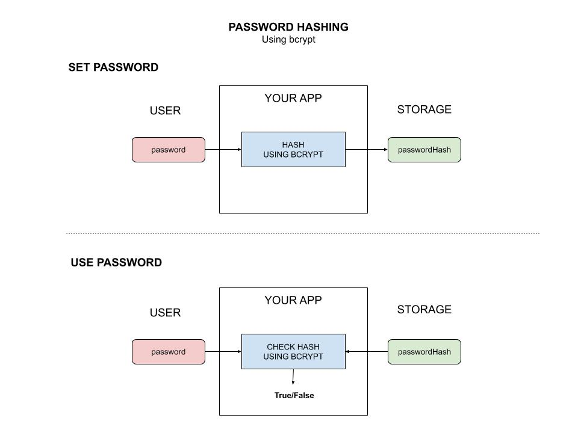

# bcrypt-password-hashing

_Store your password hash, not your password.
Set your password hash and then check your password using `bcrypt`._

Documents and reference,

* The genesis for this example
  [here](https://gowebexamples.com/password-hashing/)

## PREREQUISITES

```bash
go get -u -v golang.org/x/crypto/bcrypt
```

## OVERVIEW

Storing normal text passwords is so 2000's.  Encrypting is so 2012.
Password Hashing is were its at. The password is never stored
on the server.

This illustration may help,



## RUN

```bash
go run bcrypt-password-hashing
```

Now go into the code and change `passwordEntered` and note it is
invalid.
