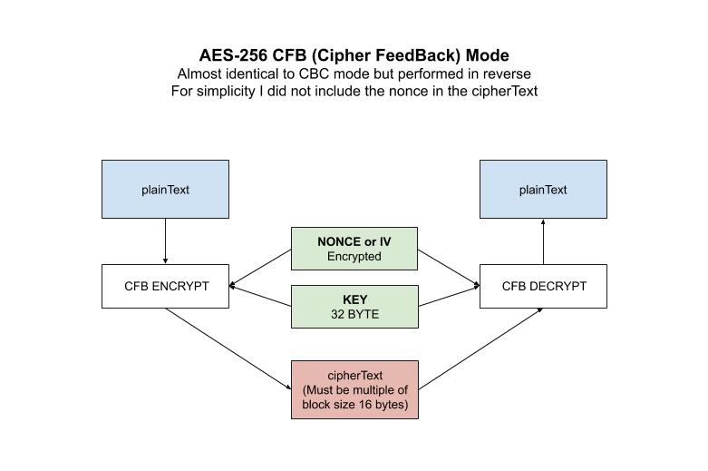

# aes-256-cfb example

_AES-256 **CFB** (**Cipher FeedBack**) mode
is almost identical to CBC mode but performed in reverse._

I have the following AES-256 mode examples,

* [aes-256](https://github.com/JeffDeCola/my-go-examples/tree/master/cryptography/symmetric-cryptography/aes-256)
  No Mode
* [aes-256-cbc](https://github.com/JeffDeCola/my-go-examples/tree/master/cryptography/symmetric-cryptography/aes-256-cbc)
  Cipher Block Chaining
* [aes-256-cfb](https://github.com/JeffDeCola/my-go-examples/tree/master/cryptography/symmetric-cryptography/aes-256-cfb)
  Cipher FeedBack Mode **(You are here)**
* [aes-256-ctr](https://github.com/JeffDeCola/my-go-examples/tree/master/cryptography/symmetric-cryptography/aes-256-ctr)
  Counter Mode
* [aes-256-gcm](https://github.com/JeffDeCola/my-go-examples/tree/master/cryptography/symmetric-cryptography/aes-256-gcm)
  Galois/Counter Mode **(I like this one)**
* [aes-256-ofb](https://github.com/JeffDeCola/my-go-examples/tree/master/cryptography/symmetric-cryptography/aes-256-ofb)
  Output FeedBack Mode

[GitHub Webpage](https://jeffdecola.github.io/my-go-examples/)

## RUN

```go
run aes-cfb.go
```

You output should be,

```txt
Original Text:           This is AES-256 CFB!!

The 32-byte Key:         myverystrongpasswordo32bitlength
The Nonce:               3f267a60bf96b424fa144da8fc4869d4

Encrypted Text:          6a2544cec434601d000afd43d7a1d9edd18f68320a
Decrypted Text:          This is AES-256 CFB!!
```

## HOW IT WORKS

* Makes a block cipher into a self-synchronizing stream cipher
* CFB decryption is almost identical to CBC encryption performed in reverse
* The IV value should be equal to AES block size
* A different nonce is needed for every message
* Encryption but not message integrity

For simplicity I did not include the nonce in the cipherText.

Encryption,

```go
// GET CIPHER BLOCK USING KEY
block, err := aes.NewCipher(keyByte)

// GET CFB ENCRYPTER
cfb := cipher.NewCFBEncrypter(block, nonce)

// ENCRYPT DATA
cfb.XORKeyStream(cipherTextByte, plaintextByte)

// RETURN HEX
cipherText := hex.EncodeToString(cipherTextByte)
```

Decryption,

```go
// GET CIPHER BLOCK USING KEY
block, err := aes.NewCipher(keyByte)

// GET CFB DECRYPTER
cfb := cipher.NewCFBDecrypter(block, nonce)

// DECRYPT DATA
cfb.XORKeyStream(plainTextByte, cipherTextByte)

// RETURN STRING
plainText := string(plainTextByte[:])
```

This illustration may help,


