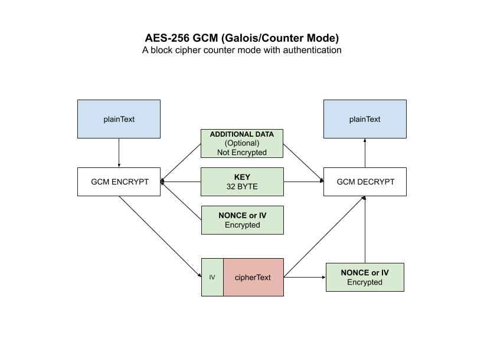

# aes-256-gcm example

_AES-256 **GCM** (**Galois/Counter Mode**) mode
is a block cipher counter mode with authentication._

I have the following AES-256 mode examples,

* [aes-256](https://github.com/JeffDeCola/my-go-examples/tree/master/cryptography/symmetric-cryptography/aes-256)
  No Mode
* [aes-256-cbc](https://github.com/JeffDeCola/my-go-examples/tree/master/cryptography/symmetric-cryptography/aes-256-cbc)
  Cipher Block Chaining
* [aes-256-cfb](https://github.com/JeffDeCola/my-go-examples/tree/master/cryptography/symmetric-cryptography/aes-256-cfb)
  Cipher FeedBack Mode
* [aes-256-ctr](https://github.com/JeffDeCola/my-go-examples/tree/master/cryptography/symmetric-cryptography/aes-256-ctr)
  Counter Mode
* [aes-256-gcm](https://github.com/JeffDeCola/my-go-examples/tree/master/cryptography/symmetric-cryptography/aes-256-gcm)
  Galois/Counter Mode  **(You are here)** **(I like this one)**
* [aes-256-ofb](https://github.com/JeffDeCola/my-go-examples/tree/master/cryptography/symmetric-cryptography/aes-256-ofb)
  Output FeedBack Mode

[GitHub Webpage](https://jeffdecola.github.io/my-go-examples/)

## RUN

```go
run aes-gcm.go
```

Your output should be similar,

```txt
Original Text:           This is an example of AES-256 GCM.

The 32-byte Key:         myverystrongpasswordo32bitlength
Additional Data:         Jeff's additional data for authorization
The Nonce:               f796b0e6a7fabdf9cb6e6d4e

Encrypted Text:          f796b0e6a7fabdf9cb6e6d4ed4109c9538107d3b9a28ecefde2b69608798209ca9ae3932e7ddc1c1884d2bb7d3aed3d85ed56a9f60389503b9b7c08e8121
Decrypted Text:          This is an example of AES-256 GCM.
```

Note how you an see the nonce at the beginning of the encrypted text.
Its because I put it there so I can extract it during decrypt.

## HOW IT WORKS

* A Counter mode effectively turns a block cipher into a stream cipher,
* GCM uses an IV (Initialization Vector) or Nonce
* I also used some Additional Data for authentication

Encryption using your gcm block,

```go
// GET CIPHER BLOCK USING KEY
block, err := aes.NewCipher(keyByte)

// GET GCM INSTANCE THAT USES THE AES CIPHER
gcm, err := cipher.NewGCM(block)

// ENCRYPT DATA
cipherTextByte := gcm.Seal(nonce, nonce, plaintextByte, additionalDataByte)
```

Decryption using your gcm block,

```go
// GET CIPHER BLOCK USING KEY
block, err := aes.NewCipher(keyByte)

// GET GCM BLOCK
gcm, err := cipher.NewGCM(block)

// DECRYPT DATA
plainTextByte, err := gcm.Open(nil, nonce, cipherTextByte, additionalDataByte)
```

This illustration may help,


