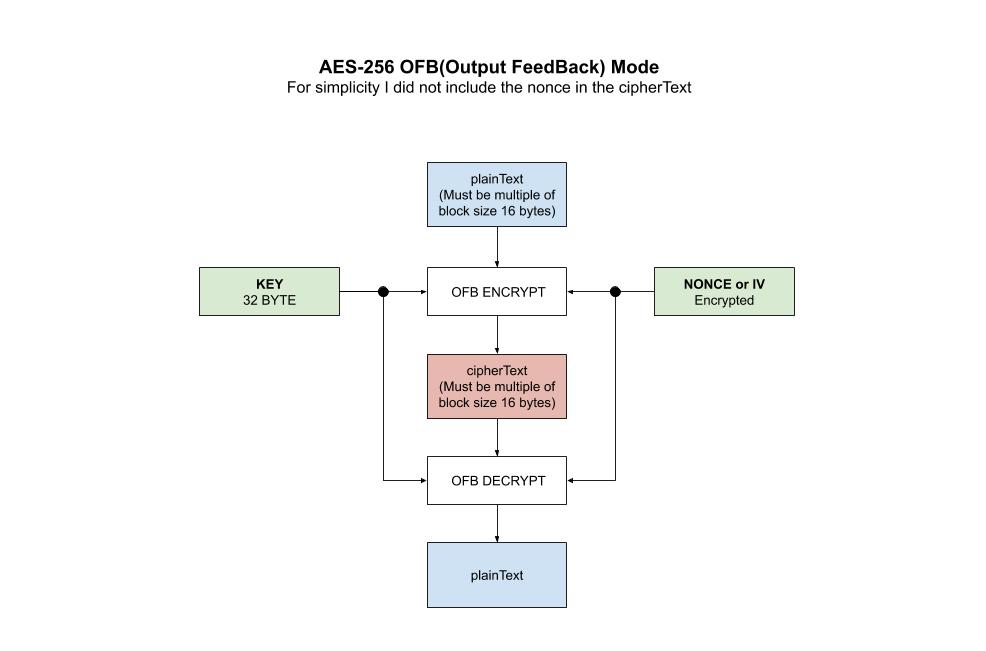

# aes-256-ofb example

_AES-256 **OFB** (**Output FeedBack**) mode
which makes a block cipher into a synchronous stream cipher.
It generates keystream blocks, which are XORed with the plaintext blocks
to get the cipherText._

I have the following AES-256 mode examples,

* [aes-256](https://github.com/JeffDeCola/my-go-examples/tree/master/cryptography/symmetric-cryptography/aes-256)
  No Mode
* [aes-256-cbc](https://github.com/JeffDeCola/my-go-examples/tree/master/cryptography/symmetric-cryptography/aes-256-cbc)
  Cipher Block Chaining
* [aes-256-cfb](https://github.com/JeffDeCola/my-go-examples/tree/master/cryptography/symmetric-cryptography/aes-256-cfb)
  Cipher FeedBack Mode
* [aes-256-ctr](https://github.com/JeffDeCola/my-go-examples/tree/master/cryptography/symmetric-cryptography/aes-256-ctr)
  Counter Mode
* [aes-256-gcm](https://github.com/JeffDeCola/my-go-examples/tree/master/cryptography/symmetric-cryptography/aes-256-gcm)
  Galois/Counter Mode **(I like this one)**
* [aes-256-ofb](https://github.com/JeffDeCola/my-go-examples/tree/master/cryptography/symmetric-cryptography/aes-256-ofb)
  Output FeedBack Mode **(You are here)**

[GitHub Webpage](https://jeffdecola.github.io/my-go-examples/)

## RUN

```go
run aes-ofb.go
```

You output should be,

```txt
Original Text:           This is AES-256 OFB (32 Bytes)!!

The 32-byte Key:         myverystrongpasswordo32bitlength
The Nonce:               0781d57b73411cac0a355394c7de214c

Encrypted Text:          f924dec67731adc6ea519e064a50607da1b62acaefb1444a846a93ca200c4919
Decrypted Text:          This is AES-256 OFB (32 Bytes)!!
```

## HOW IT WORKS

* plainText must be multiple of AES block size, you can add padding
* Nonce should be equal to AES block size
* OFB is block ciphers modes, encryption but not message integrity
* Because of the symmetry of the XOR operation, encryption and
  decryption are exactly the same

For simplicity I did not include the nonce in the cipherText.

Encryption,

```go
// GET CIPHER BLOCK USING KEY
block, err := aes.NewCipher(keyByte)

// GET OFB
ofb := cipher.NewOFB(block, nonce)

// ENCRYPT DATA
ofb.XORKeyStream(cipherTextByte, plainTextByte)

// RETURN HEX
cipherText := hex.EncodeToString(cipherTextByte)
```

Decryption,

```go
// GET CIPHER BLOCK USING KEY
block, err := aes.NewCipher(keyByte)

// GET OFB
ofb := cipher.NewOFB(block, nonce)

// DECRYPT DATA
ofb.XORKeyStream(plainTextByte, cipherTextByte)

// RETURN STRING
plainText := string(plainTextByte[:])
```

This illustration may help,


