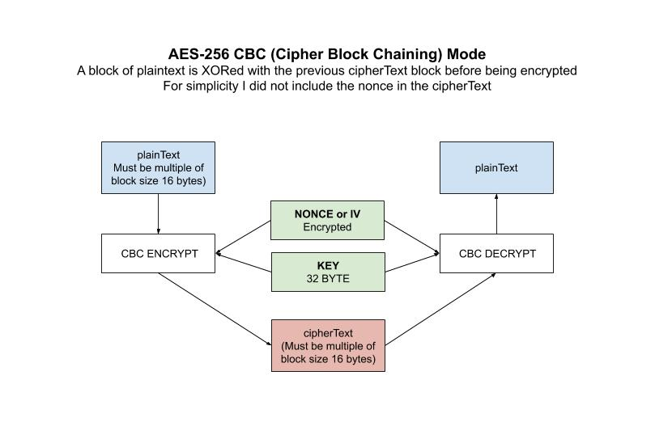

# aes-cbc example

`aes-cbc` _is an example of
_AES-256 **CBC** (**Cipher Block Chaining**) mode
where a block of plaintext is XORed with the previous cipherText block before
being encrypted._

I have the following AES mode examples,

* [aes](https://github.com/JeffDeCola/my-go-examples/tree/master/encryption-decryption/aes)
  No Mode
* [aes-gcm](https://github.com/JeffDeCola/my-go-examples/tree/master/encryption-decryption/aes-gcm)
  Galois/Counter Mode
* [aes-cbc](https://github.com/JeffDeCola/my-go-examples/tree/master/encryption-decryption/aes-cbc)
  Cipher Block Chaining **(You are here)**
* [aes-cfb](https://github.com/JeffDeCola/my-go-examples/tree/master/encryption-decryption/aes-cfb)
  Cipher Feedback Mode
* [aes-ctr](https://github.com/JeffDeCola/my-go-examples/tree/master/encryption-decryption/aes-ctr)
  Counter Mode
* [aes-ofb](https://github.com/JeffDeCola/my-go-examples/tree/master/encryption-decryption/aes-ofb)
  Output Feedback Mode

[GitHub Webpage](https://jeffdecola.github.io/my-go-examples/)

## RUN

```go
run aes-cbc.go
```

You output should be,

```txt
Original Text:           This is AES-256 CBC (32 Bytes)!!

The 32-byte Key:         myverystrongpasswordo32bitlength
The Nonce:               dcde73a548a63e3d0073ad870fd21d7b

Encrypted Text:          8eddd047a775fe81ce5343edb4d5684c16465192ee85f3765bbfb35ddb219e50
Decrypted Text:          This is AES-256 CBC (32 Bytes)!!
```

## HOW IT WORKS

In CBC Mode the given plaintext should be multiple of AES block size.
If the original plaintext lengths are not a multiple of the block size,
padding would have to be added when encrypting.

The IV value should be equal to AES block size.
For simplicity I did not include the nonce in the cipherText.

Encryption,

```go
// GET CIPHER BLOCK USING KEY
block, err := aes.NewCipher(keyByte)

// GET CBC ENCRYPTER
cbc := cipher.NewCBCEncrypter(block, nonce)

// ENCRYPT DATA
cbc.CryptBlocks(cipherTextByte, plaintextByte)

// RETURN HEX
cipherText := hex.EncodeToString(cipherTextByte)
```

Decryption,

```go
// GET CIPHER BLOCK USING KEY
block, err := aes.NewCipher(keyByte)
checkErr(err)

// GET CBC DECRYPTER
cbc := cipher.NewCBCDecrypter(block, nonce)

// DECRYPT DATA
cbc.CryptBlocks(plainTextByte, cipherTextByte)

// RETURN STRING
plainText := string(plainTextByte[:])
```

This illustration may help,


