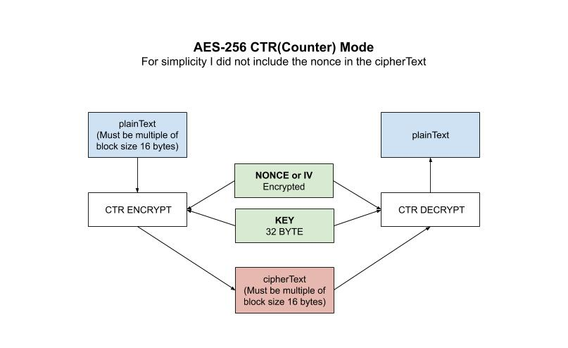

# aes-ctr example

`aes-ctr` _is an example of
AES-256 **CTR** (**Counter**) mode,
which has similar characteristics to OFB, but also
allows a random access property during decryption._

I have the following AES mode examples,

* [aes](https://github.com/JeffDeCola/my-go-examples/tree/master/encryption-decryption/aes)
  No Mode
* [aes-cbc](https://github.com/JeffDeCola/my-go-examples/tree/master/encryption-decryption/aes-cbc)
  Cipher Block Chaining
* [aes-cfb](https://github.com/JeffDeCola/my-go-examples/tree/master/encryption-decryption/aes-cfb)
  Cipher FeedBack Mode
* [aes-ctr](https://github.com/JeffDeCola/my-go-examples/tree/master/encryption-decryption/aes-ctr)
  Counter Mode **(You are here)**
* [aes-gcm](https://github.com/JeffDeCola/my-go-examples/tree/master/encryption-decryption/aes-gcm)
  Galois/Counter Mode **(I like this one)**
* [aes-ofb](https://github.com/JeffDeCola/my-go-examples/tree/master/encryption-decryption/aes-ofb)
  Output FeedBack Mode

[GitHub Webpage](https://jeffdecola.github.io/my-go-examples/)

## RUN

```go
run aes-ctr.go
```

You output should be,

```txt
Original Text:           This is AES-256 CTR (32 Bytes)!!

The 32-byte Key:         myverystrongpasswordo32bitlength
The Nonce:               25ce7cd9388daf451864bb2212b9fbc7

Encrypted Text:          17b697b077d086692632adaae6fc935b245060ed3758fd3d936e4aaf81f31161
Decrypted Text:          This is AES-256 CTR (32 Bytes)!!
```

## HOW IT WORKS

* The Counter (CTR) mode has similar characteristics to OFB
* Allows a random access property during decryption
* Well suited to operate on a multi-processor
  machine where blocks can be encrypted in parallel
* plaintext should be multiple of AES block size,
  hence padding would have to be added when encrypting (Not in this example)
* Because of the symmetry of the XOR operation, encryption and decryption
  are exactly the same.

For simplicity I did not include the nonce in the cipherText.

Encryption,

```go
// GET CIPHER BLOCK USING KEY
block, err := aes.NewCipher(keyByte)
checkErr(err)

// GET CTR
ctr := cipher.NewCTR(block, nonce)

// ENCRYPT DATA
ctr.XORKeyStream(cipherTextByte, plainTextByte)

// RETURN HEX
cipherText := hex.EncodeToString(cipherTextByte)
```

Decryption,

```go
// GET CIPHER BLOCK USING KEY
block, err := aes.NewCipher(keyByte)
checkErr(err)

// GET CTR
ctr := cipher.NewCTR(block, nonce)

// DECRYPT DATA
ctr.XORKeyStream(plainTextByte, cipherTextByte)

// RETURN STRING
plainText := string(plainTextByte[:])
```

This illustration may help,


