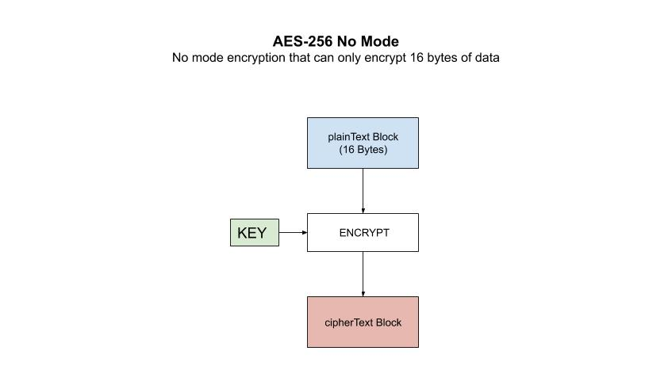

# aes example

`aes` _is an example of
AES-256 **No Mode**
can only encrypt/decrypt 16 bytes of data._

I have the following AES mode examples,

* [aes](https://github.com/JeffDeCola/my-go-examples/tree/master/encryption-decryption/aes)
  No Mode **(You are here)**
* [aes-cbc](https://github.com/JeffDeCola/my-go-examples/tree/master/encryption-decryption/aes-cbc)
  Cipher Block Chaining
* [aes-cfb](https://github.com/JeffDeCola/my-go-examples/tree/master/encryption-decryption/aes-cfb)
  Cipher FeedBack Mode
* [aes-ctr](https://github.com/JeffDeCola/my-go-examples/tree/master/encryption-decryption/aes-ctr)
  Counter Mode
* [aes-gcm](https://github.com/JeffDeCola/my-go-examples/tree/master/encryption-decryption/aes-gcm)
  Galois/Counter Mode **(I like this one)**
* [aes-ofb](https://github.com/JeffDeCola/my-go-examples/tree/master/encryption-decryption/aes-ofb)
  Output FeedBack Mode

[GitHub Webpage](https://jeffdecola.github.io/my-go-examples/)

## RUN

```go
run aes.go
```

Your output should be,

```txt
Original Text:           Hello Jeff, only 16 Bytes of this will be encrypted.

The 32-byte Key:         myverystrongpasswordo32bitlength

Encrypted Text:          1d3288a55c1b74826395bd823d7cf0a2
Decrypted Text:          Hello Jeff, only
```

## HOW IT WORKS

This example is simple and very limiting and has `no mode`.
It will only encrypt 16 bytes of data.

Encryption,

```go
// ENCRYPT DATA
block.Encrypt(cipherTextByte, plaintextByte)
```

Decryption,

```go
// DeCRYPT DATA
block.Decrypt(plainTextByte, cipherTextByte)
```

This illustration may help,


