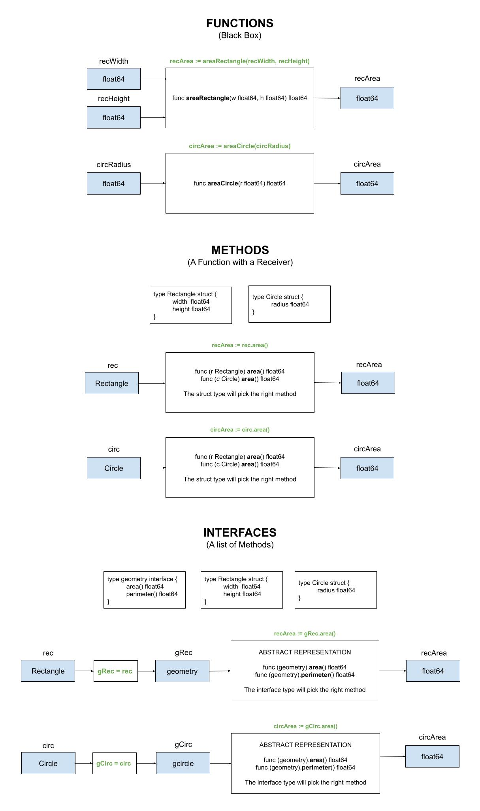

# FUNCTIONS EXAMPLE

_Using functions to calculate the area of a rectangle and circle._

Other examples using,

* **FUNCTIONS**
  * [functions](https://github.com/JeffDeCola/my-go-examples/tree/master/functions-methods-interfaces/functions/functions)
    **<- YOU ARE HERE**
  * [functions-pointers-parameters](https://github.com/JeffDeCola/my-go-examples/tree/master/functions-methods-interfaces/functions/functions-pointers-parameters)
* **METHODS**
  * [methods](https://github.com/JeffDeCola/my-go-examples/tree/master/functions-methods-interfaces/methods/methods)
  * [methods-pointers-parameters](https://github.com/JeffDeCola/my-go-examples/tree/master/functions-methods-interfaces/methods/methods-pointers-parameters)
  * [methods-pointers-receivers](https://github.com/JeffDeCola/my-go-examples/tree/master/functions-methods-interfaces/methods/methods-pointers-receivers)
* **INTERFACES**
  * [interfaces](https://github.com/JeffDeCola/my-go-examples/tree/master/functions-methods-interfaces/interfaces/interfaces)
  * [interfaces-pointers-parameters](https://github.com/JeffDeCola/my-go-examples/tree/master/functions-methods-interfaces/interfaces/interfaces-pointers-parameters)
  * [interfaces-pointers-receivers](https://github.com/JeffDeCola/my-go-examples/tree/master/functions-methods-interfaces/interfaces/interfaces-pointers-receivers)
  * [shapes-package](https://github.com/JeffDeCola/my-go-examples/tree/master/functions-methods-interfaces/interfaces/shapes-package)

tl;dr,

```go
// SYNTAX
    // (receiver) func (parameters) (return parameters)

// FUNCTIONS

    // USING RETURNS
        func areaRectangle(w float64, h float64) float64 {    
        recArea := areaRectangle(recWidth, recHeight)
    // USING POINTERS IN PARAMETERS
        func areaRectangle(w float64, h float64, a *float64) {
        var recArea float64
        areaRectangle(recWidth, recHeight, &recArea)

// METHODS

    // USING RETURNS
        func (r Rectangle) area() float64 {
        rec := Rectangle{2.4, 34.4}
        recArea := rec.area()
    // USING POINTERS IN PARAMETERS
        func (r Rectangle) area(a *float64) {
        rec := Rectangle{2.4, 34.4}
        var recArea float64
        rec.area(&recArea)
     // USING POINTERS IN RECEIVERS
        func (r *Rectangle) size(f factor) {
        rec := Rectangle{2.4, 34.4} // We want to change this
        rec.size(2)

// INTERFACES
    
    // USING RETURNS
        func (geometry).area() float64 // Abstract representation
        rec := Rectangle{2.4, 34.4}
        var gRec geometry
        gRec = rec
        recArea := gRec.area()
    // USING POINTERS IN PARAMETERS
        func (geometry).area()(*float64) // Abstract representation
        rec := Rectangle{2.4, 34.4}
        var gRec geometry
        var recArea float64
        gRec = rec
        gRec.area(&recArea)
    // USING POINTERS IN RECEIVERS
        func (geometry).size()(*float64) // Abstract representation
        rec := Rectangle{2.4, 34.4} // We want to change this
        var gRec geometry
        gRec = &rec // Note this
        gRec.size(2)
```

Table of Contents

* [OVERVIEW](https://github.com/JeffDeCola/my-go-examples/tree/master/functions-methods-interfaces/functions/functions#overview)
* [RUN](https://github.com/JeffDeCola/my-go-examples/tree/master/functions-methods-interfaces/functions/functions#run)
* [TEST](https://github.com/JeffDeCola/my-go-examples/tree/master/functions-methods-interfaces/functions/functions#test)
* [AN ILLUSTRATION THAT MAY HELP](https://github.com/JeffDeCola/my-go-examples/tree/master/functions-methods-interfaces/functions/functions#an-illustration-that-may-help)

## OVERVIEW

Define the rectangle,

```go
var recWidth float64 = 2.4
var recHeight float34 = 34.4
```

Calculate the area using a function,

```go
recArea := areaRectangle(recWidth, recHeight)
```

The rectangle function,

```go
func areaRectangle(w float64, h float64) float64 {
    area := w * h
    return area
}
```

## RUN

To run,

```bash
go run main.go
```

## TEST

To create _test files,

```bash
gotests -w -all main.go
```

To unit test the code,

```bash
go test -cover ./... 
```

## AN ILLUSTRATION THAT MAY HELP


