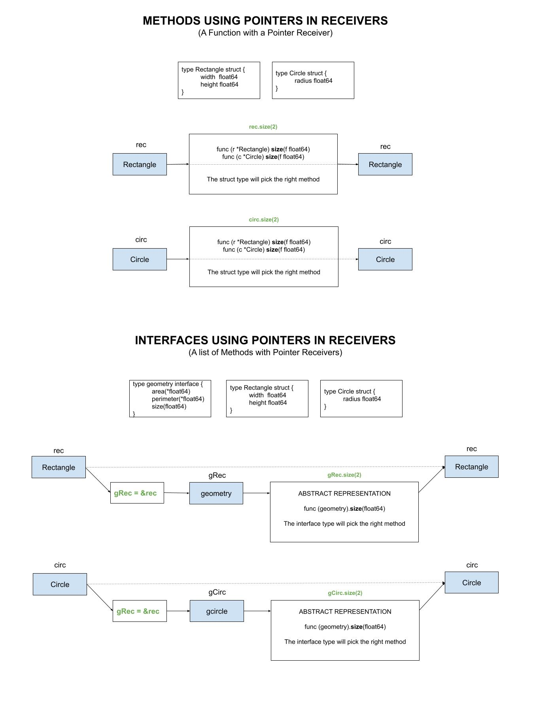

# geometry-package

 _Using an interface to calculate the area and perimeter of a rectangle,
circle and triangle via a geometry package.
It uses pointers for arguments and receivers._

Other examples using,

* **FUNCTIONS**
  * [functions](https://github.com/JeffDeCola/my-go-examples/tree/master/functions-methods-interfaces/functions/functions)
  * [functions-pointers-arguments](https://github.com/JeffDeCola/my-go-examples/tree/master/functions-methods-interfaces/functions/functions-pointers-arguments)
* **METHODS**
  * [methods](https://github.com/JeffDeCola/my-go-examples/tree/master/functions-methods-interfaces/methods/methods)
  * [methods-pointers-arguments](https://github.com/JeffDeCola/my-go-examples/tree/master/functions-methods-interfaces/methods/methods-pointers-arguments)
  * [methods-pointers-receivers](https://github.com/JeffDeCola/my-go-examples/tree/master/functions-methods-interfaces/methods/methods-pointers-receivers)
* **INTERFACES**
  * [interfaces](https://github.com/JeffDeCola/my-go-examples/tree/master/functions-methods-interfaces/interfaces/interfaces)
  * [interfaces-pointers-arguments](https://github.com/JeffDeCola/my-go-examples/tree/master/functions-methods-interfaces/interfaces/interfaces-pointers-arguments)
  * [interfaces-pointers-receivers](https://github.com/JeffDeCola/my-go-examples/tree/master/functions-methods-interfaces/interfaces/interfaces-pointers-receivers)
  * [geometry-package](https://github.com/JeffDeCola/my-go-examples/tree/master/functions-methods-interfaces/interfaces/geometry-package)
    **<- YOU ARE HERE**

tl;dr,

```go
// SYNTAX
    // (receiver) func (arguments) (return arguments)

// FUNCTIONS

    // USING RETURNS
        func areaRectangle(w float64, h float64) float64 {    
        recArea := areaRectangle(recWidth, recHeight)
    // USING POINTERS IN ARGUMENTS
        func areaRectangle(w float64, h float64, a *float64) {
        var recArea float64
        areaRectangle(recWidth, recHeight, &recArea)

// METHODS

    // USING RETURNS
        func (r Rectangle) area() float64 {
        rec := Rectangle{2.4, 34.4}
        recArea := rec.area()
    // USING POINTERS IN ARGUMENTS
        func (r Rectangle) area(a *float64) {
        rec := Rectangle{2.4, 34.4}
        var recArea float64
        rec.area(&recArea)
     // USING POINTERS IN RECEIVERS
        func (r *Rectangle) size(f factor) {
        rec := Rectangle{2.4, 34.4} // We want to change this
        rec.size(2)

// INTERFACES
    
    // USING RETURNS
        func (geometry).area() float64 // Abstract representation
        rec := Rectangle{2.4, 34.4}
        var gRec geometry
        gRec = rec
        recArea := gRec.area()
    // USING POINTERS IN ARGUMENTS
        func (geometry).area()(*float64) // Abstract representation
        rec := Rectangle{2.4, 34.4}
        var gRec geometry
        var recArea float64
        gRec = rec
        gRec.area(&recArea)
    // USING POINTERS IN RECEIVERS
        func (geometry).size()(*float64) // Abstract representation
        rec := Rectangle{2.4, 34.4} // We want to change this
        var gRec geometry
        gRec = &rec // Note this
        gRec.size(2)
```

Table of Contents,

* [OVERVIEW](https://github.com/JeffDeCola/my-go-examples/tree/master/functions-methods-interfaces/interfaces/geometry-package#overview)
* [RUN](https://github.com/JeffDeCola/my-go-examples/tree/master/functions-methods-interfaces/interfaces/geometry-package#run)
* [TEST](https://github.com/JeffDeCola/my-go-examples/tree/master/functions-methods-interfaces/interfaces/geometry-package#test)
* [AN ILLUSTRATION THAT MAY HELP](https://github.com/JeffDeCola/my-go-examples/tree/master/functions-methods-interfaces/interfaces/geometry-package#an-illustration-that-may-help)

Documentation and reference,

* This repos [github webpage](https://jeffdecola.github.io/my-go-examples/)

## OVERVIEW

The power of interfaces really shine when you have a package.
Because you can have one interface that does a lot of things
like a geometry shapes package.

Defines the shapes using a struct,

```go
rec := geometry.Rectangle{
    Width:  2.4,
    Height: 34.4,
}
circ := geometry.Circle{
    Radius: 2.3,
}
tri := geometry.Triangle{
    A: 2,
    B: 3.3,
    C: 4,
}
```

Calculate area and perimeter using a interface,

```go
var gRec geometry.Geometry
var gCirc geometry.Geometry
var gTri geometry.Geometry
var recArea, circArea, triArea float64
var recPerimeter, circPerimeter, triPerimeter float64

gRec = &rec
gCirc = &circ
gTri = &tri

// CALCULATE AREA PERIMETER
gRec.Area(&recArea)
gRec.Perimeter(&recPerimeter)
gCirc.Area(&circArea)
gCirc.Perimeter(&circPerimeter)
gTri.Area(&triArea)
gTri.Perimeter(&triPerimeter)

// INCREASE SIZE BY A FACTOR OF 2 USING POINTER RECIEVER
gRec.Size(2)
gCirc.Size(2)
TTri.Size(2)
```

Where the interface is,

```go
type Geometry interface {
    Area(*float64)
    Perimeter(*float64)
    Size(float64)
}
```

## RUN

To run,

```bash
go run geometry-package.go
```

## TEST

To create _test files,

```bash
cd geometry
gotests -w -all geometry.go
```

To unit test the code,

```bash
go test -cover ./... 
```

## AN ILLUSTRATION THAT MAY HELP


