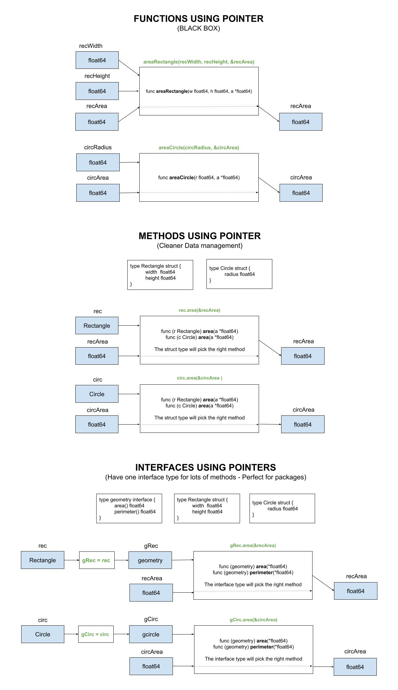

# interfaces-pointers-arguments

_Using an interface to calculate the area of a rectangle and circle
by passing pointers._

Other examples using,

* Functions using
  * [returns](https://github.com/JeffDeCola/my-go-examples/tree/master/basic-syntax/functions/area-shapes-functions)
  * [pointers](https://github.com/JeffDeCola/my-go-examples/tree/master/basic-syntax/functions/area-shapes-functions-ptrs)
* Methods using
  * [returns](https://github.com/JeffDeCola/my-go-examples/tree/master/basic-syntax/methods/area-shapes-methods)
  * [pointers](https://github.com/JeffDeCola/my-go-examples/tree/master/basic-syntax/methods/area-shapes-methods-ptrs)
* Interface using
  * [returns](https://github.com/JeffDeCola/my-go-examples/tree/master/basic-syntax/interfaces/area-shapes-interfaces)
  * [pointers](https://github.com/JeffDeCola/my-go-examples/tree/master/basic-syntax/interfaces/area-shapes-interfaces-ptrs)
    **<- YOU ARE HERE**
  * [pointers](https://github.com/JeffDeCola/my-go-examples/tree/master/basic-syntax/interfaces/area-shapes-interfaces-ptrs-x2)
    (multiply structs by 2)
  * [returns using a package](https://github.com/JeffDeCola/my-go-examples/tree/master/basic-syntax/interfaces/shapes-package)
  * [pointers using a package](https://github.com/JeffDeCola/my-go-examples/tree/master/basic-syntax/interfaces/shapes-package-ptrs)
  
tl;dr,

```go
// FUNCTION
    // USING RETURN
    recArea := areaRectangle(recWidth, recHeight)
    // USING POINTER
    var recArea float64
    areaRectangle(recWidth, recHeight, &recArea)
// METHOD
    // USING RETURN
    rec := Rectangle{2.4, 34.4}
    recArea := rec.area()
    // USING POINTER
    rec := Rectangle{2.4, 34.4}
    var recArea float64
    rec.area(&recArea)
// INTERFACE
    // USING RETURN
    rec := Rectangle{2.4, 34.4}
    var gRec geometry
    gRec = rec
    recArea := gRec.area()
    // USING POINTER
    rec := Rectangle{2.4, 34.4}
    var gRec geometry
    var recArea float64
    gRec = rec
    gRec.area(&recArea)
```

Table of Contents,

* [OVERVIEW](https://github.com/JeffDeCola/my-go-examples/tree/master/basic-syntax/interfaces/area-shapes-interfaces-ptrs-ptrs#overview)
  * [WRAP INTERFACE IN A FUNCTION](https://github.com/JeffDeCola/my-go-examples/tree/master/basic-syntax/interfaces/area-shapes-interfaces-ptrs-ptrs#wrap-interface-in-a-function)
* [RUN](https://github.com/JeffDeCola/my-go-examples/tree/master/basic-syntax/interfaces/area-shapes-interfaces-ptrs-ptrs#run)
* [TEST](https://github.com/JeffDeCola/my-go-examples/tree/master/basic-syntax/interfaces/area-shapes-interfaces-ptrs-ptrs#test)
* [AN ILLUSTRATION THAT MAY HELP](https://github.com/JeffDeCola/my-go-examples/tree/master/basic-syntax/interfaces/area-shapes-interfaces-ptrs-ptrs#an-illustration-that-may-help)

Documentation and reference,

* This repos [github webpage](https://jeffdecola.github.io/my-go-examples/)

## OVERVIEW

Define the rectangle using a struct,

```go
type Rectangle struct {
    width  float64
    height float64
}

rec := Rectangle{2.4, 34.4}
```

Calculate the area using a interface,

```go
var gRec geometry
var recArea float64
gRec = rec
gRec.area(&recArea)
```

Where the interface is,

```go
type geometry interface {
    area(*float64)
    perimeter(*float64)
}
```

Which will chose the area method that has a Rectangle struct,

```go
func (r Rectangle) area(a *float64) {
    *a = r.width * r.height
}
```

## RUN

To run,

```bash
go run area-shapes-interfaces-ptrs.go
```

## TEST

To create _test files,

```bash
gotests -w -all area-shapes-interfaces-ptrs.go
```

To unit test the code,

```bash
go test -cover ./... 
```

## AN ILLUSTRATION THAT MAY HELP


