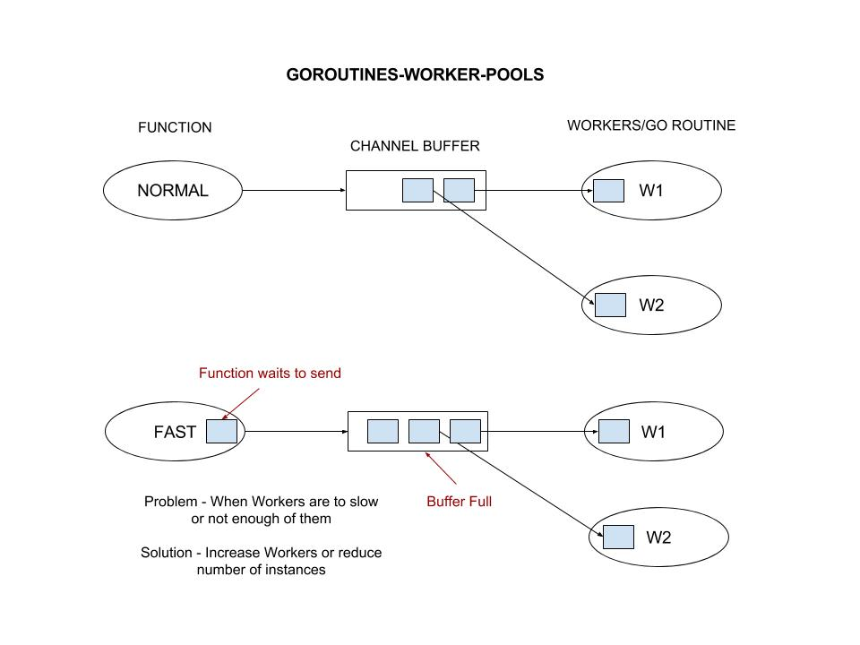

# goroutines-worker-pools example

`goroutines-worker-pools`  _is an example of concurrency using a
worker pool with goroutines and channels._

[GitHub Webpage](https://jeffdecola.github.io/my-go-examples/)

## GOROUTINE (CONCURRENCY)

You set the number of workers.

You can set the number of times you need to use the workers (per tick) via numbers of
instances and metrics.

If the numbers of workers you need to use during a tick time does not finish,
it will skip some tick time so the workers can catch up.

