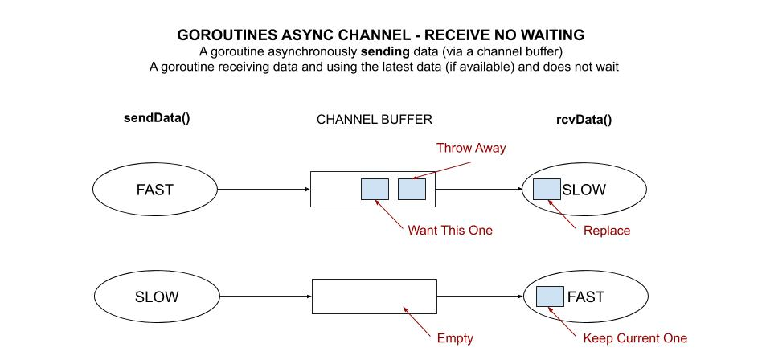

# goroutines-async-channel-receive-no-waiting

`goroutines-async-channel-receive-no-waiting`  _is an example of
A goroutine asynchronously sending data (via a channel buffer) and a goroutine
receiving that data, using the latest (if available) and does not wait._

[GitHub Webpage](https://jeffdecola.github.io/my-go-examples/)

## ASYNCHRONOUS CHANNEL

`sendData()` will,

* Send data every x seconds to the channel buffer

`rcvData()` will,

* Read the latest data from the channel buffer (if available)
* If there are no data, just use the previous data



## rcvData() FUNCTION - NO WAITING

The `rcvData()' function asynchronously reads from the channel buffer.

Since the channel is asynchronous, the channel buffer could be empty or full
depending on how much faster or slower the `sendData()` goroutine is.
Hence, we don't want the `rvcData()` function to wait.

To solve the problem of the `rvcData()' function waiting around,

* If there is something in channel
  * Read and continue reading until empty channel (hence, get latest one)
  * break out of loop like above
* If there is nothing in channel
  * default and break out of the loop

```go
for {
    select {
    case newVal := <-rcvCh:
        data = newVal
        fmt.Printf("%40d - Received data %v\n", counter, data)
        continue
    default:
    }
    break
}
```

## RUN

```bash
go run goroutines-async-channel-receive-no-waiting.go
```

Try slowing down or speeding up the goroutines,

```go
sendSpeedSeconds = X
rcvSpeedSeconds = X
```
