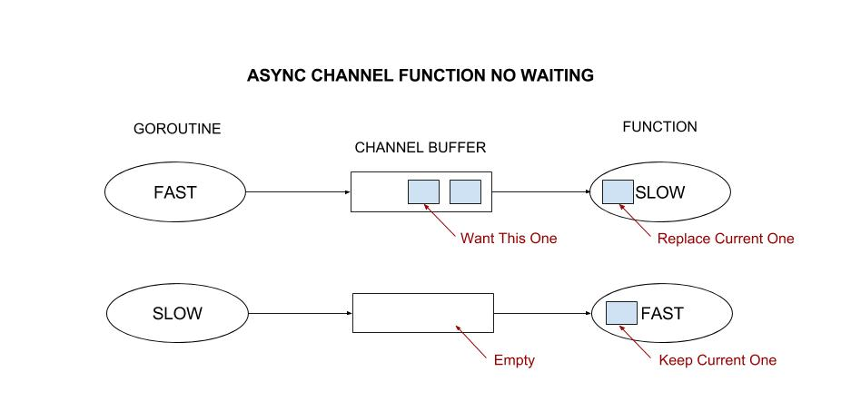

# async-channel-no-waiting example

`async-channel-no-waiting`  _is an example of a gorouting asynchronously sending data
(via a channel) to a function that uses the latest data (if available) and does not wait._

[GitHub Webpage](https://jeffdecola.github.io/my-go-examples/)

## ASYNCHRONOUS CHANNEL

The goal of the goroutine `getInstances()` is to:

    * Get `instances`.
    * Send to the channel buffer.

The goal of the function `usingInstances()` is to:

    * Read the latest instances from the channel.
    * If there are no instances, just use the previous ones.

The assumption is that the instances can constantly
change so you always want the most recent list.

## MAGIC IN THE usingInstance() FUNCTION - NO WAITING

The `usingInstances()' function asynchronously reads from the channel buffer.

Since the channel is asynchronous, the channel buffer could be empty or full
depending on how much faster or slower the `getInstances()` goroutine is.
Hence, we don't want the `usingInstances()' function to wait.

To solve the problem of the `usingInstances()' function waiting around:

* If there is nothing in channel:
  * default and break out of loop
* If there is something in channel:
  * read and continue until empty channel (hence, get latest)
  * break out of loop like above

```go
for {
    select {
    case newVal := <-instanceListCh:
        instanceList = newVal
        continue
    default:
    }
    break
}
```



## TRY SLOWING OR SPEDDING UP GOROUTINE

Try slowing down or speeding up the goroutine or fuction
to see if everything works as explained above.

```go
var getInstanceSpeedSeconds = xx
var usingInstancesSpeedSeconds = xx
```
