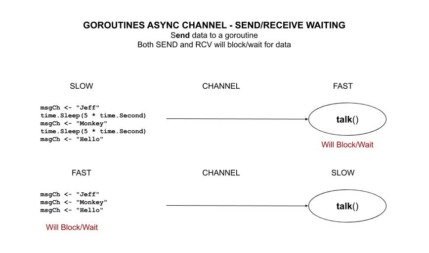

# goroutines-async-channel-send-receive-waiting example

`goroutines-async-channel-send-receive-waiting`  _is an example of
sending data to a goroutine via an async channel.
Both SEND and RCV will block/wait for data._

[GitHub Webpage](https://jeffdecola.github.io/my-go-examples/)

## CHANNELS (MESSAGE PASSING)

Giving a channel `msgCh`,

Send,

```go
msgCh <- "Jeff"                             // WAITS/BLOCKS
```

Receive,

```go
say = <-msgCh                               // ALSO WAITS/BLOCKS
```



## RUN

```bash
go run goroutines-async-channel-send-receive-waiting.go
```

Output is always,

```txt
Sent message Jeff
                             0 Received message Jeff
Sent message Clif
                             1 Received message Clif
Sent message Jack
                             2 Received message Jack
Sent message Jill
                             3 Received message Jill
```

Try slowing down or speeding up the SEND or RCV and you will always
get the same result because both sides block/wait.
