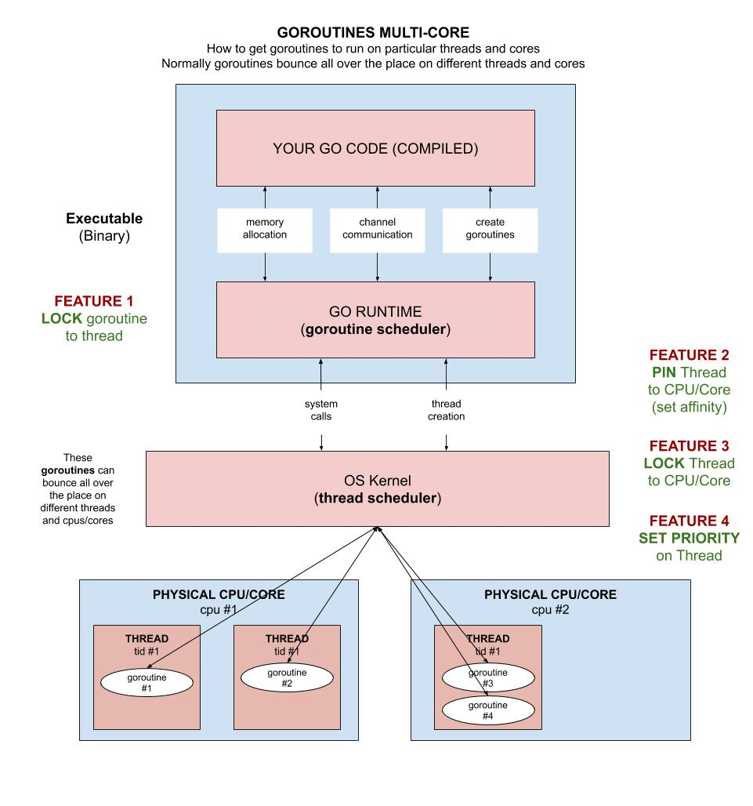

# goroutines-multi-core example

`goroutines-multi-core`  _is an example of
concurrency across multi-cores._

[GitHub Webpage](https://jeffdecola.github.io/my-go-examples/)

## SETUP

This program will allow you to set the numbers of workers per core and check the
statistics of each process and core.

```go
// GO RUNTIME
const numberCores = 5                       // Number of CPU you want to use
const lockthreads = true                    // locked the goroutine to a thread

// WORKERS
const useGoroutine = true                   // Do you want to use goroutines
const numberWorkers = 3                     // Number of workers
const timeWork = 5                          // Amount of time it takes a worker to finish

// BUFFER CHANNEL
var channelBufferSize = numberWorkers + 1   // How many channel buffers
```

This diagram will help explain what we are trying to do,



## GOROUTINES AND THREADS

You go executable has the go runtime in it, so it schedules the goroutine to a thread.
And this can goroutine can use many threads.  So to make this program easier to understand
we are forcing the go runtime environment to lock a goroutine to a particular thread.

```go
runtime.LockOSThread()
```

## RUN

```go
go run goroutines-multi-core.go
```
