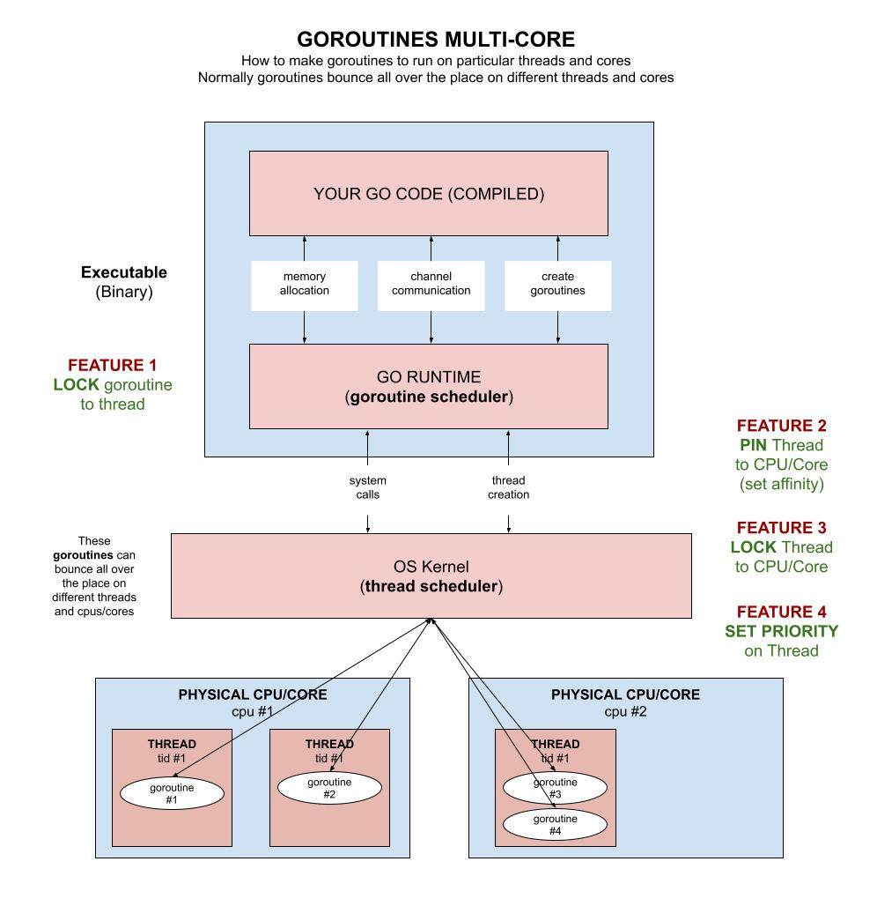

# goroutines-multi-core example

_Concurrency across multi-cores. You can play around with workers,
threads, cpus/cores and nice to find the fastest performance.
It will find the total amount of prime numbers up to a number._

This program will show that **lightweight goroutines are amazing**.

Other examples using,

* [goroutines-multi-core](https://github.com/JeffDeCola/my-go-examples/tree/master/goroutines/goroutines-multi-core)
  **<- You are here**
* [goroutines-waitgroup](https://github.com/JeffDeCola/my-go-examples/tree/master/goroutines/goroutines-waitgroup)
* [goroutines-worker-pools](https://github.com/JeffDeCola/my-go-examples/tree/master/goroutines/goroutines-worker-pools)

Table of contents,

* ???

Documentation and references,

* This repos [github webpage](https://jeffdecola.github.io/my-go-examples/)

## MACOS DOES NOT WORK

I could not get the c code to run on macOS and did not spend the time to
figure it out. But if someone figures this out, please let me know.

## OVERVIEW

Your go executable has a go runtime environment that schedules
where the goroutines run (which CPU and which thread).
This is constantly changing.

This example will show you how to `lock the goroutine` to a particular
CPU and a particular thread.

This example will also allow you to change variables (like how many workers) to
see if you can improve performance.

This diagram will help explain what we're trying to do,



## SETUP

This program will allow you to set the numbers of workers per core and check the
statistics of each process and core.

```go
// FEATURE 1 - LOCK A GOROUTINE TO A THREAD
    const lockThread = true                 // locked the goroutine to a thread (Done in go runtime)

// FEATURE 2 - PIN A THREAD TO A CPU (set affinity)
    const useParticularCPUs = true          // Do you want to use particular CPUs?
    var usetheseCPUs = []int{0,1,2,3}       // Which CPU/Cores to use. These will rotate

// FEATURE 3 - LOCK A THREAD TO A CPU/CORE
    const lockCore = true                   // locked the thread to a core (Done in C)

// FEATURE 4 - SET PRIORITY ON THREAD
    const setPriority = true                // Set the thread priority the goroutine
    const setPriorityLevel = 7              // (0 to 39 with 0 highest)

// WORKERS
    const useGoroutine = true               // Do you want to use goroutines
    const numberWorkers = 5                 // Number of workers
    const testforPrimes = 20000             // Find all prime numbers up to this number (brute force way)
                                            // This must be divisible by the numberWorkers

// BUFFER CHANNEL
    var channelBufferSize = numberWorkers + 1 // How many channel buffers
```

The workload will simple split the workload (finding a prime number)
over the number of workers.  For example if you have
5 workers and you are trying to find out how many numbers are prime under 1000,
worker 1 will get numbers 1-200, worker 2, 201-400 and so on.

## GO RUNTIME FEATURES

I added some features you can play around to see what gives you the better performance.

### FEATURE 1 - LOCK A GOROUTINE TO A THREAD

The `go runtime` will schedule goroutines to cores and threads.  And this
can change a lot.  No goroutine is locked to a particular thread or a
particular core.

```go
// Lock this goroutine to a particular thread (go runtime won't change threads)
if lockThread {
    runtime.LockOSThread()
    defer runtime.UnlockOSThread()
}
```

## OS KERNAL FEATURES

These require c code or system calls to the kernal.

### FEATURE 2 - PIN A THREAD TO A CPU (set affinity)

This is a little more tricky and needs a bit of C code.
What its really doing is pinning a thread to a cpu.

```go
// Set thread to a particular Core/CPU - Set affinity()
C.set_affinity(useCPU)
```

### FEATURE 3 - LOCK A THREAD TO A CPU/CORE

This is also outside go and uses C.  So since we now have a locked thread,
and we are on a particular CPU, lets lock that thread to a CPU.

```go
// Now lock this thread to the Core/CPU you are on 
if lockCore {
    // Get the cpu your are on
    cpuID := C.sched_getcpu()
    // lock the thread to a cpu
    C.lock_thread(C.int(cpuID))
}
```

### FEATURE 4 - SET PRIORITY ON THREAD

I believe setting it works, but getting the value and printing it out is
always off a little. So take my nice code with a grain of salt.
I will have to revisit this at some point.

```go
startthreadPriority, _ := syscall.Getpriority(syscall.PRIO_PROCESS, 0)
if setPriority {
    err := syscall.Setpriority(syscall.PRIO_PROCESS, 0, setPriorityLevel)
    ...
}
```

## RUN

```bash
go run goroutines-multi-core.go
```

Simply press return to exit.

Check a pid, nice levels and show threads,

```bash
ps -lTp <pid>
```

## SOME BENCHMARKS

OK, after all that work, here is the gravy.
For calculating all primes up to 200,000 (17,984 primes)

Running on my rig,

| Focus     | LOCK goroutine | NUM CPUs | LOCK Thread | Priority | Workers |          Time |
|:----------|---------------:|--------:|------------:|---------:|---------:|--------------:|
|   Workers |              N |       1 |           N |  default |       50 |     25.532367 |
|           |              N |       1 |           N |  default |      500 |     22.465188 |
|           |              N |       1 |           N |  default |     2000 |     22.259715 |
|           |              N |       1 |           N |  default |    20000 |     20.062055 |
|   Lock GR |              Y |       1 |           N |  default |       50 |     24.042777 |
|           |              Y |       1 |           N |  default |      500 |     22.255453 |
|           |              Y |       1 |           N |  default |     2000 |     21.577278 |
|           |              Y |       1 |           N |  default |    20000 |     19.667587 |
|     CPU 8 |              N |       8 |           N |  default |       50 |     24.942142 |
|           |              N |       8 |           N |  default |      500 |     21.898585 |
|           |              N |       8 |           N |  default |     2000 |     21.253711 |
|           |              N |       8 |           N |  default |    20000 |     19.375311 |
|    CPU 16 |              N |      16 |           N |  default |       50 |     22.748823 |
|           |              N |      16 |           N |  default |      500 |     21.665127 |
|           |              N |      16 |           N |  default |     2000 |     21.284461 |
|           |              N |      16 |           N |  default |    20000 |     19.730614 |
|  Lock Thd |              N |       1 |           Y |  default |       50 |     23.949443 |
|           |              N |       1 |           Y |  default |      500 |     21.841208 |
|           |              N |       1 |           Y |  default |     2000 |     22.090544 |
|           |              N |       1 |           Y |  default |    20000 |     19.762526 |
|     Pri O |              N |       1 |           N |        0 |       50 |     23.553114 |
|           |              N |       1 |           N |        0 |      500 |     21.522687 |
|           |              N |       1 |           N |        0 |     2000 |     21.230785 |
|           |              N |       1 |           N |        0 |    20000 |     19.401425 |

From the above I tried to find the sweet spot,

| Focus     | LOCK goroutine | NUM CPUs | LOCK Thread | Priority | Workers |          Time |
|:----------|---------------:|--------:|------------:|---------:|---------:|--------------:|
|           |              Y |      16 |           Y |        0 |    20000 |     18.912954 |
|           |              Y |      16 |           Y |        0 |    50000 |     15.456460 |

You can see the **more routines doing a small calculations** is the key.
Lightweight goroutines are amazing.

## TEST

To create _test files,

```bash
gotests -w -all channels-buffered.go
```

To unit test the code,

```bash
go test -cover ./... 
```

## COMMUNICATIONS ILLUSTRATION

This illustration may help,


