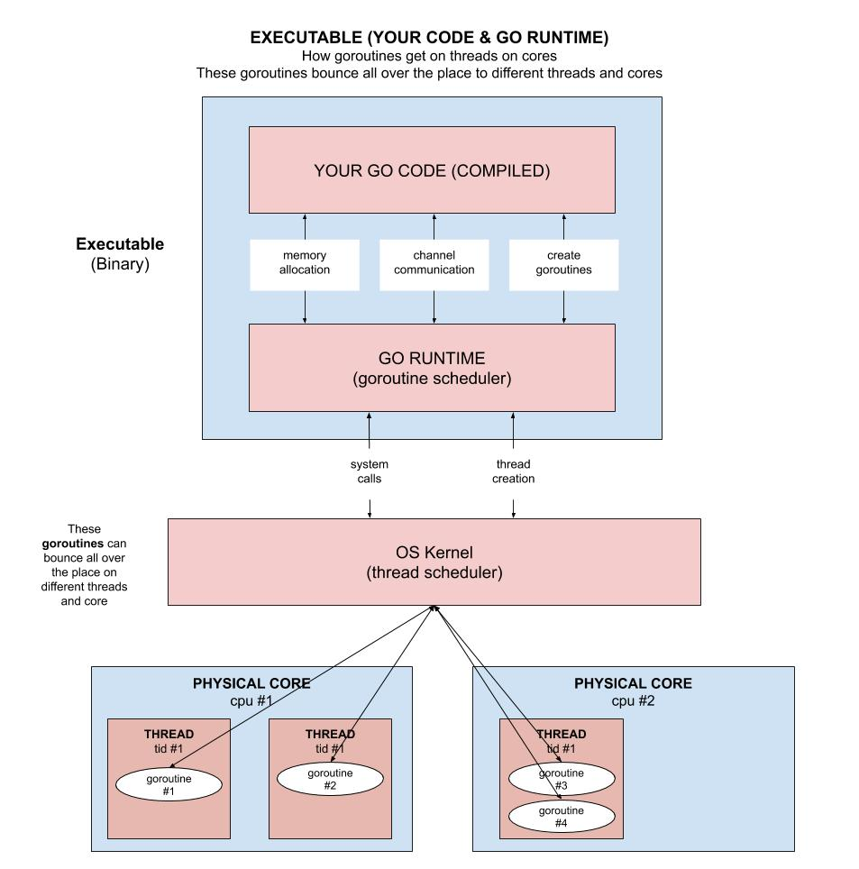

# goroutines-multi-core example

`goroutines-multi-core`  _is an example of
concurrency across multi-cores._

[GitHub Webpage](https://jeffdecola.github.io/my-go-examples/)

## OVERVIEW

Your go executable has a go runtime environment that schedules
where the goroutines run (which CPU and which thread).
This is constantly changing.

This example will show you how to `lock the goroutine` to a particular
CPU and particular thread.

This diagram will help explain what we are trying to do,



## SETUP

This program will allow you to set the numbers of workers per core and check the
statistics of each process and core.

```go
??????? UPDATE
```

## LOCK YOUR GOROUTINE

The `go runtime` will schedule goroutines to cores and threads.  And this
can change a lot.  No goroutine is locked to a particular thread or a
particular core.

### LOCK A GOROUTINE TO A THREAD

```go
// Lock this goroutine to a particular thread (go runtime won't change threads)
if lockThread {
    runtime.LockOSThread()
    defer runtime.UnlockOSThread()
}
```

### PIN A GOROUTINE TO A CPU (set affinity)

This is a little more tricky and needs a bit of C code.

```go
// Set goroutine to a particular Core/CPU - Set affinity()
C.set_affinity(useCPU)
```

### LOCK A THREAD TO A CPU/CORE

This is also outside go and uses C.  So since we now have a locked thread,
and we are on a particular CPU, lets lock that thread to a CPU.

```go
// Now lock this thread to the Core/CPU you are on 
if lockCore {
    // Get the cpu your are on
    cpuID := C.sched_getcpu()
    // lock the thread to a cpu
    C.lock_thread(C.int(cpuID))
}
```

## RUN

```go
go run goroutines-multi-core.go
```

Check a pid


