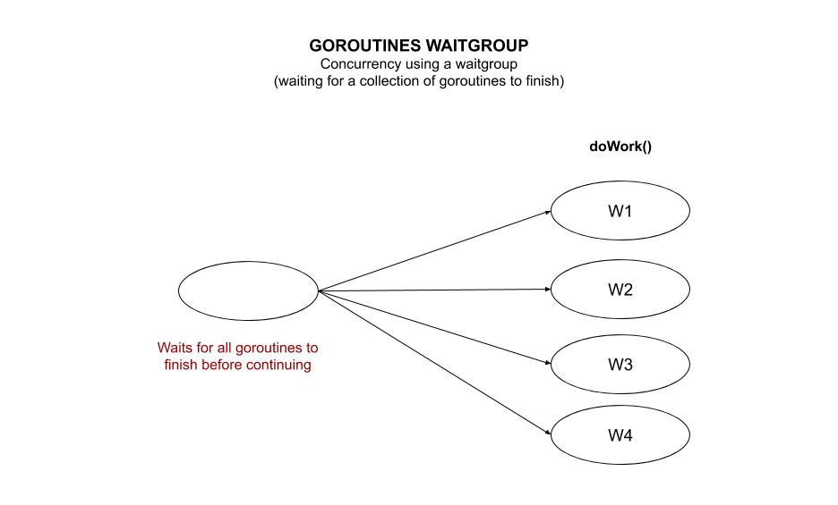

# goroutines-waitgroup

_Concurrency using a waitgroup (waiting for a collection of goroutines to finish)._

Other examples using,

* [goroutines-multi-core](https://github.com/JeffDeCola/my-go-examples/tree/master/goroutines/goroutines-multi-core)
* [goroutines-waitgroup](https://github.com/JeffDeCola/my-go-examples/tree/master/goroutines/goroutines-waitgroup)
  **<- You are here**
* [goroutines-worker-pools](https://github.com/JeffDeCola/my-go-examples/tree/master/goroutines/goroutines-worker-pools)

Table of Contents,

* [OVERVIEW](https://github.com/JeffDeCola/my-go-examples/tree/master/goroutines/goroutines-waitgroup#overview)
* [RUN](https://github.com/JeffDeCola/my-go-examples/tree/master/goroutines/goroutines-waitgroup#run)

Documentation and references,

* This repos [github webpage](https://jeffdecola.github.io/my-go-examples/)

## OVERVIEW

Go is written for **concurrency**. The go runtime schedules goroutines on threads.
The OS schedules these threads on cpus/cores.

A WaitGroup waits for a collection of goroutines to finish.

First make a waitgroup,

```go
var wg sync.WaitGroup
```

Then,

* **wg.Add(1)** - Add the goroutines to the waitgroup
* **wg.Done()** - Call done when goroutine finished
* **wg.Wait()** - Wait for all the the waitgroups to finish

This illustration may help,



## RUN

Run,

```bash
go run goroutines-waitgroup.go
```
