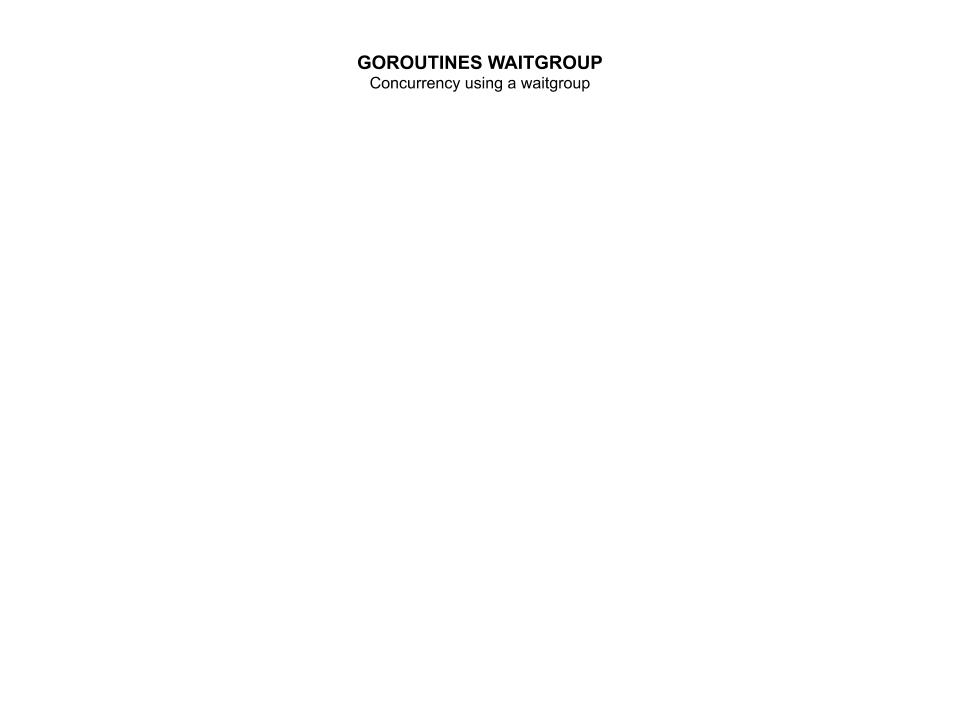

# goroutines-waitgroup example

`goroutines-waitgroup`  _is an example of
concurrency using a waitgroup._

[GitHub Webpage](https://jeffdecola.github.io/my-go-examples/)

## WAITGROUP

A WaitGroup allows to wait for a collection of goroutines to finish.

