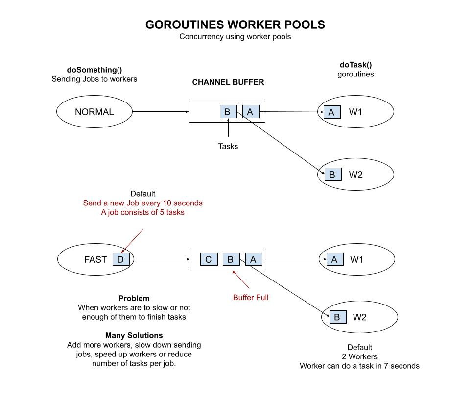

# goroutines-worker-pools

_Concurrency using worker pools._

Other examples using,

* [goroutines-multi-core](https://github.com/JeffDeCola/my-go-examples/tree/master/goroutines/goroutines-multi-core)
* [goroutines-waitgroup](https://github.com/JeffDeCola/my-go-examples/tree/master/goroutines/goroutines-waitgroup)
* [goroutines-worker-pools](https://github.com/JeffDeCola/my-go-examples/tree/master/goroutines/goroutines-worker-pools)
  **<- You are here**

Table of Contents,

* [OVERVIEW](https://github.com/JeffDeCola/my-go-examples/tree/master/goroutines/goroutines-worker-pools#overview)
* [RUN](https://github.com/JeffDeCola/my-go-examples/tree/master/goroutines/goroutines-worker-pools#run)

Documentation and references,

* This repos [github webpage](https://jeffdecola.github.io/my-go-examples/)

## OVERVIEW

Go is written for **concurrency**. The go runtime schedules goroutines on threads.
The OS schedules these threads on cpus/cores.

Worker pools are goroutines that do work.
Usually they will pull from a channel buffer to get data on what to do.

In this example, doSomething() is sending tasks to workers.

The **default is to complete a job (consisting of 5 tasks in 10 seconds)**.
But we have 2 task workers in pool that take 7 seconds to finish each task.

This will break. So you will have to fix this by doing one of the following,

* Increase the number of workers in pool
  * Try changing **numberWorkers** from 2 to 5
* Reduce the number of tasks per job
  * Try reducing **jobTaskList** to two tasks
* Increase new job Time to finish all tasks
  * Try increasing **SendNewJobTime** to 30
* Speed up the workers
  * Try changing **taskTime** from 7 to 1

Increasing the buffer size will only work until it fills up.

This illustration may help,



## RUN

Run,

```bash
go run goroutines-worker-pools.go
```

**Press return to stop.**

The default settings are,

```go
// FOR doSomething()
var jobTaskList = []string{"taskA", "taskB", "taskC", "taskD", "taskE"} // 5 tasks
const SendNewJobTime = 10                               // Send a job every x seconds

// FOR WORKERS - doTask()
const numberWorkers = 2 // How many workers in pool
const taskTime = 7      // How long it takes a worker to complete a task

// CHANNEL
var channelBufferSize = 2
```
