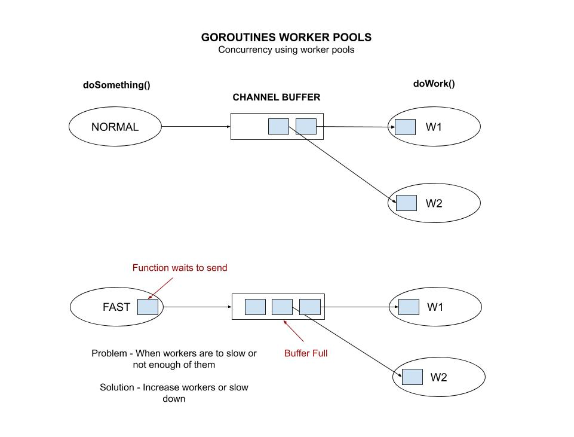

# goroutines-worker-pools example

`goroutines-worker-pools` _is an example of concurrency using
worker pools._

These are my 5 main example of using goroutines,

* [goroutines-async-channel-receive-no-waiting](https://github.com/JeffDeCola/my-go-examples/tree/master/goroutines/goroutines-async-channel-receive-no-waiting)
* [goroutines-async-channel-send-receive-waiting](https://github.com/JeffDeCola/my-go-examples/tree/master/goroutines/goroutines-async-channel-send-receive-waiting)
* [goroutines-multi-core](https://github.com/JeffDeCola/my-go-examples/tree/master/goroutines/goroutines-multi-core)
* [goroutines-waitgroup](https://github.com/JeffDeCola/my-go-examples/tree/master/goroutines/goroutines-waitgroup)
* **goroutines-worker-pools** <- You are here

[GitHub Webpage](https://jeffdecola.github.io/my-go-examples/)

## WORKER POOLS

Worker pools are goroutines that do work.
Usually they will pull from a channel buffer to get data on what to do.



## TICK TIME

In this example, doSomething is using tick time.
Meaning, asking the workers to do a bunch of stuff in period of time
(a tick).
In this example the default is to have the workers complete
5 jobs in 10 seconds.
And we only have 2 workers that take 7 seconds to complete its task.
So you can see this will break.

So you will have to fix this by doing one of the following,

* Increase the number of workers
* Reduce the number of jobs per tick
* Speed up the workers

## RUN

```bash
go run goroutines-worker-pools.go
```

**Simply press return to stop.**

These are the defaults, play around with them.  Right now it will break,
so you need to adjust this.

```go
// SET CONSTANTS FOR WORKER doWork()
const numberWorkers = 2                                             // How many workers you want
const workerTime = 7                                                // How long it takes a worker to work

// SET CONSTANTS FOR doSomething()
var jobList = []string{"jobA", "jobB", "jobC", "jobD", "jobE"}      // 5 jobs with jobNames
var ticktimeSeconds = 10                                            // Tick time to send a bunch of jobs workers

// OTHER
var channelBufferSize = 1                                           // How many channel buffers
```
