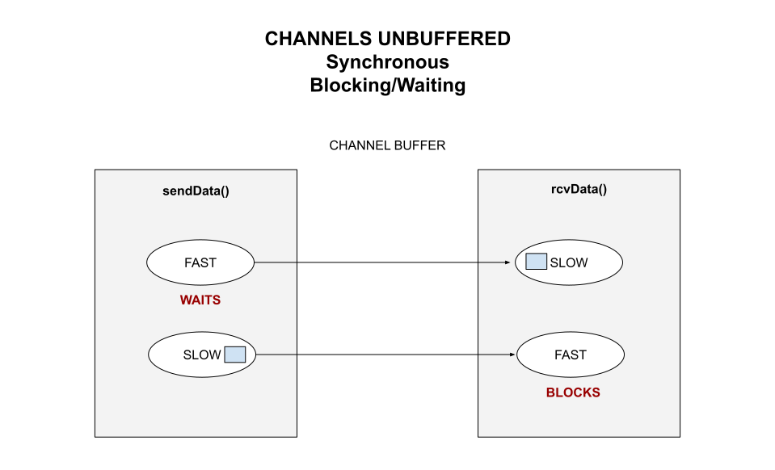

# CHANNELS UNBUFFERED EXAMPLE

[](https://jeffdecola.com)
[](https://jeffdecola.mit-license.org)

_Unbuffered channels are uni-directional, synchronous with blocking._

**I - IN-PROCESS COMMUNICATION**

* **SHARED MEMORY**
  * ASYNCHRONOUS
  * SYNCHRONOUS
    * [pipes-unnamed-simple](https://github.com/JeffDeCola/my-go-examples/tree/master/in-process-communication/shared-memory/synchronous/pipes-unnamed-simple)
    * [pipes-unnamed](https://github.com/JeffDeCola/my-go-examples/tree/master/in-process-communication/shared-memory/synchronous/pipes-unnamed)
    * [pipes-unnamed-io](https://github.com/JeffDeCola/my-go-examples/tree/master/in-process-communication/shared-memory/synchronous/pipes-unnamed-io)
* **MESSAGE PASSING**
  * ASYNCHRONOUS
    * [channels-buffered](https://github.com/JeffDeCola/my-go-examples/tree/master/in-process-communication/message-passing/asynchronous/channels-buffered)
  * SYNCHRONOUS
    * [channels-unbuffered](https://github.com/JeffDeCola/my-go-examples/tree/master/in-process-communication/message-passing/synchronous/channels-unbuffered)
      **<- YOU ARE HERE**

**II - INTER-PROCESS COMMUNICATION (IPC)**

* **SHARED MEMORY**
  * ASYNCHRONOUS
  * SYNCHRONOUS
    * [pipes-named](https://github.com/JeffDeCola/my-go-examples/tree/master/inter-process-communication-ipc/shared-memory/synchronous/pipes-named)
* **MESSAGE PASSING**
  * **OPERATING SYSTEM**
    * ASYNCHRONOUS
      * [message-queues](https://github.com/JeffDeCola/my-go-examples/tree/master/inter-process-communication-ipc/message-passing/operating-system/asynchronous/message-queues)
      * [pub-sub-nats-os](https://github.com/JeffDeCola/my-go-examples/tree/master/inter-process-communication-ipc/message-passing/operating-system/asynchronous/pub-sub-nats-os)
      * [tcp](https://github.com/JeffDeCola/my-go-examples/tree/master/inter-process-communication-ipc/message-passing/operating-system/asynchronous/tcp)
    * SYNCHRONOUS
      * [grpc-os](https://github.com/JeffDeCola/my-go-examples/tree/master/inter-process-communication-ipc/message-passing/operating-system/synchronous/grpc-os)
  * **NETWORK**
    * ASYNCHRONOUS
      * [pub-sub-nats-network](https://github.com/JeffDeCola/my-go-examples/tree/master/inter-process-communication-ipc/message-passing/network/asynchronous/pub-sub-nats-network)
      * [tcp-ip](https://github.com/JeffDeCola/my-go-examples/tree/master/inter-process-communication-ipc/message-passing/network/asynchronous/tcp-ip)
    * SYNCHRONOUS
      * [grpc-network](https://github.com/JeffDeCola/my-go-examples/tree/master/inter-process-communication-ipc/message-passing/network/synchronous/grpc-network)
      * [rest](https://github.com/JeffDeCola/my-go-examples/tree/master/inter-process-communication-ipc/message-passing/network/synchronous/rest)

Table of Contents

* [UNBUFFERED CHANNEL OVERVIEW](https://github.com/JeffDeCola/my-go-examples/tree/master/in-process-communication/message-passing/synchronous/channels-unbuffered#unbuffered-channel-overview)
* [CODE](https://github.com/JeffDeCola/my-go-examples/tree/master/in-process-communication/message-passing/synchronous/channels-unbuffered#code)
* [RUN](https://github.com/JeffDeCola/my-go-examples/tree/master/in-process-communication/message-passing/synchronous/channels-unbuffered#run)
* [TEST](https://github.com/JeffDeCola/my-go-examples/tree/master/in-process-communication/message-passing/synchronous/channels-unbuffered#test)
* [IN-PROCESS AND INTER-PROCESS COMMUNICATION OVERVIEW](https://github.com/JeffDeCola/my-go-examples/tree/master/in-process-communication/message-passing/synchronous/channels-unbuffered#in-process-and-inter-process-communication-overview)

Documentation and Reference

* [tbd](https://pkg.go.dev/std)
  standard package
* [my cheat sheets](https://github.com/JeffDeCola/my-cheat-sheets/tree/master/software/development/software-architectures/communication/in-process-and-inter-process-communications-ipc-overview-cheat-sheet)
  for a communications overview

## UNBUFFERED CHANNEL OVERVIEW

Unbuffered channels are uni-directional, synchronous with blocking.

* **MACHINE**: SAME
* **PROCESSES**: IN-PROCESS
* **TYPE**: MESSAGE PASSING
* **TIMING**: SYNCHRONOUS
* **DIRECTION**: UNI-DIRECTIONAL

## CODE

You create a unbuffered channel in go as follows,

```go
chUnBuffered := make(chan string) // UNBUFFERED
```

And place data on that channel as follows,

```go
chUnBuffered <- data // BLOCKING - WAITING
```

This illustration  may help,



## RUN

Run,

```bash
go run main.go
```

```bash
SEND:     I am the data that will be sent
SEND FAST - WAITS
RECEIVED: I am the data that was received 1 - Took 0 seconds
RECEIVED: I am the data that was received 2 - Took 2 seconds
RECEIVED: I am the data that was received 3 - Took 4 seconds
RECEIVED: I am the data that was received 4 - Took 4 seconds
RECEIVED: I am the data that was received 5 - Took 4 seconds
RECEIVED: I am the data that was received 6 - Took 4 seconds
SEND SLOW
RECEIVED: I am the data that was received A - Took 0 seconds
RECEIVED: I am the data that was received B - Took 0 seconds
RECEIVED: I am the data that was received C - Took 0 seconds
RECEIVED: I am the data that was received D - Took 0 seconds
RECEIVED: I am the data that was received E - Took 0 seconds
```

Note how it takes 4 seconds, because it's a 2 hop process.

## TEST

To create _test files,

```bash
gotests -w -all main.go
```

To unit test the code,

```bash
go test -cover ./...
```

## IN-PROCESS AND INTER-PROCESS COMMUNICATION OVERVIEW

Refer to
[my cheat sheets](https://github.com/JeffDeCola/my-cheat-sheets/tree/master/software/development/software-architectures/communication/in-process-and-inter-process-communications-ipc-overview-cheat-sheet)
for a more thorough communications overview.


