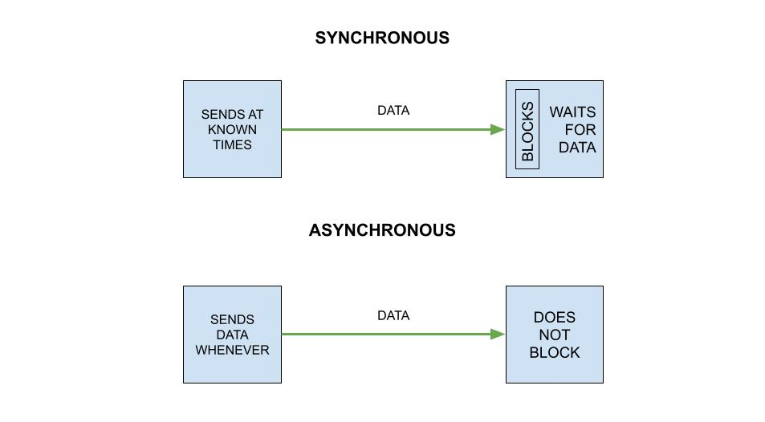
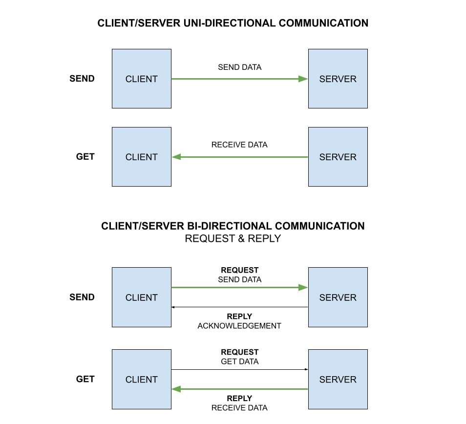
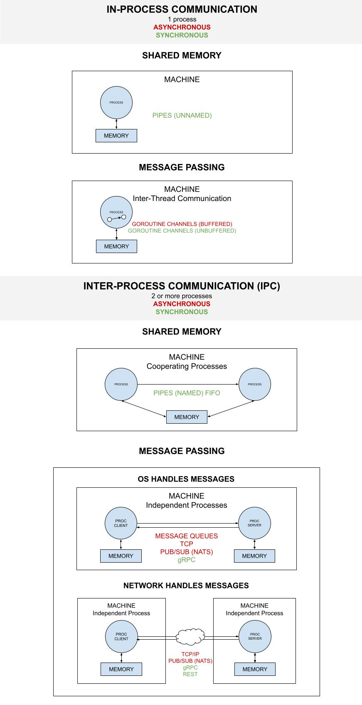

# pipes-unnamed-io

_Using a Pipe to connect an io.Writer and io.Reader._

Other communication examples using,

**I - IN-PROCESS COMMUNICATION**

* **SHARED MEMORY**
  * ASYNCHRONOUS
  * SYNCHRONOUS
    * [pipes-unnamed](https://github.com/JeffDeCola/my-go-examples/tree/master/in-process-communication/shared-memory/synchronous/pipes-unnamed)
    * [pipes-unnamed-io](https://github.com/JeffDeCola/my-go-examples/tree/master/in-process-communication/shared-memory/synchronous/pipes-unnamed-io)
      **<- YOU ARE HERE**
* **MESSAGE PASSING**
  * ASYNCHRONOUS
    * [channels-buffered](https://github.com/JeffDeCola/my-go-examples/tree/master/in-process-communication/message-passing/asynchronous/channels-buffered)
  * SYNCHRONOUS
    * [channels-unbuffered](https://github.com/JeffDeCola/my-go-examples/tree/master/in-process-communication/message-passing/synchronous/channels-unbuffered)

**II - INTER-PROCESS COMMUNICATION (IPC)**

* **SHARED MEMORY**
  * ASYNCHRONOUS
  * SYNCHRONOUS
    * [pipes-named](https://github.com/JeffDeCola/my-go-examples/tree/master/inter-process-communication-ipc/shared-memory/synchronous/pipes-named)
* **MESSAGE PASSING**
  * **OPERATING SYSTEM**
    * ASYNCHRONOUS
      * [message-queues](https://github.com/JeffDeCola/my-go-examples/tree/master/inter-process-communication-ipc/message-passing/operating-system/asynchronous/message-queues)
      * [pub-sub-nats-os](https://github.com/JeffDeCola/my-go-examples/tree/master/inter-process-communication-ipc/message-passing/operating-system/asynchronous/pub-sub-nats-os)
      * [tcp](https://github.com/JeffDeCola/my-go-examples/tree/master/inter-process-communication-ipc/message-passing/operating-system/asynchronous/tcp)
    * SYNCHRONOUS
      * [grpc-os](https://github.com/JeffDeCola/my-go-examples/tree/master/inter-process-communication-ipc/message-passing/operating-system/synchronous/grpc-os)
  * **NETWORK**
    * ASYNCHRONOUS
      * [pub-sub-nats-network](https://github.com/JeffDeCola/my-go-examples/tree/master/inter-process-communication-ipc/message-passing/network/asynchronous/pub-sub-nats-network)
      * [tcp-ip](https://github.com/JeffDeCola/my-go-examples/tree/master/inter-process-communication-ipc/message-passing/network/asynchronous/tcp-ip)
    * SYNCHRONOUS
      * [grpc-network](https://github.com/JeffDeCola/my-go-examples/tree/master/inter-process-communication-ipc/message-passing/network/synchronous/grpc-network)
      * [rest](https://github.com/JeffDeCola/my-go-examples/tree/master/inter-process-communication-ipc/message-passing/network/synchronous/rest)

Table of Contents,

* [OVERVIEW](https://github.com/JeffDeCola/my-go-examples/tree/master/in-process-communication/shared-memory/synchronous/pipes-unnamed#overview)
* [RUN](https://github.com/JeffDeCola/my-go-examples/tree/master/in-process-communication/shared-memory/synchronous/pipes-unnamed#run)
* [TEST](https://github.com/JeffDeCola/my-go-examples/tree/master/in-process-communication/shared-memory/synchronous/pipes-unnamed#test)
* [COMMUNICATIONS ILLUSTRATION](https://github.com/JeffDeCola/my-go-examples/tree/master/in-process-communication/shared-memory/synchronous/pipes-unnamed#communications-illustration)

Documentation and references,

* Refer to the
  [io.Pipe](https://pkg.go.dev/io#Pipe)
  package for more info
* This repos [github webpage](https://jeffdecola.github.io/my-go-examples/)

## OVERVIEW

A pipe provides a unidirectional inter-process communication channel, where two
ends are involved: reader and writer. Data written to the write end of
the pipe can be read from the read end.

**Pipes in go can be used to connect code expecting an io.Reader with
code expecting an io.Writer.**

```go
pr, pw := io.Pipe()

// I USE IO.WRITER
go func() {
    fmt.Fprint(pw, "I am some data using pipe\n")
    pw.Close()
}()

// I USE IO.READER
if _, err := io.Copy(os.Stdout, pr); err != nil {
    log.Fatal(err)
}
```

## RUN

Run,

```bash
go run pipes-unnamed-io.go
```

## COMMUNICATION OVERVIEW

### SYNCHRONOUS AND ASYNCHRONOUS COMMUNICATION

Synchronous and asynchronous communication really depends on
what you're referring too. For example, if you have a uni-directional
communication and you are referring to the data transfer. Or if it
a bi-directional communication and you're referring to
the reply.

Here is a high-level view,

* Synchronous – The client expects a timely response and might
  even block while it waits
* Asynchronous – The client doesn’t block while waiting for a response,
  and the response, if any, may not be immediate



### CLIENT SERVER COMMUNICATION



### IN-PROCESS AND INTER-PROCESS COMMUNICATION


