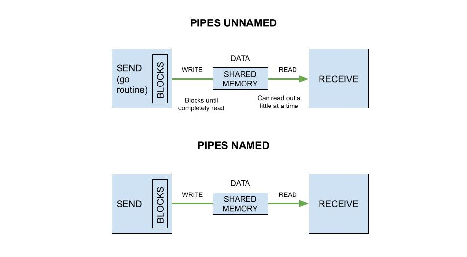

# pipes-unnamed

_This is a more robust example of an unnamed pipe showing multiple reads._

Other communication examples using,

**I - IN-PROCESS COMMUNICATION**

* **SHARED MEMORY**
  * ASYNCHRONOUS
  * SYNCHRONOUS
    * [pipes-unnamed](https://github.com/JeffDeCola/my-go-examples/tree/master/in-process-communication/shared-memory/synchronous/pipes-unnamed)
    * [pipes-unnamed](https://github.com/JeffDeCola/my-go-examples/tree/master/in-process-communication/shared-memory/synchronous/pipes-unnamed)
      **<- YOU ARE HERE**
    * [pipes-unnamed-io](https://github.com/JeffDeCola/my-go-examples/tree/master/in-process-communication/shared-memory/synchronous/pipes-unnamed-io)
* **MESSAGE PASSING**
  * ASYNCHRONOUS
    * [channels-buffered](https://github.com/JeffDeCola/my-go-examples/tree/master/in-process-communication/message-passing/asynchronous/channels-buffered)
  * SYNCHRONOUS
    * [channels-unbuffered](https://github.com/JeffDeCola/my-go-examples/tree/master/in-process-communication/message-passing/synchronous/channels-unbuffered)

**II - INTER-PROCESS COMMUNICATION (IPC)**

* **SHARED MEMORY**
  * ASYNCHRONOUS
  * SYNCHRONOUS
    * [pipes-named](https://github.com/JeffDeCola/my-go-examples/tree/master/inter-process-communication-ipc/shared-memory/synchronous/pipes-named)
* **MESSAGE PASSING**
  * **OPERATING SYSTEM**
    * ASYNCHRONOUS
      * [message-queues](https://github.com/JeffDeCola/my-go-examples/tree/master/inter-process-communication-ipc/message-passing/operating-system/asynchronous/message-queues)
      * [pub-sub-nats-os](https://github.com/JeffDeCola/my-go-examples/tree/master/inter-process-communication-ipc/message-passing/operating-system/asynchronous/pub-sub-nats-os)
      * [tcp](https://github.com/JeffDeCola/my-go-examples/tree/master/inter-process-communication-ipc/message-passing/operating-system/asynchronous/tcp)
    * SYNCHRONOUS
      * [grpc-os](https://github.com/JeffDeCola/my-go-examples/tree/master/inter-process-communication-ipc/message-passing/operating-system/synchronous/grpc-os)
  * **NETWORK**
    * ASYNCHRONOUS
      * [pub-sub-nats-network](https://github.com/JeffDeCola/my-go-examples/tree/master/inter-process-communication-ipc/message-passing/network/asynchronous/pub-sub-nats-network)
      * [tcp-ip](https://github.com/JeffDeCola/my-go-examples/tree/master/inter-process-communication-ipc/message-passing/network/asynchronous/tcp-ip)
    * SYNCHRONOUS
      * [grpc-network](https://github.com/JeffDeCola/my-go-examples/tree/master/inter-process-communication-ipc/message-passing/network/synchronous/grpc-network)
      * [rest](https://github.com/JeffDeCola/my-go-examples/tree/master/inter-process-communication-ipc/message-passing/network/synchronous/rest)

Table of Contents,

* [PIPES OVERVIEW](https://github.com/JeffDeCola/my-go-examples/tree/master/in-process-communication/shared-memory/synchronous/pipes-unnamed#pipes-overview)
* [CODE](https://github.com/JeffDeCola/my-go-examples/tree/master/in-process-communication/shared-memory/synchronous/pipes-unnamed#code)
* [RUN](https://github.com/JeffDeCola/my-go-examples/tree/master/in-process-communication/shared-memory/synchronous/pipes-unnamed#run)
* [IN-PROCESS AND INTER-PROCESS COMMUNICATION OVERVIEW](https://github.com/JeffDeCola/my-go-examples/tree/master/in-process-communication/shared-memory/synchronous/pipes-unnamed#in-process-and-inter-process-communication-overview)

Documentation and references,

* Refer to the
  [io.Pipe](https://pkg.go.dev/io#Pipe)
  package for more info
* Refer to
  [my cheat sheets](https://github.com/JeffDeCola/my-cheat-sheets/tree/master/software/development/software-architectures/communication/in-process-and-inter-process-communications-ipc-overview-cheat-sheet)
  for a communications overview
* This repos [github webpage](https://jeffdecola.github.io/my-go-examples/)

## PIPES OVERVIEW

A pipe provides a uni-directional in-process communication channel, where two
ends are involved: reader and writer. Data written to the write end of
the pipe can be read from the read end. A named pipe (FIFO) can be accessed from
different processes whereas an unnamed pipe can be accessed from the same process.

* **MACHINE**: SAME
* **PROCESSES**: IN-PROCESS
* **TYPE**: SHARED MEMORY
* **TIMING**: SYNCHRONOUS
* **DIRECTION**: UNI-DIRECTIONAL

Pipes in go can be used to connect code expecting an io.Reader with
code expecting an io.Writer.



## CODE

Create the pipe using the "io" package,

```go
pr, pw := io.Pipe()
```

Send data (write) to the pipe.

```go
_, err := pw.Write([]byte(data))
```

This writes the data to memory that is shared.

Now when ready, receive data (read) from the pipe (i.e. read from memory),

```go
rcvData := make([]byte, 100)
_, err := pr.Read(rcvData)
```

## RUN

Run,

```bash
go run pipes-unnamed.go
```

Output will be,

```txt
RECEIVED   : I am the data that w 
RECEIVED   : ill be sent 1 
SEND       : I am the data that will be sent 1 
RECEIVED   : I am the data that w 
RECEIVED   : ill be sent 2 
SEND       : I am the data that will be sent 2 
RECEIVED   : I am the data that w 
RECEIVED   : ill be sent 3 
SEND       : I am the data that will be sent 3 
CLOSED PIPE
EOF
DONE
```

## IN-PROCESS AND INTER-PROCESS COMMUNICATION OVERVIEW

Refer to
[my cheat sheets](https://github.com/JeffDeCola/my-cheat-sheets/tree/master/software/development/software-architectures/communication/in-process-and-inter-process-communications-ipc-overview-cheat-sheet)
for a more thorough communications overview.


