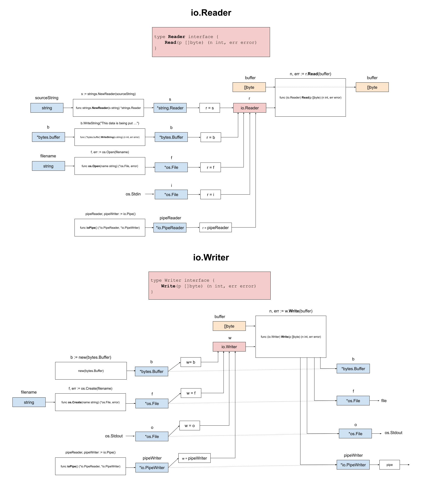

# io-reader

_Read data (a stream of bytes) from a string, buffer, file, stdin and
a pipe to a buffer using the standard `io` package._

Table of Contents,

* [OVERVIEW](https://github.com/JeffDeCola/my-go-examples/tree/master/input-output/io-reader#overview)
* [RUN](https://github.com/JeffDeCola/my-go-examples/tree/master/input-output/io-reader#run)
* [TEST](https://github.com/JeffDeCola/my-go-examples/tree/master/input-output/io-reader#test)

Documentation and references,

* Refer to the
  [io](https://pkg.go.dev/io)
  package for more info
* This repos [github webpage](https://jeffdecola.github.io/my-go-examples/)

## OVERVIEW

Buffered I/O is extremely powerful in go.
Input/output operations model data as streams of bytes that
can be read or written to.

Simply put, the io.Reader is an interface from which you can
read a stream of bytes into a buffer.



The io.Reader interface looks like,

```go
type Reader interface {
        Read(p []byte) (n int, err error)
}
```

Hence, we use the Method Read(),

```go
n, err := r.Read(buffer)
```

From a string (*strings.Reader),

```go
sourceString := "This data is being put into a string reader"
s := strings.NewReader(sourceString)
```

From a buffer (*bytes.Buffer),

```go
b := new(bytes.Buffer)
b.WriteString("This data is being put into a byte.buffer")
```

From a file (*os.File),

```go
f, err := os.Open("test.txt")
```

From a user (os.Stdin),

```go
i := os.Stdin
```

From a pipe (*io.PipeReader),

```go
pipeReader, pipeWriter := io.Pipe()
```

## RUN

Run,

```bash
go run io-reader.go
```

## TEST

To create _test files,

```bash
gotests -w -all io-reader.go
```

To unit test the code,

```bash
go test -cover ./... 
```
