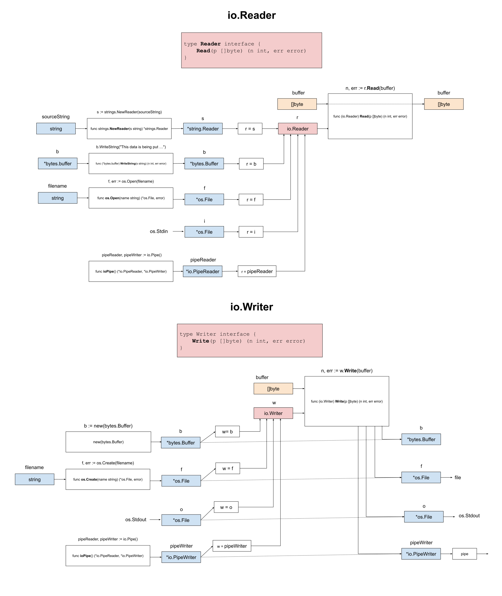

# IO.READER EXAMPLE

[](https://jeffdecola.com)
[](https://jeffdecola.mit-license.org)

_Read data (a stream of bytes) from a string, buffer, file, stdin and
a pipe to a buffer using the
[io](https://pkg.go.dev/io)
standard package._

Other Examples

* IO.READER
  * [io-reader](https://github.com/JeffDeCola/my-go-examples/tree/master/input-output/io-reader/io-reader)
    **<- YOU ARE HERE**
  * [io-reader-simple](https://github.com/JeffDeCola/my-go-examples/tree/master/input-output/io-reader/io-reader-simple)
* IO.WRITER
  * [io-writer](https://github.com/JeffDeCola/my-go-examples/tree/master/input-output/io-writer/io-writer)
  * [io-writer-simple](https://github.com/JeffDeCola/my-go-examples/tree/master/input-output/io-writer/io-writer-simple)

Table of Contents

* [OVERVIEW](https://github.com/JeffDeCola/my-go-examples/tree/master/input-output/io-reader/io-reader#overview)
* [RUN](https://github.com/JeffDeCola/my-go-examples/tree/master/input-output/io-reader/io-reader#run)
* [TEST](https://github.com/JeffDeCola/my-go-examples/tree/master/input-output/io-reader/io-reader#test)
* [AN ILLUSTRATION THAT MAY HELP](https://github.com/JeffDeCola/my-go-examples/tree/master/input-output/io-reader/io-reader#an-illustration-that-may-help)

Documentation and Reference

* [io](https://pkg.go.dev/io)
  standard package

## OVERVIEW

Buffered I/O is extremely powerful in go.
Input/output operations model data as streams of bytes that
can be read or written to.

Simply put, the io.Reader is an interface from which you can
read a stream of bytes into a buffer.

The io.Reader interface looks like,

```go
type Reader interface {
        Read(p []byte) (n int, err error)
}
```

Hence, we use the method Read(),

```go
n, err := r.Read(buffer)
```

From a string (*strings.Reader),

```go
sourceString := "This is data in string.Reader"
s := strings.NewReader(sourceString)
```

From a buffer (*bytes.Buffer),

```go
b := new(bytes.Buffer)
b.WriteString("This is data in byte.buffer")
```

From a file (*os.File),

```go
f, err := os.Open("test.txt")
```

From a user (os.Stdin),

```go
i := os.Stdin
```

From a pipe (*io.PipeReader),

```go
pipeReader, pipeWriter := io.Pipe()
```

## RUN

Run,

```bash
go run main.go
```

## TEST

To create _test files,

```bash
gotests -w -all main.go
```

To unit test the code,

```bash
go test -cover ./...
```

## AN ILLUSTRATION THAT MAY HELP


