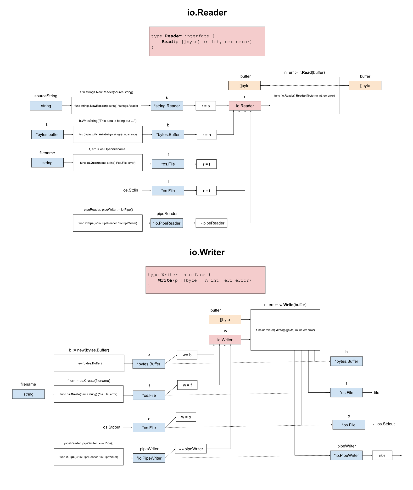

# IO.WRITER SIMPLE EXAMPLE

[](https://jeffdecola.com)
[](https://jeffdecola.mit-license.org)

_Write data (a stream of bytes) to a buffer
from a buffer using the
[io](https://pkg.go.dev/io)
standard package._

Other Examples

* IO.READER
  * [io-reader](https://github.com/JeffDeCola/my-go-examples/tree/master/input-output/io-reader/io-reader)
  * [io-reader-simple](https://github.com/JeffDeCola/my-go-examples/tree/master/input-output/io-reader/io-reader-simple)
* IO.WRITER
  * [io-writer](https://github.com/JeffDeCola/my-go-examples/tree/master/input-output/io-writer/io-writer)
  * [io-writer-simple](https://github.com/JeffDeCola/my-go-examples/tree/master/input-output/io-writer/io-writer-simple)
    **<- YOU ARE HERE**

Table of Contents

* [OVERVIEW](https://github.com/JeffDeCola/my-go-examples/tree/master/input-output/io-writer/io-writer-simple#overview)
* [RUN](https://github.com/JeffDeCola/my-go-examples/tree/master/input-output/io-writer/io-writer-simple#run)
* [AN ILLUSTRATION THAT MAY HELP](https://github.com/JeffDeCola/my-go-examples/tree/master/input-output/io-writer/io-writer-simple#an-illustration-that-may-help)

Documentation and Reference

* [io](https://pkg.go.dev/io)
  standard package

## OVERVIEW

Buffered I/O is extremely powerful in go.
Input/output operations model data as streams of bytes that
can be read or written to.

Simply put, the io.Writer is an interface from which you can
write a stream of bytes from a buffer.

The io.Writer interface looks like,

```go
type Writer interface {
        Write(p []byte) (n int, err error)
}
```

Hence, we use the Method Write(),

```go
n, err := r.Write(buffer)
```

Therefore,

```go
// CREATE THE IO WRITER INTERFACE
var w io.Writer

// CREATE BUFFER TO READ FROM
buffer := []byte("This is the buffer data")

// CREATE THE BUFFER b TO WRITE TO
b := new(bytes.Buffer)
fmt.Printf("Buffer in:  %s\n", b.String())

// ASSIGN b TO WRITER
w = b

// WRITE METHOD (USING io.Writer)
_, err := w.Write(buffer)
if err != nil {
    fmt.Printf("Error with io.Writer: %s", err)
}

// PRINT b
fmt.Printf("Buffer out: %s\n", b.String())
```

## RUN

Run,

```bash
go run main.go
```

## AN ILLUSTRATION THAT MAY HELP


