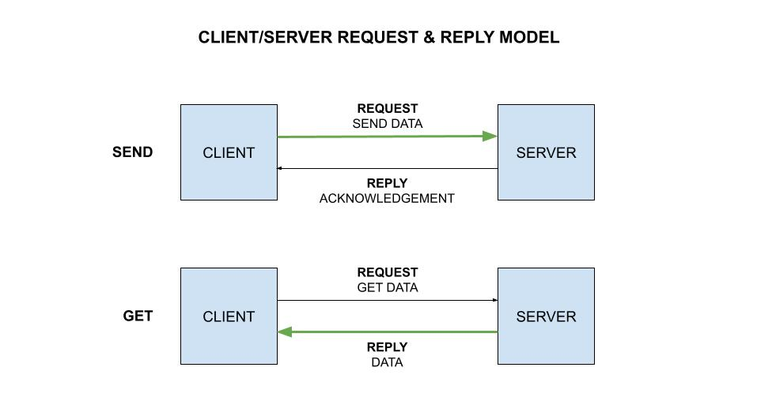

# grpc-os

_Start a grpc server in the go runtime environment using googles grpc package._

Other communication examples using,

**I - IN-PROCESS COMMUNICATION**

* **SHARED MEMORY**
  * ASYNCHRONOUS
  * SYNCHRONOUS
    * [pipes-unnamed](https://github.com/JeffDeCola/my-go-examples/tree/master/in-process-communication/shared-memory/synchronous/pipes-unnamed)
    * [pipes-unnamed-io](https://github.com/JeffDeCola/my-go-examples/tree/master/in-process-communication/shared-memory/synchronous/pipes-unnamed-io)
* **MESSAGE PASSING**
  * ASYNCHRONOUS
    * [channels-buffered](https://github.com/JeffDeCola/my-go-examples/tree/master/in-process-communication/message-passing/asynchronous/channels-buffered)
  * SYNCHRONOUS
    * [channels-unbuffered](https://github.com/JeffDeCola/my-go-examples/tree/master/in-process-communication/message-passing/synchronous/channels-unbuffered)

**II - INTER-PROCESS COMMUNICATION (IPC)**

* **SHARED MEMORY**
  * ASYNCHRONOUS
  * SYNCHRONOUS
    * [pipes-named](https://github.com/JeffDeCola/my-go-examples/tree/master/inter-process-communication-ipc/shared-memory/synchronous/pipes-named)
* **MESSAGE PASSING**
  * **OPERATING SYSTEM**
    * ASYNCHRONOUS
      * [message-queues](https://github.com/JeffDeCola/my-go-examples/tree/master/inter-process-communication-ipc/message-passing/operating-system/asynchronous/message-queues)
      * [pub-sub-nats-os](https://github.com/JeffDeCola/my-go-examples/tree/master/inter-process-communication-ipc/message-passing/operating-system/asynchronous/pub-sub-nats-os)
      * [tcp](https://github.com/JeffDeCola/my-go-examples/tree/master/inter-process-communication-ipc/message-passing/operating-system/asynchronous/tcp)
    * SYNCHRONOUS
      * [grpc-os](https://github.com/JeffDeCola/my-go-examples/tree/master/inter-process-communication-ipc/message-passing/operating-system/synchronous/grpc-os)
        **<- YOU ARE HERE**
  * **NETWORK**
    * ASYNCHRONOUS
      * [pub-sub-nats-network](https://github.com/JeffDeCola/my-go-examples/tree/master/inter-process-communication-ipc/message-passing/network/asynchronous/pub-sub-nats-network)
      * [tcp-ip](https://github.com/JeffDeCola/my-go-examples/tree/master/inter-process-communication-ipc/message-passing/network/asynchronous/tcp-ip)
    * SYNCHRONOUS
      * [grpc-network](https://github.com/JeffDeCola/my-go-examples/tree/master/inter-process-communication-ipc/message-passing/network/synchronous/grpc-network)
      * [rest](https://github.com/JeffDeCola/my-go-examples/tree/master/inter-process-communication-ipc/message-passing/network/synchronous/rest)

Table of Contents,

* tbd

Documentation and references,

* Refer to the
  [???](https://pkg.go.dev/????)
  package for more info
* This repos [github webpage](https://jeffdecola.github.io/my-go-examples/)

## CLIENT/SERVER MODEL

Inter-process communication (IPC) message passing is based on the
client-server model as shown,



* Synchronous – The client expects a timely response and might
  even block while it waits
* Asynchronous – The client doesn’t block while waiting for a response,
  and the response, if any, may not be immediate

## gRPC OVERVIEW

gRPC enables client and server to communicate easily using functions.
It uses HTTP/2 for transport which is a binary protocol.

### SERVER

Using go runtime environment to start a gRPC Server

```go


```

### CLIENT

## RUN

Run,

```bash
go run server.go
go run client.go
```

## TEST

To create _test files,

```bash
gotests -w -all grpc-os.go
```

To unit test the code,

```bash
go test -cover ./... 
```

## COMMUNICATIONS ILLUSTRATION

This illustration may help,


