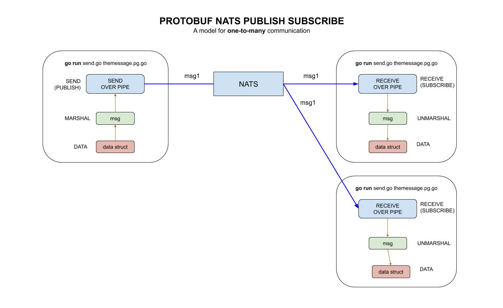

# protobuf-NATS-publish-subscribe example

`protobuf-NATS-publish-subscribe` _is an example of
sending a protobuf msg over NATS from a client
to a server using publish and subscribe._

These are my 3 main example of using protobuf,

* [protobuf](https://github.com/JeffDeCola/my-go-examples/tree/master/messaging/protobuf)
* `protobuf-NATS-publish-subscribe` You are here
* [protobuf-NATS-request-response](https://github.com/JeffDeCola/my-go-examples/tree/master/messaging/protobuf-NATS-request-response)

Refer to my
[protobuf cheat sheet](https://github.com/JeffDeCola/my-cheat-sheets/tree/master/software/development/software-architectures/messaging/protobuf-cheat-sheet)
for information on installation and use.

[GitHub Webpage](https://jeffdecola.github.io/my-go-examples/)

## STARTS NAT SERVER

I run the NATS server using,

```bash
gnatsd -DV -addr localhost --port 4222
```

## PROTOCOL .proto BUFFER FILE

```go
message Token {
    string AccessToken = 1;
    string TokenType = 2;
    string RefreshToken = 3;
    int64 ExpiresAt = 4;
    int64 counter = 5;
}
```

## PROTOBUF COMPILER

Compile the protcol buffer file to get the wrappers,

```bash
protoc --go_out=. messages.proto
```

## CLIENT.GO: PROTOBUF - CLIENT - MARSHAL - WRITE/SEND

Now lets create the message `msg` to send. Create a pointer
to a type Token struct and fill it with data.

```go
token := &Token{
    AccessToken:  "the access token",
    TokenType:    "this",
    RefreshToken: "and the refresh token",
    ExpiresAt:    5,
    Counter:      5,
}
```

```go
msg, err := proto.Marshal(token)
```

## CLIENT.GO: NATS - PUBLISH on "foo"

Connect to a NATS server and publish msg on foo,

```go
nc, _ := nats.Connect("nats://127.0.0.1:4222)
nc.Publish("foo", msg)
```

## SERVER.GO: NATS - SUBSCRIBE (synchronous way) on "foo"

Connect to a NATS server and subscribe (synchronously)
msg on foo,

```go
nc, _ := nats.Connect("nats://127.0.0.1:4222)
sub, err := nc.SubscribeSync("foo")
msg, err := sub.NextMsg(time.Duration(5) * time.Second)
```

## SERVER.GO: PROTOBUF - SERVER - RECEIVE - READ/UNMARSHAL

Unmarshal and print,

```go
rcvToken := &Token{}
err := proto.Unmarshal(msg.Data, rcvToken)
log.Printf("Token received: %+v", rcvToken)
```

## RUN

Run both the client and server.

```go
cd client
go run client.go messages.pb.go
```

```go
cd server
go run server.go messages.pb.go
```

## HIGH-LEVEL-VIEW


