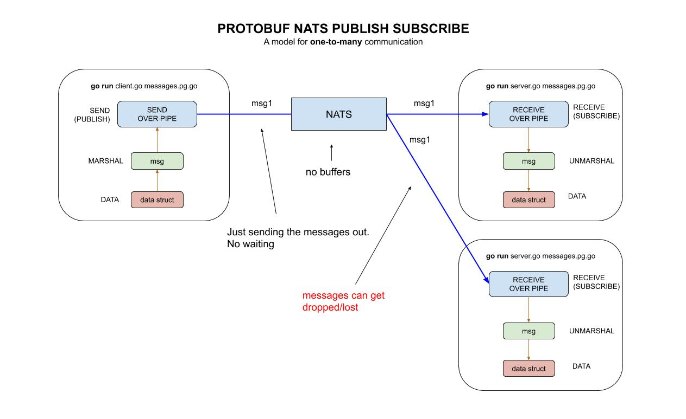

# protobuf-NATS-publish-subscribe example

`protobuf-NATS-publish-subscribe` _is an example of
sending a protobuf msg over NATS from a client
to a server using publish and subscribe._

These are my 3 main example of using protobuf,

* [protobuf](https://github.com/JeffDeCola/my-go-examples/tree/master/messaging/protobuf)
* **protobuf-NATS-publish-subscribe** You are here
* [protobuf-NATS-request-response](https://github.com/JeffDeCola/my-go-examples/tree/master/messaging/protobuf-NATS-request-response)

Documentation and reference,

* My [protobuf cheat sheet](https://github.com/JeffDeCola/my-cheat-sheets/tree/master/software/development/software-architectures/messaging/protobuf-cheat-sheet)
* My [NATS cheat sheet](https://github.com/JeffDeCola/my-cheat-sheets/tree/master/software/development/software-architectures/messaging/NATS-cheat-sheet)
* Official [NATS go client library](https://github.com/nats-io/nats.go)
  at github

[GitHub Webpage](https://jeffdecola.github.io/my-go-examples/)

## START YOUR NATS SERVER

Time to use NATS as a pipe.  First, lets start your NATS server,

```bash
nats-server -v
nats-server -DV -p 4222 -a 127.0.0.1
```

Where -DV is both debug and trace log.

## GET NATS GO CLIENT LIBRARY

You must have this library to use go,

```go
go get -v -u github.com/nats-io/nats.go/
```

## PROTOCOL .proto BUFFER FILE

Lets use the same protobuf file in all three examples.

```go
message Person {
    string name = 1;
    int32 age = 2;
    string email = 3;
    string phone = 4;
    uint32 count = 5;
}
```

Compile the protocol buffer file to get the wrappers,

```bash
protoc --go_out=. messages.proto
```

And place in the client and server directories.

## CLIENT.GO: PROTOBUF - CLIENT - MARSHAL - WRITE/SEND

Now lets create the message `msg` to send. Create a pointer
to a type Token struct and fill it with data.

```go
sndPerson := &Person{
    Name:  "Jeff",
    Age:   20,
    Email: "blah@blah.com",
    Phone: "555-555-5555",
    Count: count,
}
```

```go
msg, err := proto.Marshal(sndPerson)
```

## SEND - NATS - PUBLISH on "foo" (THE PIPE)

`SEND - NATS - PUBLISH on "foo" (THE PIPE)`

Connect to a NATS server and publish msg on foo,

```go
nc, _ := nats.Connect("nats://127.0.0.1:4222)
nc.Publish("foo", msg)
```

## RECEIVE SIDE

: NATS - SUBSCRIBE (synchronous way) on "foo"

Connect to a NATS server and subscribe (synchronously)
msg on foo,

```go
nc, _ := nats.Connect("nats://127.0.0.1:4222)
sub, err := nc.SubscribeSync("foo")
msg, err := sub.NextMsg(time.Duration(5) * time.Second)
```

## SERVER.GO: PROTOBUF - SERVER - RECEIVE - READ/UNMARSHAL

Unmarshal and print,

```go
rcvToken := &Token{}
err := proto.Unmarshal(msg.Data, rcvToken)
log.Printf("Token received: %+v", rcvToken)
```

## RUN

Run both the client and server.

```go
cd client
go run client.go messages.pb.go
```

```go
cd server
go run server.go messages.pb.go
```

## HIGH-LEVEL-VIEW


