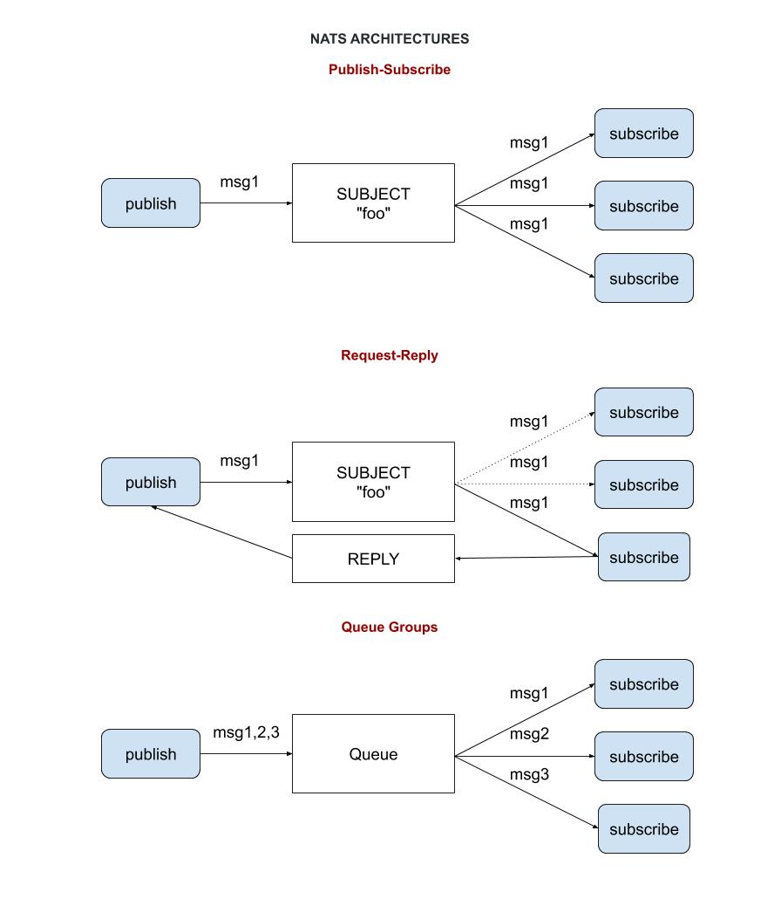

# protobuf-NATS-queue-groups example

`protobuf-NATS-queue-groups` _is an example of
  _Using NATS (queue groups) as a pipe to send protobuf messages.
  This is a model for **one-to-one communication**._

These are my 5 main example of using protobuf,

* [protobuf](https://github.com/JeffDeCola/my-go-examples/tree/master/messaging/protobuf)
* [protobuf-NATS-publish-subscribe](https://github.com/JeffDeCola/my-go-examples/tree/master/messaging/protobuf-NATS-publish-subscribe)
* **protobuf-NATS-queue-groups** <- Your are here
* [protobuf-NATS-request-reply](https://github.com/JeffDeCola/my-go-examples/tree/master/messaging/protobuf-NATS-request-reply)
* [protobuf-NATS-request-reply-goroutines](https://github.com/JeffDeCola/my-go-examples/tree/master/messaging/protobuf-NATS-request-reply-goroutines)

Table of contents,

* [OVERVIEW OF NATS ARCHITECTURES](https://github.com/JeffDeCola/my-go-examples/tree/master/messaging/protobuf-NATS-publish-subscribe#overview-of-nats-architectures)
* [START YOUR NATS SERVER](https://github.com/JeffDeCola/my-go-examples/tree/master/messaging/protobuf-NATS-publish-subscribe#start-your-nats-server)
* [GET NATS GO CLIENT LIBRARY](https://github.com/JeffDeCola/my-go-examples/tree/master/messaging/protobuf-NATS-publish-subscribe#get-nats-go-client-library)
* [PROTOCOL .proto BUFFER FILE](https://github.com/JeffDeCola/my-go-examples/tree/master/messaging/protobuf-NATS-publish-subscribe#protocol-proto-buffer-file)
* [RUN](https://github.com/JeffDeCola/my-go-examples/tree/master/messaging/protobuf-NATS-publish-subscribe#run)
* [FLOW - HOW DOES IT WORK](https://github.com/JeffDeCola/my-go-examples/tree/master/messaging/protobuf-NATS-publish-subscribe#flow---how-does-it-work)
* [HIGH-LEVEL ILLUSTRATION](https://github.com/JeffDeCola/my-go-examples/tree/master/messaging/protobuf-NATS-publish-subscribe#high-level-illustration)

Documentation and reference,

* My [protobuf cheat sheet](https://github.com/JeffDeCola/my-cheat-sheets/tree/master/software/development/software-architectures/messaging/protobuf-cheat-sheet)
* My [NATS cheat sheet](https://github.com/JeffDeCola/my-cheat-sheets/tree/master/software/development/software-architectures/messaging/NATS-cheat-sheet)
* Official [NATS go client library](https://github.com/nats-io/nats.go)
  at github

[GitHub Webpage](https://jeffdecola.github.io/my-go-examples/)

## OVERVIEW OF NATS ARCHITECTURES

We have 3 examples using NATS as a pipe. This diagram may help,



## START YOUR NATS SERVER

Using NATS as a pipe.  First, lets start your NATS server,

```bash
nats-server -v
nats-server -DV -p 4222 -a 127.0.0.1
```

Where -DV is both debug and trace log.

## GET NATS GO CLIENT LIBRARY

You must have this library to use go,

```go
go get -v -u github.com/nats-io/nats.go/
```

## PROTOCOL .proto BUFFER FILE

Lets use the same protobuf file `messages.proto` in all four examples,

```go
message Person {
    string name = 1;
    int32 age = 2;
    string email = 3;
    string phone = 4;
    uint32 count = 5;
}
```

Compile the protocol buffer file to get the wrappers,

```bash
protoc --go_out=. messages.proto
```

Place wrapper file `messages.pb.go` in both the client and server directories.

## RUN

This example will publish a message every second to NATS and
whoever is subscribed will get the message. This is referred to as
**one-to-one**.

Using queue subscribers will balance message delivery across a group
of subscribers which can be used to provide application fault tolerance
and scale workload processing.

In separate windows run,

```go
cd client
go run client.go messages.pb.go
```

```go
cd server
go run server.go messages.pb.go
```

You can run as many servers as you want, each
will get a unique message.

## FLOW - HOW DOES IT WORK

First you need to connect to the NATS server in go,

```go
nc, err := nats.Connect("nats://127.0.0.1:4222")
defer nc.Close()
```

Lets look at the entire flow `data -> marshal -> snd -> rcv -> unmarshal -> data`.

### DATA

```go
sndPerson := &Person{
    Name:  "Jeff",
    Age:   20,
    Email: "blah@blah.com",
    Phone: "555-555-5555",
    Count: count,
}
```

### MARSHAL

```go
msg, err := proto.Marshal(sndPerson)
```

### SEND (PUBLISH)

```go
nc.Publish("foo", msg)
```

### RECEIVE (SUBSCRIBE)

To create a queue subscription, subscribers register a queue name.
All subscribers with the same queue name form the queue group.

```go
// RECEIVE
nc.QueueSubscribe("foo", "jeffsQueue", func(msg *nats.Msg) {

    // UNMARSHAL -> DATA
    <SEE BELOW>
})
```

### UNMARSHAL -> DATA

```go
rcvPerson := &Person{}
err = proto.Unmarshal(msg.Data, rcvPerson)
```

## HIGH-LEVEL ILLUSTRATION

This illustration may help show what we did,


