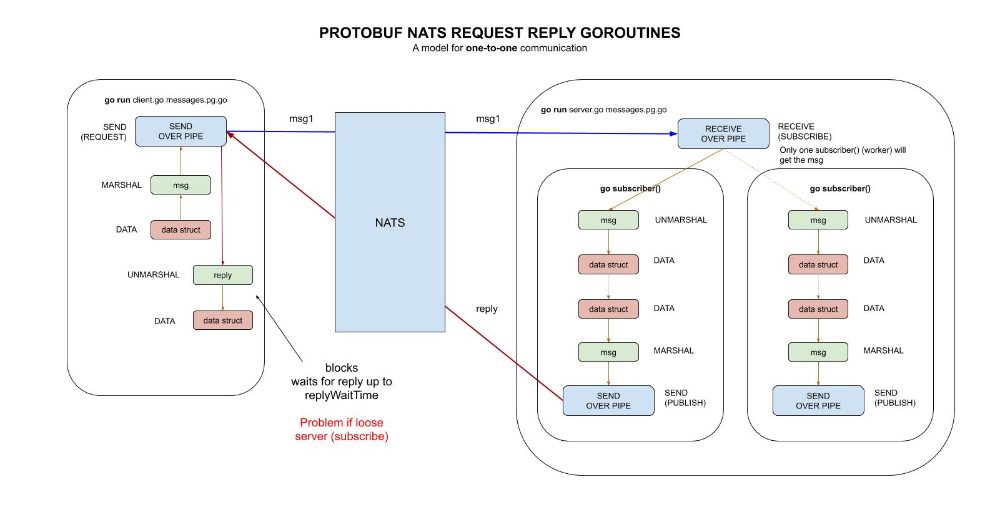

# protobuf-NATS-request-reply-goroutines example

_Same as `protobuf-NATS-request-reply`
but using goroutines for subscribers.
This is also a model for **one-to-one** communication._

These are my 6 main example of using protobuf,

* [protobuf](https://github.com/JeffDeCola/my-go-examples/tree/master/messaging/protobuf)
* [protobuf-NATS-publish-subscribe](https://github.com/JeffDeCola/my-go-examples/tree/master/messaging/protobuf-NATS-publish-subscribe)
* [protobuf-NATS-queue-groups](https://github.com/JeffDeCola/my-go-examples/tree/master/messaging/protobuf-NATS-queue-groups)
* [protobuf-NATS-queue-groups-request-reply](https://github.com/JeffDeCola/my-go-examples/tree/master/messaging/protobuf-NATS-queue-groups-request-reply)
  (I like this one)
* [protobuf-NATS-request-reply](https://github.com/JeffDeCola/my-go-examples/tree/master/messaging/protobuf-NATS-request-reply)
* **protobuf-NATS-request-reply-goroutines** <- You are here

Table of contents,

* [REFER TO PREVIOUS EXAMPLE](https://github.com/JeffDeCola/my-go-examples/tree/master/messaging/protobuf-NATS-request-reply-goroutines#refer-to-previous-example)
* [RUN](https://github.com/JeffDeCola/my-go-examples/tree/master/messaging/protobuf-NATS-request-reply-goroutines#run)
* [HIGH-LEVEL ILLUSTRATION](https://github.com/JeffDeCola/my-go-examples/tree/master/messaging/protobuf-NATS-request-reply-goroutines#high-level-illustration)

Documentation and reference,

* My [protobuf cheat sheet](https://github.com/JeffDeCola/my-cheat-sheets/tree/master/software/development/software-architectures/messaging/protobuf-cheat-sheet)
* My [NATS cheat sheet](https://github.com/JeffDeCola/my-cheat-sheets/tree/master/software/development/software-architectures/messaging/NATS-cheat-sheet)
* Official [NATS go client library](https://github.com/nats-io/nats.go)
  at github

[GitHub Webpage](https://jeffdecola.github.io/my-go-examples/)

## REFER TO PREVIOUS EXAMPLE

This example is exactly the same as the previous example
[protobuf-NATS-request-reply](https://github.com/JeffDeCola/my-go-examples/tree/master/messaging/protobuf-NATS-request-reply),
but uses goroutines for subscribers (server).
Because of the goroutine channel it will mimic
**one-to-one** communication.
Refer to that example for all information.

## RUN

Start nats-server,

```bash
nats-server -v
nats-server -DV -p 4222 -a 127.0.0.1
```

In separate windows run,

```go
cd client
go run client.go messages.pb.go
```

```go
cd server
go run server.go messages.pb.go
```

## HIGH-LEVEL ILLUSTRATION

This illustration may help show what we did,


