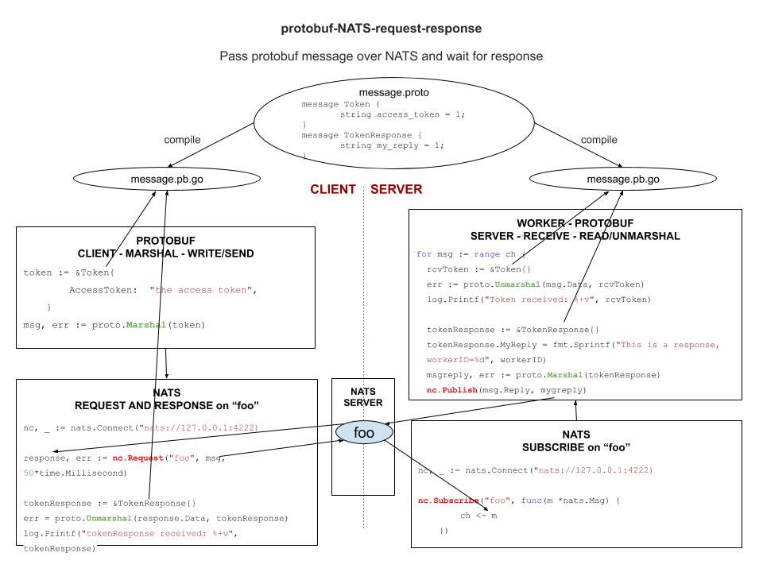

# protobuf-NATS-request-response example

`protobuf-NATS-request-response` _is an example of
sending a protobuf msg over NATS from a
client to a server using request and response._

These are my 3 main example of using protobuf,

* [protobuf](https://github.com/JeffDeCola/my-go-examples/tree/master/messaging/protobuf)
* [protobuf-NATS-publish-subscribe](https://github.com/JeffDeCola/my-go-examples/tree/master/messaging/protobuf-NATS-publish-subscribe)
* **protobuf-NATS-request-response** You are here

Refer to my
[protobuf cheat sheet](https://github.com/JeffDeCola/my-cheat-sheets/tree/master/software/development/software-architectures/messaging/protobuf-cheat-sheet)
for information on installation and use.

[GitHub Webpage](https://jeffdecola.github.io/my-go-examples/)

## BASED ON PREVIOUS EXAMPLE protobuf-NATS

This example will add workers(servers) and the client will request
and get a response back.

Refer to
[protobuf-NATS-publish-subscribe](https://github.com/JeffDeCola/my-go-examples/tree/master/protobuf-NATS-publish-subscribe).

## HIGH-LEVEL-VIEW

