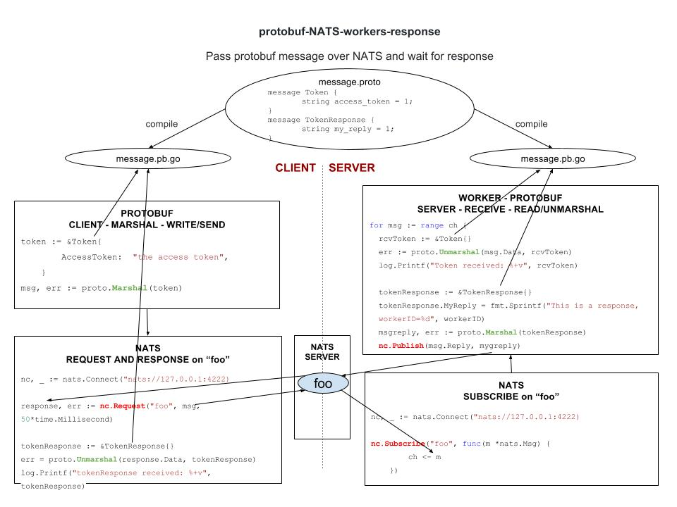

# protobuf-NATS-request-response example

`protobuf-NATS-request-response` _sends a protobuf msg over NATS from a
client to a server using request and response._

[GitHub Webpage](https://jeffdecola.github.io/my-go-examples/)

## BASED ON PREVIOUS EXAMPLE protobuf-NATS

This example will add workers(servers) and the client will request
and get a reponse back.

Refer to
[protobuf-NATS-publish-subscribe](https://github.com/JeffDeCola/my-go-examples/tree/master/protobuf-NATS-publish-subscribe).

## HIGH-LEVEL-VIEW

