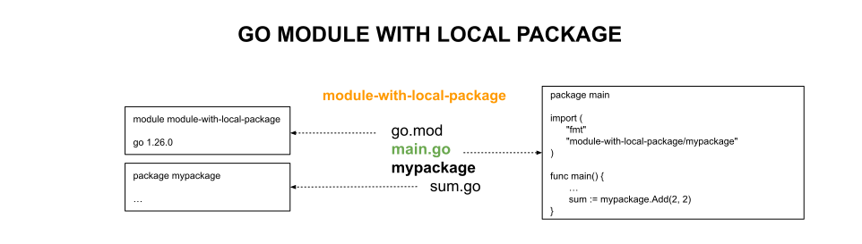

# MODULE WITH LOCAL PACKAGE EXAMPLE

[](https://jeffdecola.com)
[](https://jeffdecola.mit-license.org)

_A go module with a local package._

tl;dr

```go
import "module-with-local-package/mypackage"

sum := mypackage.Add(2, 2) // 4
```

Examples

* [module-with-local-package](https://github.com/JeffDeCola/my-go-examples/tree/master/modules-and-packages/local-packages/module-with-local-package)
  **YOU ARE HERE**
* [module-with-remote-package](https://github.com/JeffDeCola/my-go-examples/tree/master/modules-and-packages/remote-packages/module-with-remote-package)

Table of Contents

* [OVERVIEW](https://github.com/JeffDeCola/my-go-examples/tree/master/modules-and-packages/local-packages/module-with-local-package#overview)
* [STRUCTURE](https://github.com/JeffDeCola/my-go-examples/tree/master/modules-and-packages/local-packages/module-with-local-package#structure)
* [CREATE A MODULE (go.mod)](https://github.com/JeffDeCola/my-go-examples/tree/master/modules-and-packages/local-packages/module-with-local-package#create-a-module-gomod)
* [RUN](https://github.com/JeffDeCola/my-go-examples/tree/master/modules-and-packages/local-packages/module-with-local-package#run)
* [VS CODE AND GO MULTI-MODULES (go.work)](https://github.com/JeffDeCola/my-go-examples/tree/master/modules-and-packages/local-packages/module-with-local-package#vs-code-and-go-multi-modules-gowork)

Documentation and Reference

* [go modules reference](https://go.dev/ref/mod)
* [how to write go code](https://go.dev/doc/code)
* [effective go - package names](https://go.dev/doc/effective_go#package-names)
* [go spec - packages](https://go.dev/ref/spec#Packages)
* [tutorial - multi-module workspaces (go.work)](https://go.dev/doc/tutorial/workspaces)

## OVERVIEW

A **package** is a directory of related go files.
Every go file in the same directory belongs to the same package.

A **module** is a collection of packages versioned and released together.
It is defined by a go.mod file, which declares the module path and its dependencies.
That module path is the import prefix for every package inside it.

## STRUCTURE



Import the local package and use in main,

```go
import (
    ...
    "module-with-local-package/mypackage"
    ...
)
func main() {
    ...
    sum := mypackage.Add(2, 2)
    ...
}
```

## CREATE A MODULE (go.mod)

```cmd
go mod init module-with-local-package
```

The `go.mod` look like,

```txt
module module-with-local-package

go 1.26.0
```

## RUN

To run,

```bash
go run main.go
```

The output should look like,

```bash
4
```

## VS CODE AND GO MULTI-MODULES (go.work)

**This example is a single module** where `mypackage`
is a subdirectory of the same module.

If you are using VS Code and have a multi-module repo like this,
you will need to add a `go.work` file to the root of your workspace.

```txt
cd [workspace root]
go work init
go work use my-go-examples/modules-and-packages/module-with-local-package
go work use my-go-examples/modules-and-packages/module-with-remote-package
```

It will look like,

```txt
go 1.26.0

use (
    ...
    ./my-go-examples/modules-and-packages/module-with-local-package
    ./my-go-examples/modules-and-packages/module-with-remote-package
    ...
)
```

This diagram may help,


