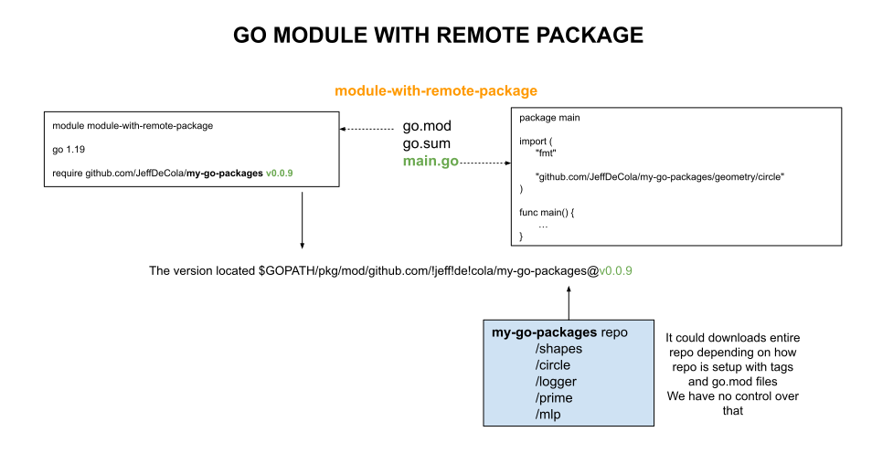
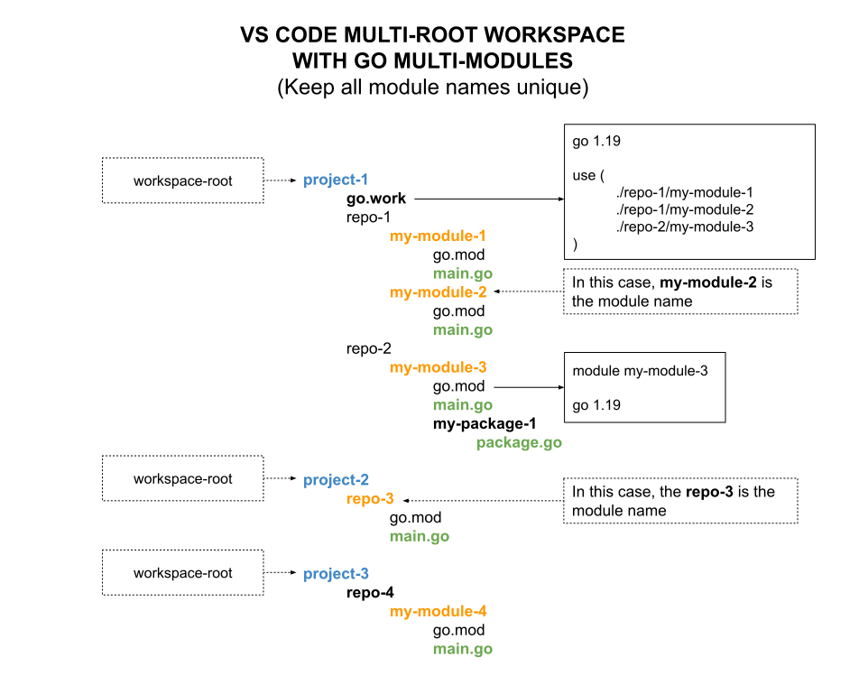

# MODULE WITH REMOTE PACKAGE EXAMPLE

_A go module with a remote (public) package._

Other Examples

* [module-with-local-package](https://github.com/JeffDeCola/my-go-examples/tree/master/modules-and-packages/local-packages/module-with-local-package)
* [module-with-remote-package](https://github.com/JeffDeCola/my-go-examples/tree/master/modules-and-packages/remote-packages/module-with-remote-package)
  **<- YOU ARE HERE**

Table of Contents

* [PREREQUISITES](https://github.com/JeffDeCola/my-go-examples/tree/master/modules-and-packages/remote-packages/module-with-remote-package#prerequisites)
* [OVERVIEW](https://github.com/JeffDeCola/my-go-examples/tree/master/modules-and-packages/remote-packages/module-with-remote-package#overview)
* [STRUCTURE](https://github.com/JeffDeCola/my-go-examples/tree/master/modules-and-packages/remote-packages/module-with-remote-package#structure)
* [CREATE A MODULE (go.mod)](https://github.com/JeffDeCola/my-go-examples/tree/master/modules-and-packages/remote-packages/module-with-remote-package#create-a-module-gomod)
* [EXAMPLE](https://github.com/JeffDeCola/my-go-examples/tree/master/modules-and-packages/remote-packages/module-with-remote-package#example)
* [RUN](https://github.com/JeffDeCola/my-go-examples/tree/master/modules-and-packages/remote-packages/module-with-remote-package#run)
* [TEST](https://github.com/JeffDeCola/my-go-examples/tree/master/modules-and-packages/remote-packages/module-with-remote-package#test)
* [VS CODE AND GO MULTI-MODULES (go.work)](https://github.com/JeffDeCola/my-go-examples/tree/master/modules-and-packages/remote-packages/module-with-remote-package#vs-code-and-go-multi-modules-gowork)

Documentation and Reference

* My circle
  [package](https://github.com/JeffDeCola/my-go-packages/tree/master/geometry/circle)

## OVERVIEW

A go **module** is used to manage various versions of dependencies/packages.

In go, each directory is considered its own **package**. A package is a collection
of related go source files in the same directory.

## PREREQUISITES

```go
go get -u -v github.com/JeffDeCola/my-go-packages
go install -v github.com/JeffDeCola/my-go-packages@latest
```

## STRUCTURE

Let's use a package I made to calculate the area and circumference of a circle.



## CREATE A MODULE (go.mod)

```cmd
go mod init module-with-remote-package
```

Will look like,

```txt
module module-with-remote-package

go 1.19

require github.com/JeffDeCola/my-go-packages v0.0.0.9
```

Run `go mod tidy` to clean up the go.mod file,

```cmd
go mod tidy
```

## EXAMPLE

```go
package main

import (
    "fmt"

    "github.com/JeffDeCola/my-go-packages/geometry/circle"
)

func main() {

    // Create a Circle type
    c := circle.Circle{Radius: 5}

    // Get the area
    a := c.Area()
    fmt.Println("Area =", a)

    // Get the circumference
    p := c.Circumference()
    fmt.Println("Circumference =", p)

}
```

## RUN

To run,

```bash
go run main.go
```

## TEST

To create _test files,

```bash
gotests -w -all main.go
```

Now edit test files.

To unit test the code,

```bash
go test -cover ./...
```

## VS CODE AND GO MULTI-MODULES (go.work)

If you are using VS Code and have a multi module repo like this,
you will need to add a `go.work` file to the root of your workspace.

```txt
cd [workspace root]
go work init
go work use my-go-examples/modules-and-packages/module-with-local-package
go work use my-go-examples/modules-and-packages/module-with-remote-package
```

It will look like,

```txt
go 1.19

use (
    ./my-go-examples/modules-and-packages/module-with-local-package
    ./my-go-examples/modules-and-packages/module-with-remote-package
)
```

This diagram may help,


