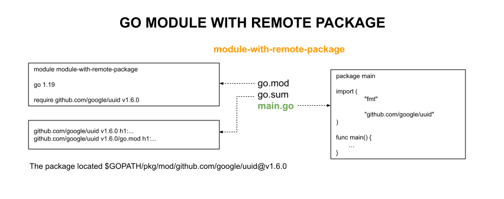
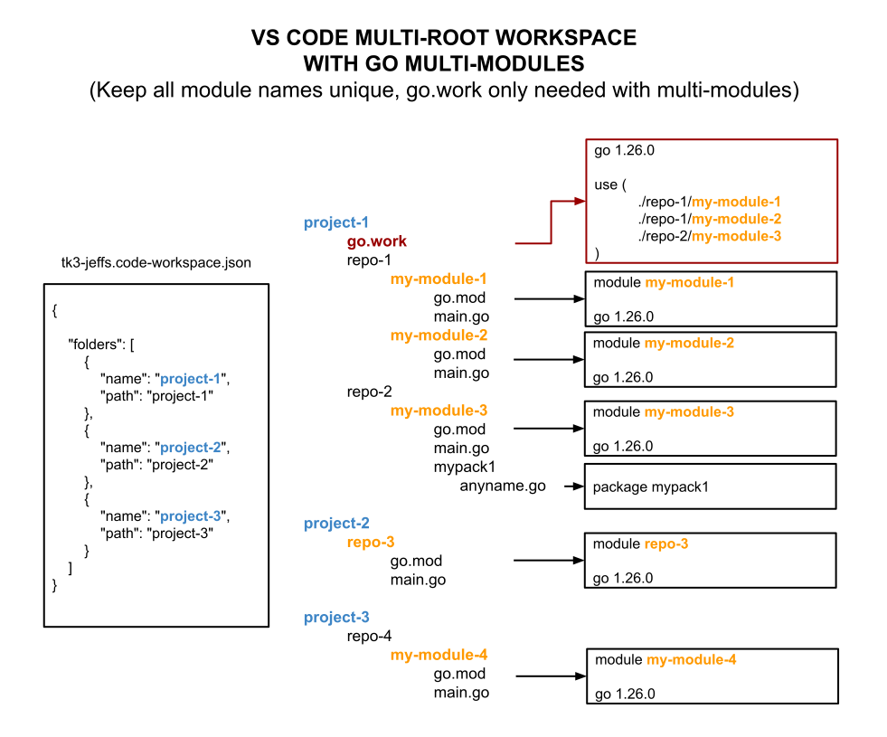

# MODULE WITH REMOTE PACKAGE EXAMPLE

[](https://jeffdecola.com)
[](https://jeffdecola.mit-license.org)

_A go module with a remote package._

tl;dr

```go
import "github.com/google/uuid"

id := uuid.New() // e.g. 1b4e28ba-2fa1-11d2-883f-0016d3cca427
```

Examples

* [module-with-local-package](https://github.com/JeffDeCola/my-go-examples/tree/master/modules-and-packages/local-packages/module-with-local-package)
* [module-with-remote-package](https://github.com/JeffDeCola/my-go-examples/tree/master/modules-and-packages/remote-packages/module-with-remote-package)
  **YOU ARE HERE**

Table of Contents

* [OVERVIEW](https://github.com/JeffDeCola/my-go-examples/tree/master/modules-and-packages/remote-packages/module-with-remote-package#overview)
* [STRUCTURE](https://github.com/JeffDeCola/my-go-examples/tree/master/modules-and-packages/remote-packages/module-with-remote-package#structure)
* [CREATE A MODULE (go.mod)](https://github.com/JeffDeCola/my-go-examples/tree/master/modules-and-packages/remote-packages/module-with-remote-package#create-a-module-gomod)
* [RUN](https://github.com/JeffDeCola/my-go-examples/tree/master/modules-and-packages/remote-packages/module-with-remote-package#run)
* [VS CODE AND GO MULTI-MODULES (go.work)](https://github.com/JeffDeCola/my-go-examples/tree/master/modules-and-packages/remote-packages/module-with-remote-package#vs-code-and-go-multi-modules-gowork)

Documentation and Reference

* [github.com/google/uuid](https://pkg.go.dev/github.com/google/uuid)
* [go modules reference](https://go.dev/ref/mod)
* [how to write go code](https://go.dev/doc/code)

## OVERVIEW

A **package** is a directory of related `.go` files - every `.go` file in the
same directory belongs to the same package.

A **module** is a collection of packages versioned and released together, defined
by its `go.mod` file. That module path is the import prefix for every package
inside it.

A **remote** package lives in another module, downloaded from its source - here,
`github.com/google/uuid`. When you fetch it, Go records the exact version in the
`require` block of `go.mod` and writes its cryptographic checksum to `go.sum` -
the file the local-package example never had. That `go.sum` is what makes the
build reproducible and tamper-evident.

## STRUCTURE



Import the remote package and use it in `main`,

```go
import (
    ...
    "github.com/google/uuid"
    ...
)

func main() {
    ...
    id := uuid.New()
    fmt.Println(id)
    ...
}
```

It's a Universally Unique Identifier — a 128-bit value written as 32 hex digits
in the 8-4-4-4-12 pattern (1b4e28ba-2fa1-11d2-883f-0016d3cca427).
The whole idea is that you can generate one anywhere, with no central
authority handing them out, and the odds of two ever colliding
are vanishingly small.

## CREATE A MODULE (go.mod)

Create the module,

```bash
go mod init module-with-remote-package
```

Add the remote dependency,

```bash
go get github.com/google/uuid
```

The `go.mod` will look like,

```txt
module module-with-remote-package

go 1.26.4

require github.com/google/uuid v1.6.0
```

Unlike the local example, fetching a remote package also creates a `go.sum`,
which records the cryptographic checksums of everything downloaded,

```txt
github.com/google/uuid v1.6.0 h1:...
github.com/google/uuid v1.6.0/go.mod h1:...
```

Run `go mod tidy` to keep `go.mod` and `go.sum` in sync with your imports,

```bash
go mod tidy
```

## RUN

To run,

```bash
go run main.go
```

The output is a new UUID each run, for example,

```bash
1b4e28ba-2fa1-11d2-883f-0016d3cca427
```

## VS CODE AND GO MULTI-MODULES (go.work)

**This example is a single module** where `mypackage`
is a subdirectory of the same module.

If you are using VS Code and have a multi-module repo like this,
you will need to add a `go.work` file to the root of your workspace.

```txt
cd [workspace root]
go work init
go work use my-go-examples/modules-and-packages/module-with-local-package
go work use my-go-examples/modules-and-packages/module-with-remote-package
```

It will look like,

```txt
go 1.26.0

use (
    ...
    ./my-go-examples/modules-and-packages/module-with-local-package
    ./my-go-examples/modules-and-packages/module-with-remote-package
    ...
)
```

This diagram may help,


