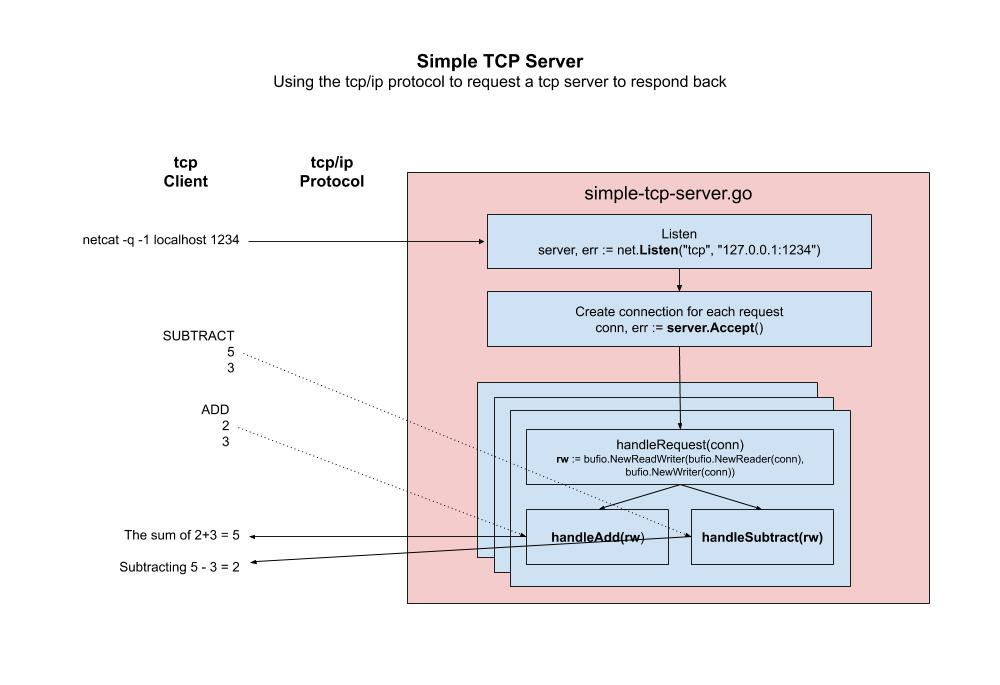

# simple-tcp-server example

_Using the standard `net` package to build a simple tcp-server
to handle requests concurrently._

Also checkout my example
[simple-tcp-server-with-????](https://github.com/JeffDeCola/my-go-examples/tree/master/api/simple-tcp-server-with-????).

[GitHub Webpage](https://jeffdecola.github.io/my-go-examples/)

## HOW IT WORKS

The `/net` package lets us map ???? to functions.

1. Set which IP and port you would like to listen on,

    ```go
    server, err := net.Listen("tcp", "127.0.0.1:1234")
    ```

1. Create connection for each request,

    ```go
    conn, err := server.Accept()
    go handleRequest(conn)
    ```

1. Create your handler `handleRequest()`,

    ```go
    rw := bufio.NewReadWriter(bufio.NewReader(conn), bufio.NewWriter(conn))
    cmd, err := rw.ReadString('\n')
    ```

1. Create your handler functions like `handletAdd()`,

   ```go
    handleAdd(rw)
   ```

This illustration may help,



## RUN

```bash
go run simple-tcp-server.go
```

Press return to exit.

You can interact with the tcp server in many ways

### USING NETCAT

In another terminal, use the nc command which runs Netcat,
a utility for sending raw data over a network connection.

```bash
netcat -q -1 localhost 1234
nc -q -1 localhost 1234
```

Now you can issue commands such as,

```bash
ADD
4
5
SUBTRACT
5
4
```

You can have as many connections as you like open.
