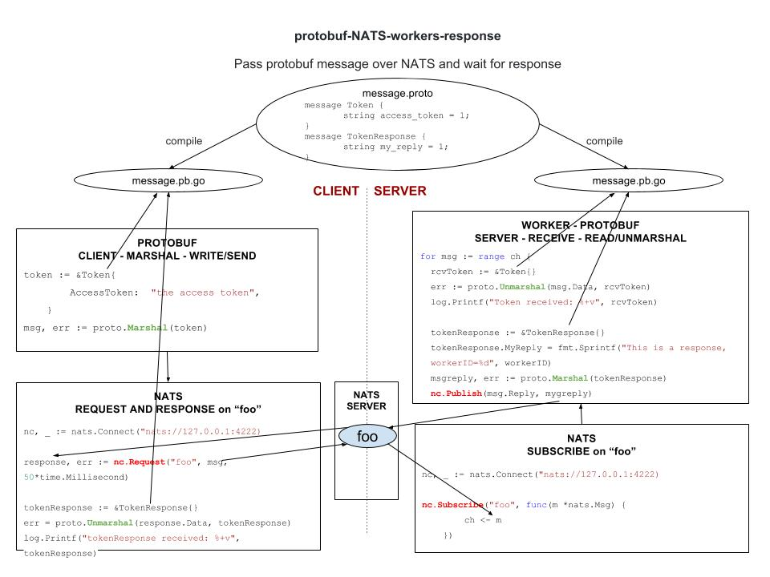

# protobuf-NATS-workers-response example

`protobuf-NATS-workers-response` _sends a protobuf msg over NATS
from a client to a server/worker and gets a response back_

[GitHub Webpage](https://jeffdecola.github.io/my-go-examples/)

## BASED ON PREVIOUS EXAMPLE protobuf-NATS

This example will add workers(servers) and the client
will get a reponse back.

Refer to
[protobuf-NATS](https://github.com/JeffDeCola/my-go-examples/tree/master/protobuf-NATS).

## HIGH-LEVEL-VIEW

